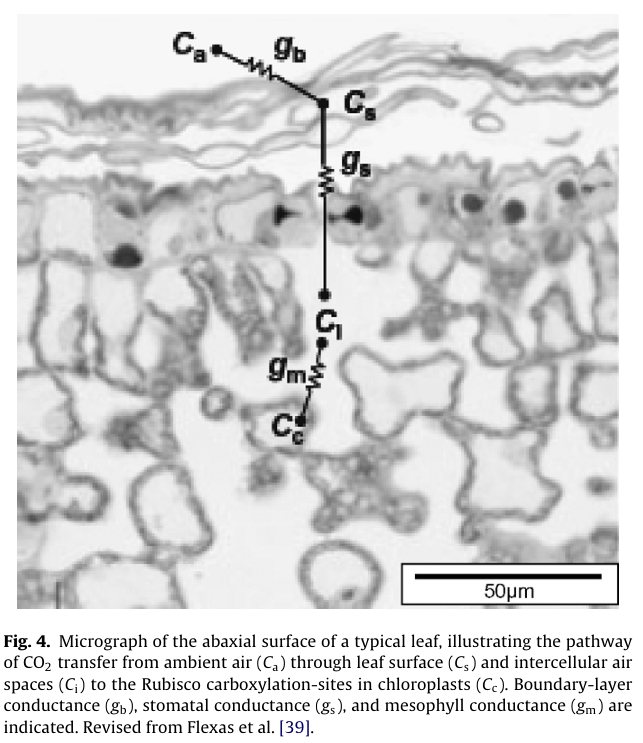

# 1 水文循环过程

---

<!-- ## 1.1 流域 -->

<!-- 
 -->

- 流域：由分水线所包围的闭合集水区。

  > 分水线：分水线两侧水流流向不同。在山区分数线是<u>山脊线</u>，在平原则常以<u>堤防</u>或<u>岗地</u>为分水线。

  

<!--  -->

<!-- --- -->
<!-- __两个重要属性：__ -->

- 集水面积：哪些区域的降水会从该河道流出？
   > <u>数字高程</u>+水往低处流。

- 汇流时间（上下游滞后时间）：多久降水会从流域出口点流出？

:::info:汇流速度快慢影响因素：
流域形状、流域面积、流域地形、地表粗糙度
:::

---

  

---

### 1.1.1 水文站点与气象站点的不同之处

__水文站__：代表的__其控制面积（流域）__上的水资源量

__气象站__：代表的是__气象站周围__的气象要素

<!--   -->

  

---

<!-- ## 1.2 水量平衡要素 -->
1. **降水**
2. **蒸散发**
3. **径流**
4. **储水量**（土壤含水量 + 地下水）

$$
P - E - R = \Delta S + Human
$$

 
<!-- 上式 __忽略的因素__：人类活动的影响 -->

5. **人类活动影响**

- 水利工程调节（大坝、水库、南水北调）
- 人类生活用水、工业用水、灌溉用水

<!-- ---

### 4.2.1. 不可忽略的人类活动影响

<h3>示例：</h3>
<h4>2022年水文干旱多极端？</h4>

> 今年干旱有多极端？重现期如何？
>
> 三峡修建之后，宜昌站水位降低。这个因素如何考虑？

 

<http://113.57.190.228:8001/#!/web/Report/RiverReport> -->

<!--    -->

---

### 流量测量的不确定性

      
      

  

  

---

### 蒸散发的不确定性

#### 1.2.2.1 实际蒸散发

ET (Evapotranspiration)：`Evaporation` + `Transpiration` + `Canopy Interception`

- 土壤蒸发（35%）

- 植被蒸腾（55%）

- 冠层截留蒸发（10%）

#### 1.2.2.2 潜在蒸散发

- 潜在蒸散发：蒸发皿蒸发与陆地潜在蒸散发的区别

> **注意实际蒸散法与潜在蒸散发的区别**

---

### 水储量的不确定性

- 站点观测：10cm, 30cm, 70cm, 100cm？（观测困难、点到面的转换不确定）

- 卫星：GRACE重力卫星观测，2°×2°大网格 

---

<h4>水量平衡</h4>

$$ P - E - R = \Delta S + Human $$

- **降雨过程**：锋面降雨、地形抬升、对流运动

- **产流过程**：蓄满产流、超渗产流

- **汇流过程**：地表坡面汇流、河道河网汇流（流域形状、D8法流向）

- **蒸散发过程**：土壤蒸发、植被蒸腾、冠层截流蒸发

- **土壤水**：壤中流(RI)，(达西定律)：梯度 × 水力传到系数

- **地下水**: 地下水径流(Rs)

:::block
Q1: 土壤与下渗、蒸发、径流的交互关系

Q2: 植被发挥的了什么角色？

Q3: 洪涝与干旱分别关注的是水文循环中的什么变量？
:::

---

<h4>能量平衡</h4>

 

$$
Rn - G = \lambda E + H
$$
 

- 蒸发过程：$E = g_w * (e_s - e_a)$

- **植被光合：**$A = g_c * (C_a - C_i)$

- 感热通量：$H = \rho c_p (T_s - T_a) g_H$

- 土壤热通量：$G = -\kappa \frac{\partial T}{\partial z}$

- **土壤水运动：**$Q = -K \frac{\partial{(\Psi + z)} }{\partial z}$

<!-- > 扩散系数$g_w$, $g_c$, $K$, $\kappa$。 -->

:::footnote
Yin X, Struik P C. C3 and C4 photosynthesis models: An overview from the perspective of crop modelling[J]. ***NJAS-Wageningen Journal of Life Sciences***, 2009, 57(1): 27-38.
:::

---

# 2 水的相变与饱和水汽压

---

<!-- ## 2.1 水的相变 -->

### 2.1.1 气化潜热

1. **气化潜热**：单位质量的液体，从液态变为气态所需吸收的热量。

   $$
   \lambda = 2.5 - 0.0024 T_a, (MJ/kg)
   $$

   **单位的转化（重点）**：MJ/kg -> mm

   > Q1: 地表单位面积上，$1mm$深的水，气化所需的能量？

   > Q2: 假设地表净辐射$R_n$为$100 W/m^2$，能量全部转化为蒸发，一天的蒸发量是多少？

   > Q3: 单位体积空气，已知空气密度$\rho$, $q_1$, $q_2$，写出LE的表达式

   > Q4: 与Q3相同，只是$q$换为$e$，已知$e_1$，$e_2$，写出LE的表达式

2. 升华潜热，单位质量的液体，从固态变为气态所需吸收的热量。
   冰面温度−40℃ ~ 0℃时，升华潜热近似为常数。

$$

\lambda_s = 2.5 + 0.334, (MJ/kg)
$$

---

### 2.1.2 比热容$Cp$

:::block
比热容$Cp$：单位质量，温度升高1℃所需的能量。
:::
  > 空气的比热容为$1.103×10^{-3} MJ kg^{-1} ℃^{-1}$。

 

$$
H = Cp * m * \Delta T
$$

---

---

## 2.2 饱和水汽压

---

### 2.2.1 饱和水气压

**饱和水汽压**：指一定体积空气，在某一温度条件下所能容纳的<u>最大水汽量所具有的压力</u>，用$es$表示。

<u>**饱和水汽压随温度升高而升高，随温度降低而降低。**</u>

**应用：**

1. **大气的横向运动**
   
2. **大气的垂向运动**
   + 上升运动：$T$下降，$es$下降，$RH$升高，易降水，云雨；（<u>低压系统</u>）
   + 下沉运动：$T$升高，$es$上升，$RH$降低，不易降水，高温干旱；（<u>低压系统</u>）

3. **迎风坡、背风坡**
   > 迎风坡降水（同时水汽从气态转化为液态，释放热量，背风坡气体温度偏高）

4. **早晨露水**

5. **全球变暖背景下的极端事件**

---

$$
es(T_a) = 0.6108 \;exp (\frac{17.27 T_a}{T_a + 237.3})
$$

> $es(T_a)$：饱和水气压，kPa
> $T_a$：空气温度，℃
> $\Delta$：$es(T_a)$的斜率

**Reference**

1. Allen, R., Pereira, L., Raes, D., & Smith, M. (1998). *J. Hydrol.*, *285*, 19–40.

---

$$
V = \frac{R_h^{2/3}}{n}S^{1/2}, R_h = A/P
$$

$$
Q = V A = \frac{A_h^{5/3}}{n P^{2/3}} S^{1/2}
$$

<h4>坡面</h4>
