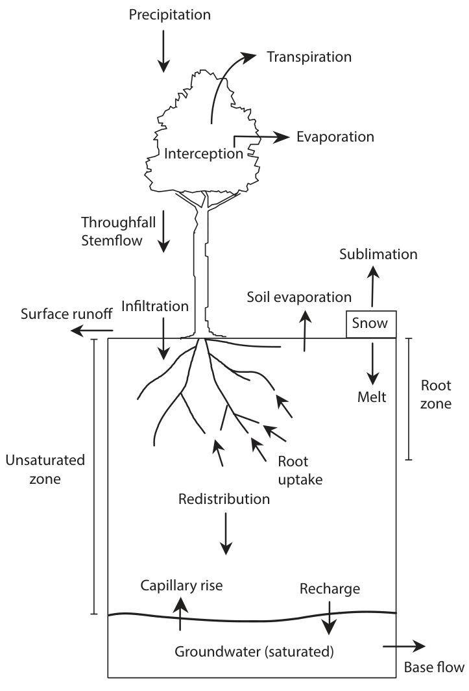
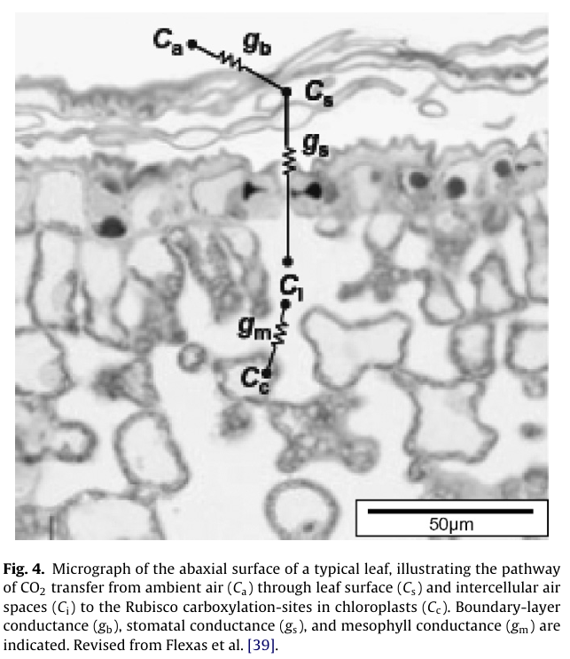

<!-- Global style -->

<h1>水文气象学2024</h1>
<h4>课程介绍</h4>

 

孔冬冬，**kongdongdong@cug.edu.cn**

办公室：科教六楼307

中国地质大学（武汉）大气科学系

 

**Github**: <https://github.com/kongdd>
**Profile**: <http://grzy.cug.edu.cn/kongdd>
**Researchgate**: <https://www.researchgate.net/profile/Dongdong_Kong>

---

## 1. 个人简介

孔冬冬，河南周口人；

| 时间            | 地点                 | 角色                      |
| --------------- | -------------------- | ------------------------- |
| 2020.07~至今    | 中国地质大学（武汉） | 副教授、硕导              |
| 2015.09~2020.06 | 中山大学             | 自然地理学 博士（直博生） |
| 2018.12~2019.01 | 南方科学大学         | 访学                      |
| 2018.09~2018.11 | 澳洲CSIRO            | 科研助理                  |
| 2017.12~2018.11 | 澳洲CSIRO            | 联合培养博士生            |
| 2015.09~2015.10 | 香港中文大学         | 访学                      |
| 2011.09~2015.06 | 中山大学             | 水文学与水资源工程  学士  |

---

### 1.1. 开发水文气象专业相关工具包30余项

- `PML.jl`: 陆面三层**蒸散发**与植被总初级生产力，<https://github.com/gee-hydro/gee_PML>, <https://github.com/jl-pkgs/PML.jl>

- `SoilDifferentialEquations.jl`: **土壤热通量**与**土壤水运动**，<https://github.com/jl-pkgs/SoilDifferentialEquations.jl>

- `MarrMot.jl`: **地表产汇流**，47个集总式水文模型，<https://github.com/jl-pkgs/MARRMoT.jl>

- `VIC5.R`：**地表产汇流**，分布式水文模型VIC5与集总式水文模型XAJ，<https://github.com/rpkgs/VIC5>

- `hydroTools`：**水文气象专业R包**，<https://github.com/CUG-hydro/hydroTools>

- `SpatioTemporalCluster.jl`: 干旱、热浪，三维时空聚类

- 研究组`CUG-hydro`：<https://github.com/CUG-hydro>

---

### 1.2. 个人研究

<!-- 研究团队在水文模型方面持续深耕，具有扎实的研究基础和技术优势。 -->

- 2021年，中尺度水文模型`VIC5`模型R语言版本核心维护者，CRAN官网发布至今使用人次7368（截至2023-11-08）;

- 2021年9月，研究团队获第一届水科学数值模拟大赛**特等奖**；

- 2022年，47个集总式水文模型`MarrMot`Julia语言版本（简称`MarrMot.jl`）完工，与旧版本相比，实现300倍提速，为大范围的推广应用奠定基础；

- 2022年，`MarrMot.jl`提供47个水文模型的API接口，被**气象公司象辑科技**应用；

- 2023年，`MarrMot.jl`API接口，在**长江水科院**得到推广应用；

- 2023年7月，作为第三届水科学数值模拟创新大赛获奖团队，受邀到长江电力三峡梯调开展成果验证（全国85家单位274支队伍，共5组受邀参加）；

- 2023年8月，中国短时洪涝预警开源社区召集者，<https://github.com/CUG-Flood/ChinaFlood_Monitor>

- 2023年11月，研究团队关于全球水资源变化的合作论文发表在**Science期刊**。

---

- Yongqiang Zhang; Congcong Li; Francis H. S. Chiew; David A. Post; Xuanze Zhang; Ning Ma; Jing Tian; ***<u>Dongdong Kong</u>***; L. Ruby Leung; Qiang Yu; Jiancheng Shi; Changming Liu ; Southern Hemisphere dominates recent decline in global water availability, <u>***Science***</u>, 2023, 382(6679): 579-584

- Yongqiang Zhang, Hongxing Zheng, Xuanze Zhang, L. Ruby Leung, Changming Liu, Chunmiao Zheng, Yuhan Guo, Francis H. S. Chiew, David Post, <u>***Dongdong Kong***</u>, Hylke E. Beck, Congcong Li & Günter Blöschl. Future global streamflow declines are probably more severe than previously estimated. <u>***Nature Water***</u>, 2023, 1, : 261-271.

---

### 1.3. 指导本科生

<h5>2022级本科生</h5>

- 陈家应；创新训练项目项目选题（2024），冠层与地表视角的城市热岛效应及其郊区影响研究（省级，5000元）

<h5>2020级本科生</h5>

- 史嘉琪；创新训练项目项目选题（2022），机器学习与传统水文模型短时径流预报研究 （省级，5000元）

<h5>2019级本科生</h5>

- 宋和洋；创新训练项目精品项目选题（2021），1961-2017年中国热浪时空多维变化规律（国家级，2万元）

<h5>2018级本科生</h5>

- 田靖龙、雷诺、李和洋、庄胜杰；创新项目（2021），一种基于数据挖掘和驱动的流域径流预报方法（学校级，3000）

- 李晨曦、康晓萍、韦李宏；第八届“共享杯”科技资源共享服务创新大赛（2021），三等奖（73/3200，3200队伍参赛，73组获奖）

---

## 2. 课程介绍

<h4>上课地点</h4>

:::block
<u>周三5-6节，10-17周，041222</u>，公教1-413
<u>周五9-10节，11-18周，041222</u>，公教2-302

周三9-10节，10-17周，041221，公教2-302
周五5-6节，11-18周，041221，公教2-302
:::

**地点**：<u>公教2-107</u>

**时间**：11-18周，星期二（7-8节），星期四（1-2节）

<h4>考试安排</h4>

2024-01-10 (14:30-16:30，结课后一周)

- 公教1-116, 26，041221

- 公教1-114, 22人，041222

---

## 3. 考核方法

<h4>平时成绩（50%）：</h4>

1. 考勤（10%）
   > 缺勤超过三次，无考勤分！

2. 课堂小测（20%）：4-5次小测，去除一次最低分。
   > bonus: <u>小测做的不好，可以通过主动回答问题弥补，</u>
   > 可能会通过小测判断考勤，**无小测、无考勤**。

3. 平时作业（20%）：2-3次作业

<h4>期末考试（50%）：</h4>

- 闭卷，50%

---

## 4. 推荐的教材

1. Bonan, Climate Change and Terrestrial Ecosystem Modeling，2019

2. 戴永久陆面模式研发团队，通用陆面模式CoLM，2024

3. 葛朝霞等，**气象学与气候学教程**，中国水利水电出版社（第2版）

4. 荣艳淑等，**水文气象学与气候学**，中国水利水电出版社

5. Frederick（陈星等译），气象学与生活，电子工业出版社（第12版，修订版）

--- 

<h4>课程大纲</h4>

1. 绪论

2. 基本水文、气象要素

<h5>PART I：水文过程</h5>

3. 地表能量平衡——辐射

4. 蒸散发与地表水量平衡

5. 土壤水运动与土壤热通量

6. 产汇流过程（选讲）

<h5>PART II: 气象学原理</h5>

7. 位势高度与气压场

8. 辐射、温度与热浪分析

9. 水汽通量与暴雨分析

10. 大气环流（选讲）

---

<h4>万物皆浓度扩散？</h4>

 

$$
Rn - G = \lambda E + H
$$
 

- 蒸发过程：$E = g_w * (e_s - e_a)$

- **植被光合：**$A = g_c * (C_a - C_i)$

- 感热通量：$H = \rho c_p (T_s - T_a) g_H$

- 土壤热通量：$G = -\kappa \frac{\partial T}{\partial z}$

- **土壤水运动：**$Q = -K \frac{\partial{(\Psi + z)} }{\partial z}$

<!-- > 扩散系数$g_w$, $g_c$, $K$, $\kappa$。 -->

:::footnote
Yin X, Struik P C. C3 and C4 photosynthesis models: An overview from the perspective of crop modelling[J]. ***NJAS-Wageningen Journal of Life Sciences***, 2009, 57(1): 27-38.
:::

---

<h4>学会上述内容后，离洪水预报还有多远 ？</h4>

- 降雨$P$

- 冠层截流$E_i$

- 地表径流$R$

- 下渗$I$

- 壤中流$RI$与地下径流$RG$

- 河网汇流（Routing）

---

<h4>气象学成因</h4>

- **位势高度与气压场**：气象分析基本理论

- **高温热浪分析**

- **暴雨分析**

- **大气环流**：气候态分析

---

## 6. 能收获哪些？

- 基本的水文循环过程

- 掌握极端水文气象事件（如热浪、寒潮、干旱、洪水）的分析方法（知其然，从1维生物到4维生物）

- 学会分析基础的极端事件的成因和机制（知其所以然）

- <u>基本的数据分析？**Julia编程语言** </u> 
  + <https://www.runoob.com/julia/julia-environment.html>
  + https://cn.julialang.org/JuliaZH.jl/latest/manual/getting-started/

<!-- ## 可以解决哪些问题？

- 如何全方面的分析极端水文气象事件（经过、损失、影响、成因）

- 未来几天或者今年偏冷、偏热？

- 寒潮、热浪（温度偏冷、偏热）成因

- 洪旱（水多、水少）的成因 -->

---

## 7. 如何学好这门课？

> <u>**系统性学习，刨根问底**</u>；多问为什么，多检索，想办法解决生活中的水文气象问题

- **知乎**：高质量的问答
- **公众号**：系统性的总结
- **bilibili、YouTube**：简明易懂的教程
- **百度、google**：中英文专业搜索引擎
- **知网**：中文文献
- **Google Scholar**：外文文献
- **Wikipedia**：比知乎更专业的知识库

--- 

<h3>紧跟时代的脚步</h3>

<!-- <h4>多维分析</h4>

- 四维变量可视化

- 极端事件定量追踪 -->
<h4>大语言模型</h4>

**高效学习**

- ChatGPT: <https://chat.openai.com/>

- GitHub Copilot: <https://github.com/github-copilot/signup>

---

## 8. 如何拿到高分

1. 体现出工作量（检索5-10篇文献，才有自己的报告）；

2. 体现出自己的思考（避免抄袭，避免写自己不懂的部分；抄的好，但没有自己的思考照样低分），具体地去解读别人的文章，先写用到哪些知识点，再写如何看图；

3. 写作有逻辑（建议采用总分的结构），使用书面表达（避免口语化），排版美观，注意中英文标点、中英文字体（中：宋体，英：Times New Roman）、页码、参考文献格式；

4. 学会分析具体的应用案例。

<u>**认真！细心！精益求精！**</u>

> 挑战让自己紧张的事情。

---

## 9. 准研究生的训练

- 基础的数据处理、制图和数据分析能力（<u>**熟练**</u>掌握一门编程语言）

- 独立解决复杂问题

- 英文文献阅读
  
- 写作逻辑训练

- 大创、竞赛（厚积薄发，勇于尝试）
