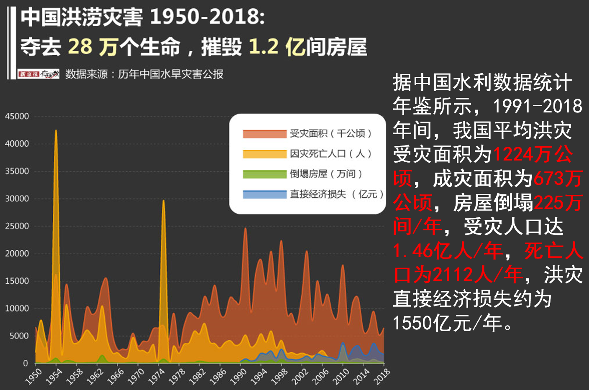
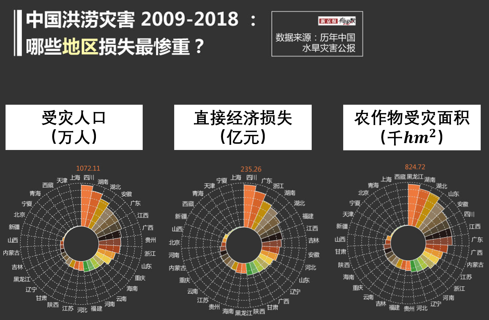
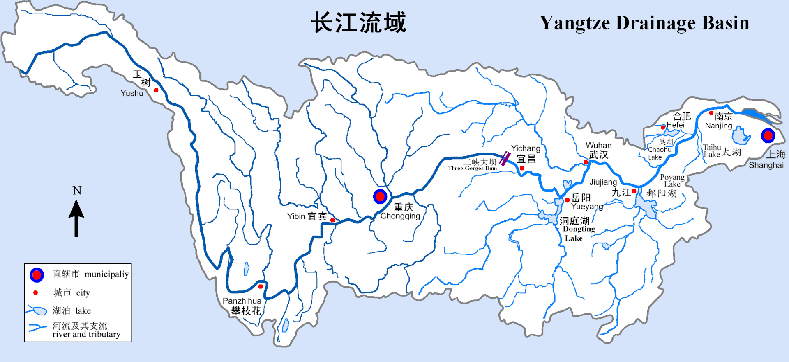
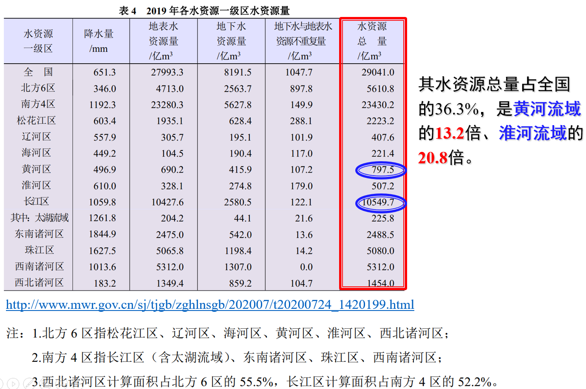
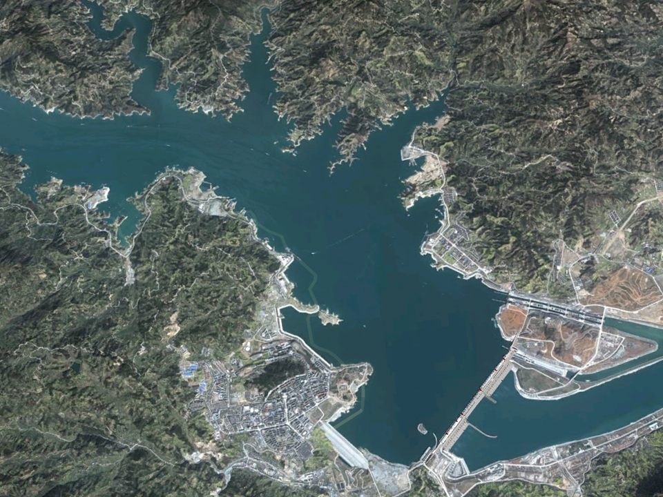
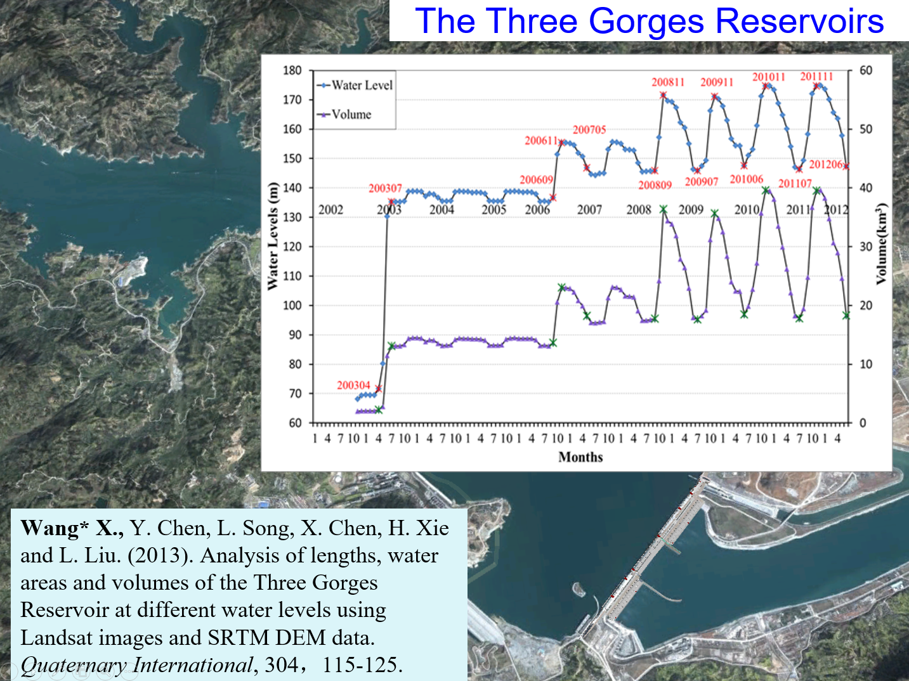

**土壤、植被、大气、地下水连续体**
Groundwater-Soil-Plant-Atmosphere Continuum (**GSPAC**)

- 植被蒸腾与植被光合过程
  > 1. 农田耗水；
  > 2. 农田产量；
  > 3. 区域水量平衡。

- 地表温度与土壤热通量
  > 1. 地表感热、潜热能量分配。
  > 2. 夏季地表温度，多少度？
  > 3. 更精细化地研究城市热岛。

- 土壤水运动
  > 1. 影响土壤蒸发（主要发生在第一层）
  > 2. 影响植被蒸腾（每一层的土壤都可能会为其供水）

---

## 2.1. 洪旱灾害规律

### 2.1.1. 洪涝

<!-- style -->
<!-- scoped -->

<h4>1. 频率高</h4>
我国洪涝灾害频发，严重威胁人民生命和财产安全。

公元前206年至1949年的2155年间，全国发生较大洪涝灾害（主要是流域洪水）1092次，<u>__平均每两年发生一次较大水灾__</u>（中华人民共和国防洪法）

<h4>2. 损失重</h4>

中国水旱灾害占各类自然灾害<u>**直接经济总损失60%**</u>（中国水利部部长陈雷，2003）

<!-- :::footnote -->
<http://www.npc.gov.cn/npc/c2171/200011/b316ad59e54d493e84e7e3f3b49f69c2.shtml>
<http://www.chinanews.com/gn/news/2008/11-11/1444648.shtml>
<!-- ::: -->

<!-- **历史典故：**

- 大禹治水（約4000年前），三过家门而不入

- 李冰（战国时期秦国），都江堰，2300年前的水利工程，造就天府之国，<https://www.bilibili.com/video/BV1Hf4y1q7e1> -->

---

<h4>民国期间</h4>

---

<h4>建国以来</h4>

1950-2021年，全国因洪涝受灾面积68116.880万hm2、死亡人口 284,052人，倒塌房屋 12,296.77 万间，直接经济损失50,813.03亿元（1990-2021 年数据），年均值分别为946.068万$hm^2$、<u>3945.17人/年</u>、170.79万间、
<u>__1587.91亿元__</u>。

得益于不断完善的水利设施，相较于1991-2000年，近10年（2009-2018）洪灾受灾面积和成灾面积分别下降了48%和42%，但近10年洪灾引起的直接经济损失却增加了72%，达2170亿元/年。（<u>__中国水利数据统计年鉴__</u>）

> 1.《中国水旱灾害防御公报》编写组.《中国水旱灾害防御公报2021》概要[J].中国防汛抗旱, 2022, 32(9):38-45.
> 2.《中国水旱灾害防御公报 2021》

<!-- <https://www.163.com/dy/article/HL0S0PS4055339SU.html> -->

## 2.2. 长江流域的特殊性

---

:::footnote
<http://www.bjnews.com.cn/graphic/2020/06/28/742967.html>
:::

---

<!-- _backgroundColor: #333333 -->

---

<!-- _backgroundColor: #D5E4FB -->

发源于青藏高原唐古拉山脉主峰各拉丹冬雪山的西南侧。干流流经青、藏、川、滇、鄂、湘、赣、皖、苏、沪l0省、市、自治区，注入东海。全长约6300km。流域面积180余万$km^2$(不包括淮河流域)，约占全国土地总面积的1／5。

<!-- <https://zh.wikipedia.org/wiki/%E9%95%BF%E6%B1%9F%E6%B5%81%E5%9F%9F> -->
<!-- <http://www.igsnrr.cas.cn/cbkx/kpyd/zgdl/cnszy/202009/t20200910_5692425.html> -->

---

<h4>长江是我国第一大河，也是我国洪灾最严重的区域</h4>

---

<h4>长江流域近150a洪水</h4>

1. **1870**: 06.13-06.21，长江上游地区、嘉陵江，1153年至20世纪末，900年间规模最大的洪水。
  
2. **1931**: 6-8月，江淮地区，422,499死亡，灾民5311-6000万人。
   
3. **1954**: 6-9月，江淮地区，死亡3.3万人，受灾人口1888万人，京广铁路停运100天。水灾水量、水位均大于1931年江淮水灾。
   
4. **1998**，7-8月，3000余人死亡，受灾人口2亿，宜昌63300$m^3/s$。

---

<!--  -->

<!-- :::footnote
Wang* X., Y. Chen, L. Song, X. Chen, H. Xie and L. Liu. (2013). Analysis of lengths, water areas and volumes of the Three Gorges Reservoir at different water levels using Landsat images and SRTM DEM data. Quaternary International, 304，115-125. 

::: -->

---

<h4>2020年中国南方洪涝灾害</h4>

三峡水库入库流量(m3/s)

- 7月02日10时，1号洪水，50,000；02日14时，53,000 $m^3/s$;
  
- 7月17日10时，2号洪水，50,000；18日08时，61,000 $m^3/s$;
  
- 7月26日14时，3号洪水，50,000；27日14时，60,000 $m^3/s$;
  
- 8月14日05时，4号洪水，寸滩50900；15日8时，62,000 $m^3/s$;

- 8月17日14时，5号洪水，寸滩50400；20日8时，**75,000** $m^3/s$

---
