<!-- Global style -->

<h1>水文气象学–01绪论</h1>

# 1. 气候背景

---

## 1.1. CO2浓度近似指数级升高

<h4>过去80万年最高</h4>

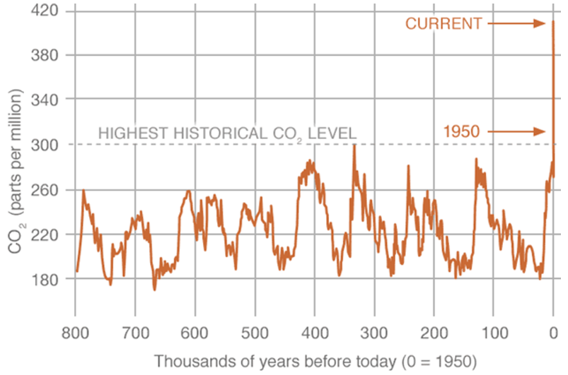

> 工业化革命之前的80万年，CO2浓度最高值只有300ppm左右，但是工业化革命之后的100~200年，CO2近似以指数增长，截止2023年，CO2浓度达420ppm

---

<h4>近几十年增加速度不减</h4>

<table>
<tr></tr>
<tr><td> 

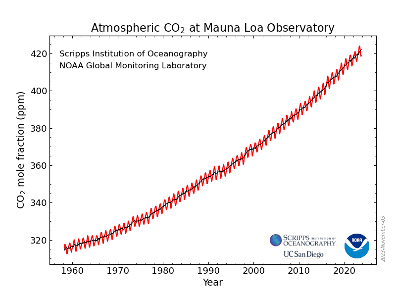 
</td><td>

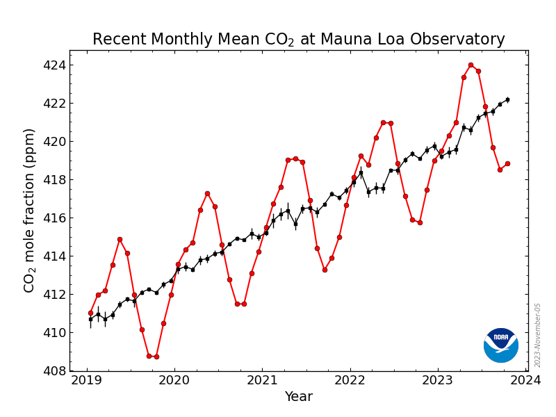
</td></tr></table>

> CO2浓度“指数级升高”，增长势头不减

<https://gml.noaa.gov/ccgg/trends/>

---

## 1.2. CO2浓度与升温

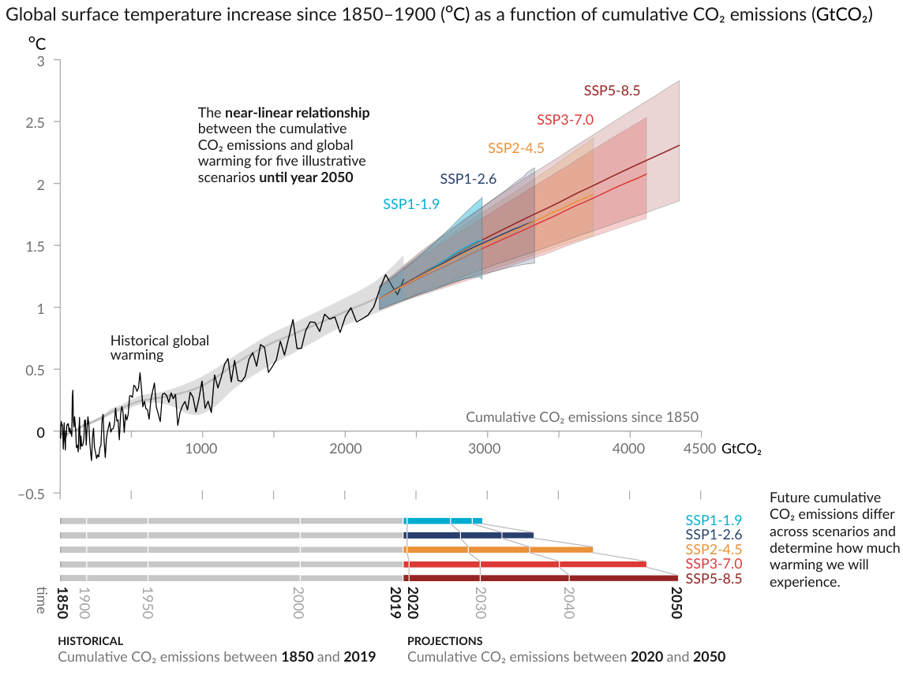

- SSP1-2.6: 可持续发展路径，
  辐射强迫$+2.6W/m2$

- SSP2-4.5: 中等发展路径，$+4.5W/m2$

- SSP5-8.5: 高速发展路径，$+8.5W/m2$

:::footnote
*<u>IPCC6 Reports: Summary for Policymakers</u>*
:::

---

<h4>CO2排放情景</h4>

---

<h4>未来升温与CO2贡献</h4>

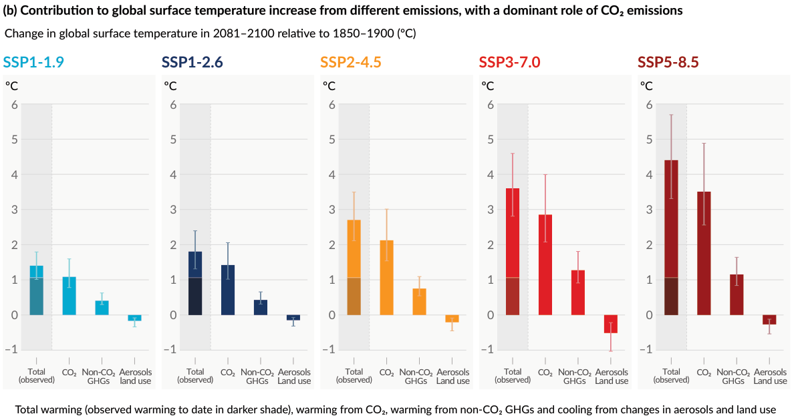

---

## 1.3. 政策

- **1992《联合国气候变化框架公约》**（《气候变化公约》）

  1992年，联合国召开地球问题首脑会议，迈出了解决这个问题的第一步，197个国家参与。公约的终极目标是防止气候系统受到“危险的”人为干扰。

- **2017《京都议定书》**

  1997《京都议定书》正式通过，具有法律约束力，要求发达国家缔约方遵守减排目标。第一个承诺期是从2008年到2012年，第二个承诺期从2013年至2020年截止。

- **2015《巴黎协定》**

  加强对气候变化所产生的威胁做出全球性回应，实现与前工业化时期相比将全球温度升幅控制在2℃以内；并争取把温度升幅限制在1.5℃。

  特朗普2017年6月宣布美国将退出。2020年1月，拜登重新加入。

<https://www.un.org/zh/global-issues/climate-change>

---

<h4>中国</h4>

> 2020年9月，习近平总书记在第七十五届联合国大会一般性辩论上正式宣布：

 

:::warn:碳中和、碳达峰
“中国将提高国家自主贡献力度，采取更加有力的政策和措施，

- 二氧化碳排放力争于2030年前达到峰值；
- 努力争取2060年前实现碳中和。”
:::

:::footnote
<https://www.gov.cn/yaowen/2023-04/06/content_5750183.htm>
:::

---

<h4>2021 年诺贝尔奖:人类正让地球变暖</h4>

 

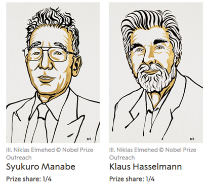

Manabe与Hasselmann共同获得了一半的诺贝尔物理学奖：

建立了地球气候的物理模型，能够量化变化情况、以及可靠预测全球变暖。

- Manabe的研究证实了<u>*温度的变化是由二氧化碳水平上升导致*</u>的

- Hasselmann提出指纹法区分天然大气变暖与人类所致大气变暖

---

## 1.4. 当下升温幅度

<h4>202309升温幅度: 1.82 ± 0.09 °C above the 1850~1900 average</h4>

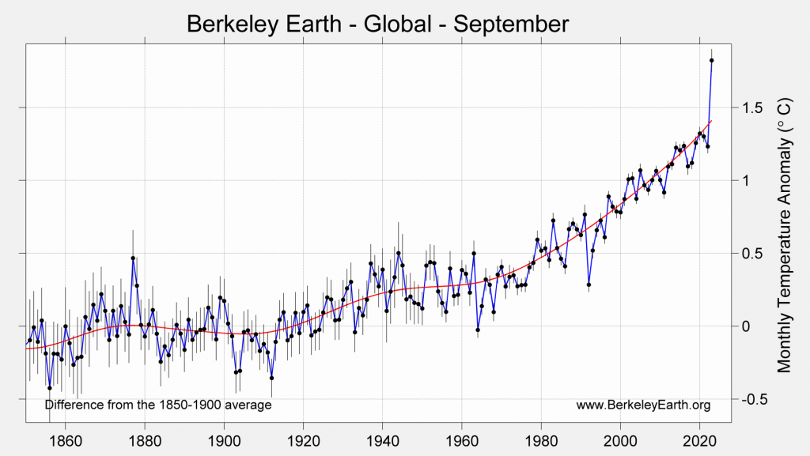

<https://berkeleyearth.org/september-2023-temperature-update/>

---

<h4>JAS: 连续三个月全球平均温度超过1.5°C</h4>

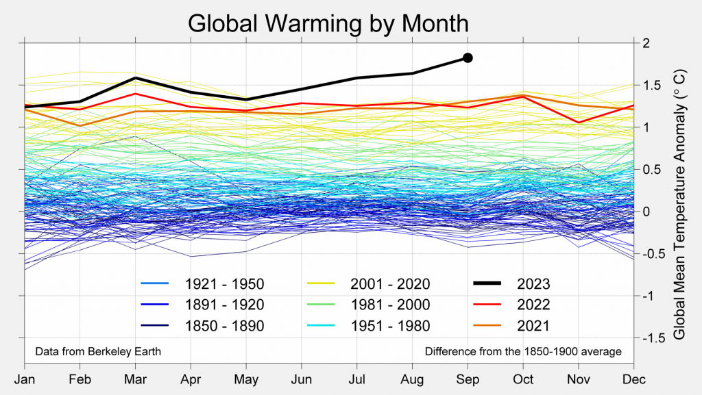

---

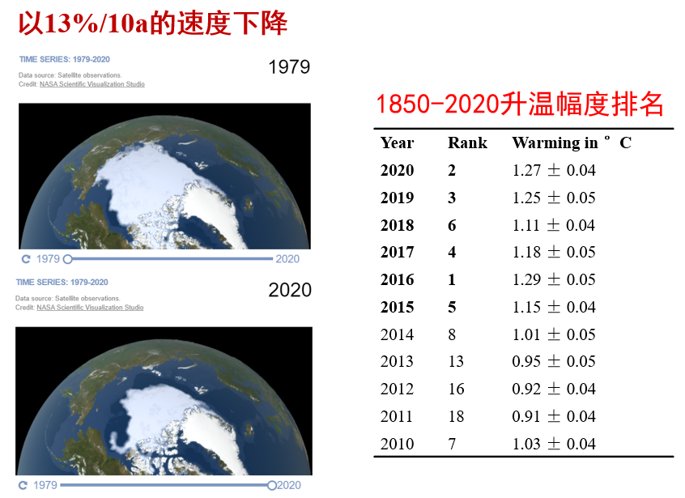

<https://climate.nasa.gov/vital-signs/arctic-sea-ice/>

---

# 2. 气候变暖的影响

- 夏季北冰洋海冰消失，升温2℃10年一遇，升温1.5℃则为100年一遇。

- 升温1.5℃，珊瑚礁将减少70%~90%；升温2℃则99%都将消失

---

## 2.1. 热浪

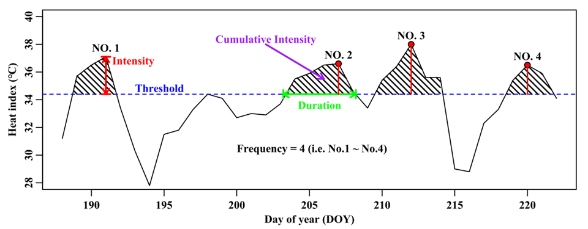

$HWD$: 持续天数；$HWI$: 热浪强度
$HWS$: 热浪严重程度；$HWA$: 热浪面积

---

<h4>CMIP5：未来热浪风险</h4>

*<u>Kong, 2020, JGR-A</u>*

---

<h4>CMIP6: 三维时空热浪风险</h4>

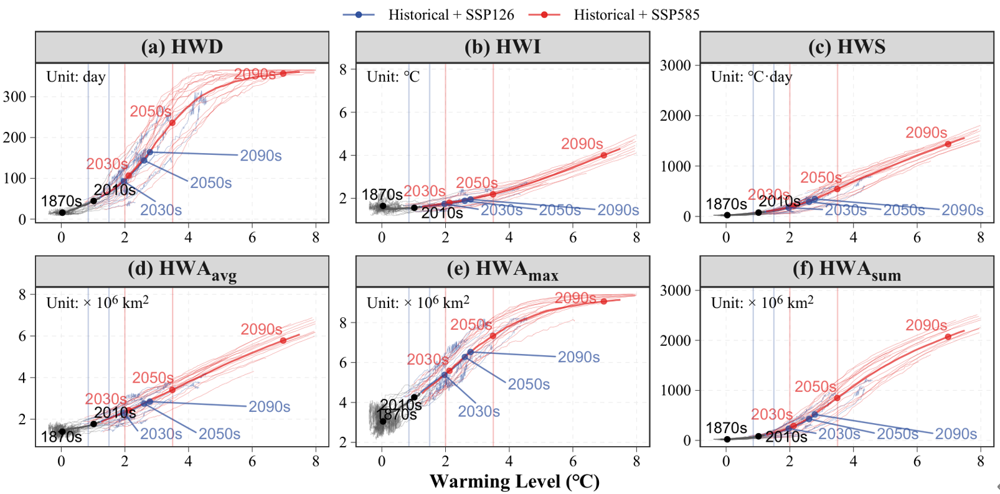

$HWD$: 持续天数；$HWI$: 热浪强度
$HWS$: 热浪严重程度；$HWA$: 热浪面积

---

## 2.2. 寒潮

丁一汇院士：气候变暖，寒潮为何变多？
 

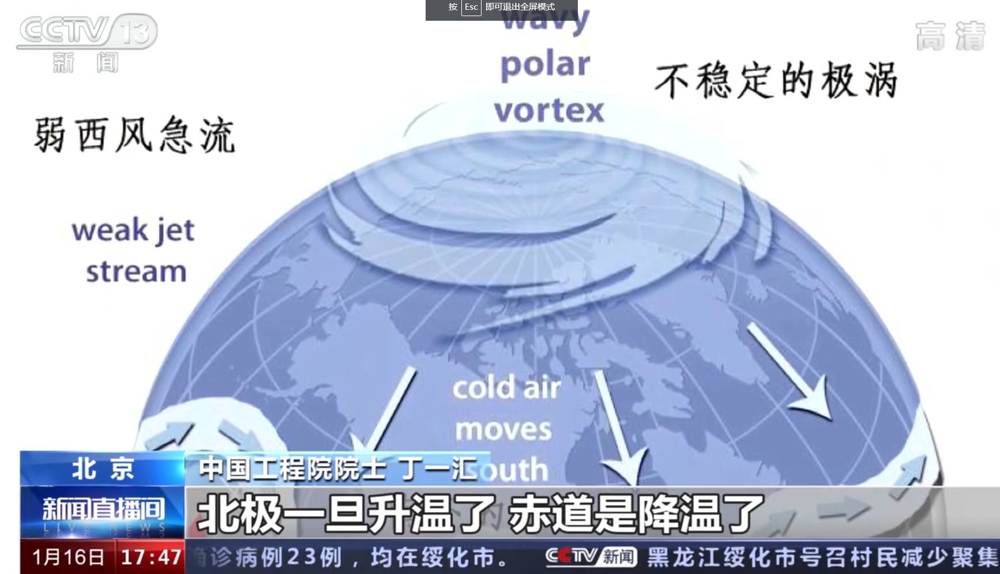

:::footnote
<https://www.bilibili.com/video/BV1no4y1o7ec>
:::

---

## 2.3. 极端降水与水资源分配

- 2021年7月河南暴雨洪水、2021年10月山西暴雨洪水
  
- 2023年7月底，京津冀暴雨洪水
  > 视频：<u>*北戴河实习*</u>

:::footnote
<https://www.sxxz.gov.cn/zwyw/szfyw/202110/t20211013_3689940.shtml>
:::

--- 

<h4>施雅风院士20年前的神语言：西北地区湿化</h4>

<table>
<th>施雅风2002</th>
<th>IPCC6 2022</th>
<tr></tr>
<tr><td>

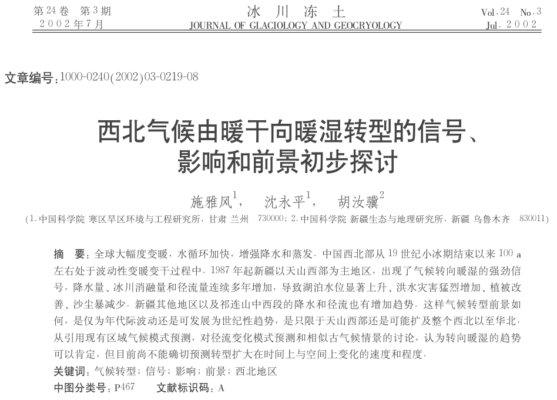
</td><td>

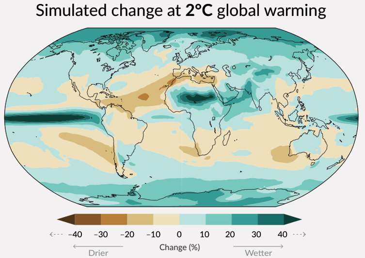
</td></tr></table>

> 在中国东部持续数十年的“南涝北旱”降水格局可能正在静悄悄发生逆转。

<!-- <https://leafmap.org/notebooks/80_solar/> -->

---

## 2.4. 极端洪旱

- 2019年长江流域伏秋连旱

- 2020年长江5场大洪水

- 2022年百年一遇的特大干旱、鄱阳湖大草原

- 2023年，7-9连续三个月全球升温幅度超1.5°

- 2023年利比亚洪灾，至9月19日洪灾已造成3958人死亡、9000多人失踪
  > 观看视频: <https://www.163.com/dy/article/IEIBCNA70521Q1HR.html>

---

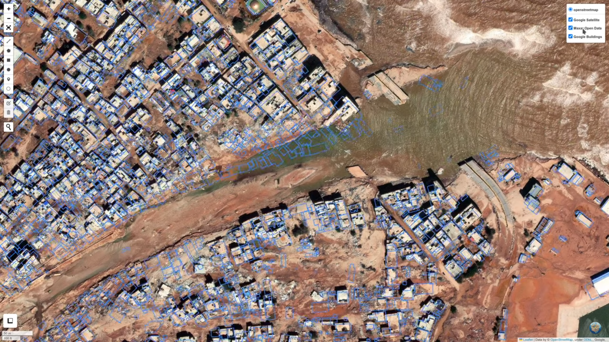

<https://www.youtube.com/watch?v=mDjrJQ338VY>

---

<https://www.youtube.com/watch?v=mDjrJQ338VY>
