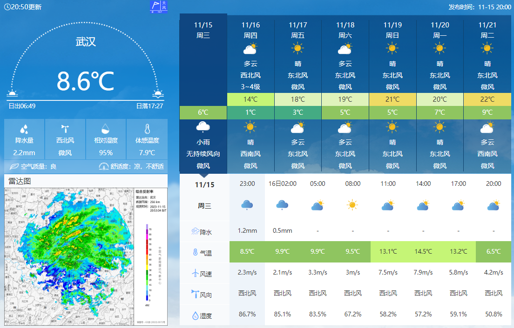
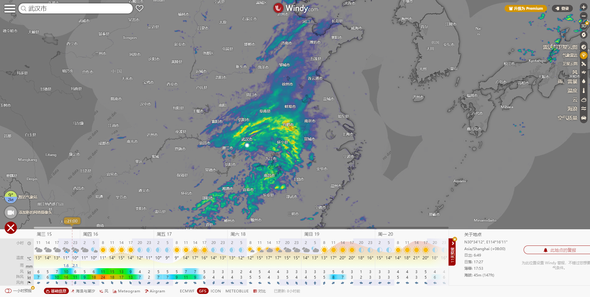
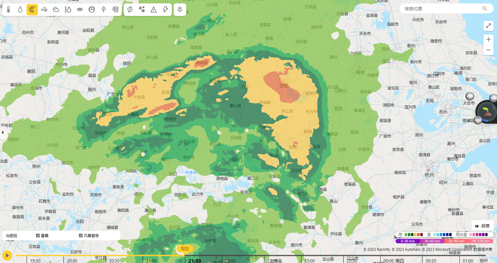
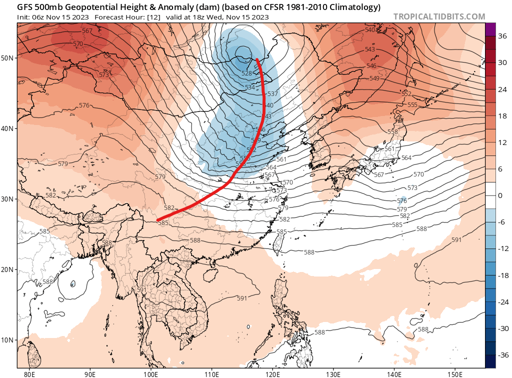
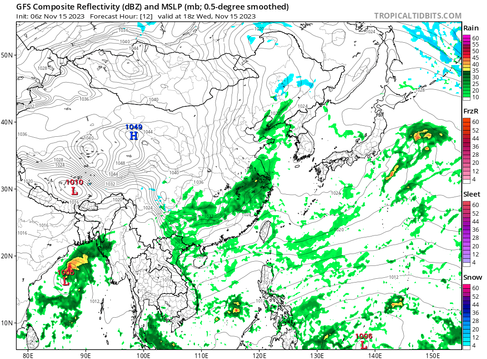
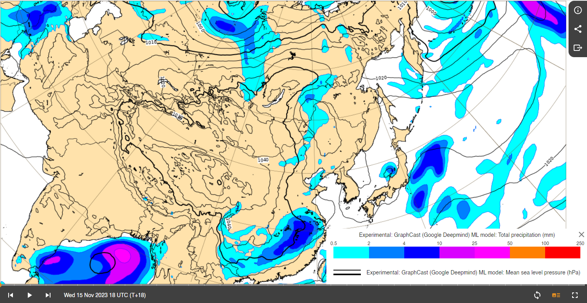

<h1>ch01_补充_天气学网站</h1>

      

<h4>References</h4>

> 知乎，“求助，哪里可以找到某个城市过去最近几天的天气图？”，<https://www.zhihu.com/question/63785418/answer/2687416982>

---

## 1. Easterlywave

<https://www.easterlywave.com>

---

## 2. 中央气象台

<http://www.nmc.cn/publish/forecast/AHB/wuhan.html>

<http://www.nmc.cn/publish/observations/hourly-precipitation.html>

---

## 3. windy

<https://www.windy.com/30.570/114.270?gfs,950h,temp,31.513,112.939,6>

---

## 4. 微软天气

<https://www.msn.cn/zh-cn/weather/maps/radar>

---

## 5. tropicaltidbits

- 降水：<https://www.tropicaltidbits.com/analysis/models/?model=gfs&region=ea&pkg=ref_frzn&runtime=2023111506&fh=12>

- 位势高度： <https://www.tropicaltidbits.com/analysis/models/?model=gfs&region=ea&pkg=z500a&runtime=2023111506&fh=12>

---

---

---

## 6. 祖师爷：ECMWF

- <https://charts.ecmwf.int/>

- 24h累积降水：<https://charts.ecmwf.int/products/graphcast_medium-rain-acc?base_time=202311150000&projection=opencharts_eastern_asia&valid_time=202311160000>

---

---

