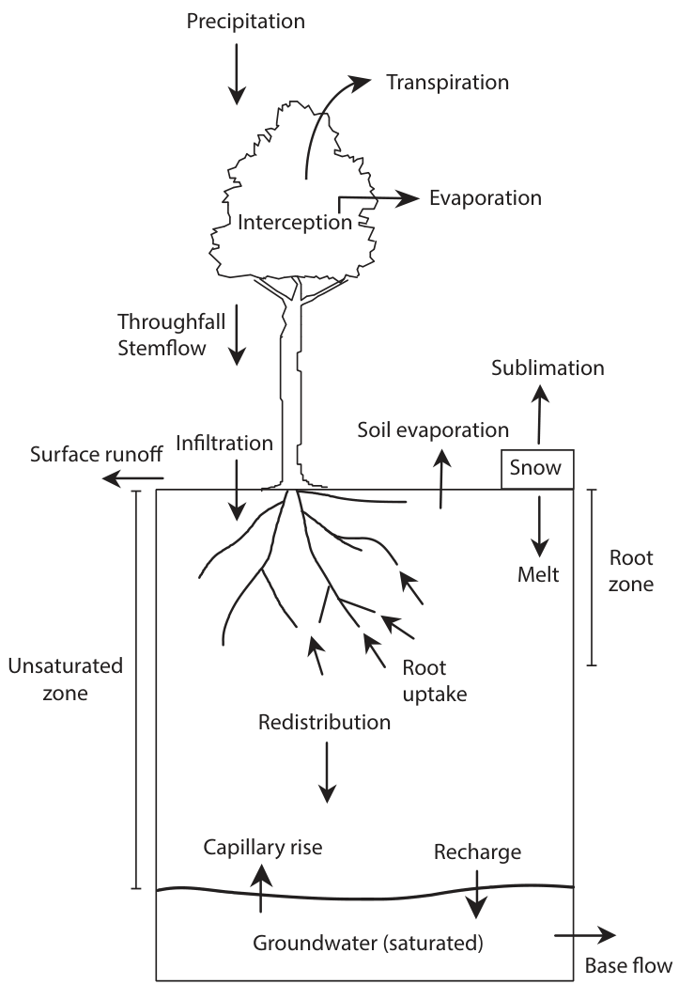

<!-- # 4. 基本的水文要素 -->

## 4.1. 流域

- 定义：由分水线所包围的闭合集水区。

   > 分水线：分水线两侧水流流向不同。在山区分数线是<u>山脊线</u>，在平原则常以<u>堤防</u>或<u>岗地</u>为分水线。

  

<!--    -->

---

__两个重要属性：__

- 集水面积：哪些区域的降水会从该河道流出？
   > 如何确定流域面积？<u>数字高程</u>+水往低处流。

- 汇流时间（上下游滞后时间）：多久降水会从流域出口点流出？

---

  

---

### 4.1.1. 水文站点与气象站点的不同之处

__水文站__：代表的__其控制面积（流域）__上的水资源量

__气象站__：代表的是__气象站周围__的气象要素

<!--   -->

  

---

## 4.2. 水文循环四要素和水量平衡

1. **降水**
2. **蒸散发**
3. **径流**
4. **储水量**（土壤含水量 + 地下水）

$$
P - E - R = \Delta S
$$

 

上式 __忽略的因素__：人类活动的影响

- 水利工程调节（大坝、水库、南水北调）

- 人类生活用水、工业用水、灌溉用水

---

### 4.2.1. 不可忽略的人类活动影响

<h3>示例：</h3>
<h4>2022年水文干旱多极端？</h4>

> 今年干旱有多极端？重现期如何？
>
> 三峡修建之后，宜昌站水位降低。这个因素如何考虑？

 

<http://113.57.190.228:8001/#!/web/Report/RiverReport>

<!--    -->

---

### 4.2.2. 流量测量的不确定性

      
      

  

  

---

### 4.2.3. 蒸散发测量的不确定性

#### 4.2.3.1. 实际蒸散发

ET (Evapotranspiration)：`Evaporation` + `Transpiration` + `Canopy Interception`

- 土壤蒸发（35%）

- 植被蒸腾（55%）

- 冠层截留蒸发（10%）

#### 4.2.3.2. 潜在蒸散发

- 潜在蒸散发：蒸发皿蒸发与陆地潜在蒸散发的区别

> **注意实际蒸散法与潜在蒸散发的区别**

---

### 4.2.4. 储水量的不确定性

- 站点观测：10cm, 30cm, 70cm, 100cm？（观测困难、点到面的转换不确定）

- 卫星：GRACE重力卫星观测，2°×2°大网格 
