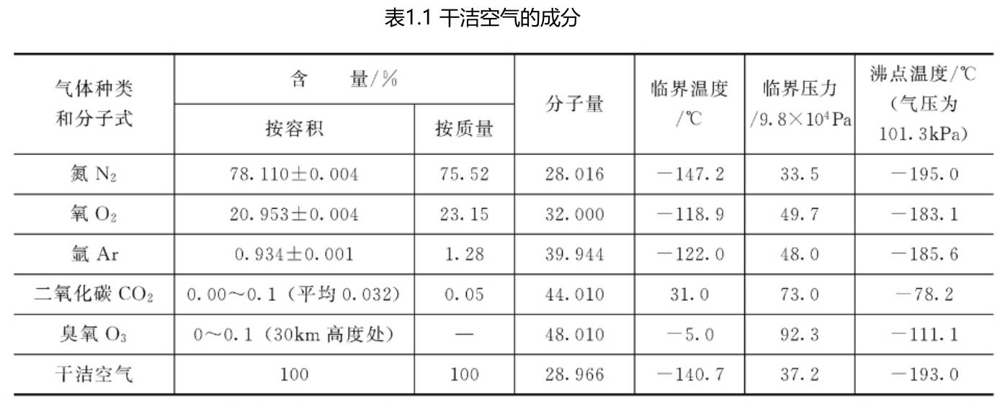
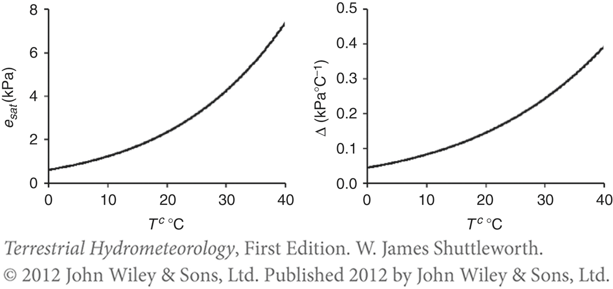

# 1. 大气的基本特征

## 1.1. 大气的成分

### 1.1.1. 干空气

### 1.1.2. 水汽

水汽是唯一能够发生相变的大气成分，常见的云、雾、雨、雪等天气现象，都是水汽相变的表现。

表1.4 各种温度和压强下的饱和比湿值

## 1.2. 大气的垂直结构

1. **对流层**

   对流层顶的气压约为200hPa。因此，==对流层的范围如果用气压表示，约为1000hPa~200hPa。==

   大气质量的3/4，水汽质量的9/10都在对流层。1.5～2km高度的水汽仅为地表的一半，5km高度的水汽是地表的1/10，再往上更少。

   （1）温度随高度的增加而降低。

   （2）对流运动明显。

   （3）气象要素分布不均匀。

   http://www.cctv.com/weather/right28.html

2. **平流层**

   对流层顶向上到50公里左右为平流层，平流层顶的气压**约1hPa**；

   飞机飞行的位置；

   温度随高度升高而升高。主要是由于臭氧的作用。臭氧吸收太阳紫外辐射，使大气温度增加。臭氧的分布决定了平流层温度的垂直分布。

3. **中间层**

4. **暖层**

5. **散逸层**

---

# 2. 大气状态方程

---

## 2.1. 气压

**气压**：气体对某一点施加的流体静力压强，来源是大气层中空气的重力，即为单位面积上的大气压力。
单位：帕斯卡，简称帕（Pa, 1 N/m2）。

在海平面的平均气压约为1013.25 hPa（76cm水银柱），这个值也被称为**标准大气压**（简称$1atm$）。

$$
p = \frac{F}{A} = \frac{mg}{A} = \frac{(m_d + m_w)g}{A}
$$

> $m_d$: 干空气的质量
> $m_w$: 水汽的质量

通常所说的气压$p$，包含了干空气的气压和水汽的气压。

- 水汽的气压一般用符号$e$表示
- 干空气的气压为：$p - e$

---

### 2.1.1. 饱和水气压

**饱和水汽压**：指一定体积空气，在某一温度条件下所能容纳的<u>最大水汽量所具有的压力</u>，用$es$表示。

<u>**饱和水汽压随温度升高而增大，随温度降低而减小。**</u>

**应用：**

1. 气体的上升运动
   > 温度下降，$es$下降，$RH$升高，易降水，对应着云雨；（<u>低压系统</u>）

2. 气体的下沉运动
   > 温度升高，$es$上升，$RH$降低，不易降水，对应高温干旱；（<u>低压系统</u>）

3. 迎风坡、背风坡
   > 迎风坡降水（同时水汽从气态转化为液态，释放热量，背风坡气体温度偏高）
   
4. 早晨露水

5. 全球变暖背景下的极端事件
   

---

$$
es(T_a) = 0.6108 \;exp (\frac{17.27 T_a}{T + 237.3})
$$

> $es(T_a)$：饱和水气压，kPa
>
> $T_a$：空气温度，℃
>
> $\Delta$：$es(T_a)$的斜率

**Reference**

> Allen, R., Pereira, L., Raes, D., & Smith, M. (1998). Crop evapotranspiration guidelines for computing crop requirements. FAO Irrig. Drain. Report modeling and application. *J. Hydrol.*, *285*, 19–40.

---

## 2.2. 大气状态方程

根据大量的科学实验总结出，一切气体在压强不太大，温度不太低（远离绝对零度）的条件下，**一定质量气体**的压强和体积的乘积除以其绝对温度等于常数，即:

$$
\frac{p_1 V_1}{T_1} = \frac{p_2 V_2}{T_2} = ... = \frac{p_n V_n}{T_n} \\
\frac{p V}{T} = 常量
$$

$$
p V = n R^* T
$$

> $p$：气压($Pa$)
$V$：体积($m^3$)
$n$：气体物质的量($mol$)
$T$：温度($K$)
$R^*$：<u>理想气体常数（也被称为普适气体常数）</u>(J mol-1K-1 ) 

**根据高中化学**，标准状态下(273K,1atm) ，1mol气体的体积为22.4L，带入上述公式，可得：

$$
\begin{align}
R^* &= \frac{p V}{n T} \\
&= \frac{1.013 × 10^5 Pa × 22.4× 10^{-3} m^3 }{1mol × 273K} \\
&= 8.31 Pa·m^3 / (mol·K) = 8.31 J / (mol·K)
\end{align}
$$

$$

$$

---

## 2.3. 理想气体状态方程的密度形式

$$
p V = \frac{m}{M} R^* T \\
p = \rho \frac{R^*}{M} T \\
p = \rho R T, (R = \frac{R^*}{M}) \\
% p \alpha =R T
$$

> $M$：相对分子质量（g / mol）；
> $m$：气体的质量 （g）；
> $R$: 为比气体常数（$J · g^{-1}K^{-1}$），$R=R^*/M$；
> $R$：$R^*$为摩尔气体常数，$R^*=8.314 J · mol ^{-1}K^{-1}$。

干空气与水汽的相对分子质量，分别用符号$R_d$和$R_w$来表示（下标$_d$表示dry，$_w$表示water）。

根据高中化学可知，$M_d = 28.97 g/mol, M_w = 18 g/mol$。带入上述公式，可得

- 对于干空气，$R_d = R^* / M_d = 8.314 / 28.97 = 0.287\;(J ·g^{-1}K^{-1})$
  
- 对于水汽，$R_w = R^* / M_w = 8.314 / 18 = 0.4615 \;(J ·g^{-1}K^{-1}) $
  $$
  \epsilon = \frac{R_d}{R_w} = \frac{M_w}{M_d} ≈ 0.622 \\
  \frac{R_w}{R_d} = \frac{1}{\epsilon} ≈ 1.608
  $$

## 2.4. 空气密度与虚温

$$
\rho_d = \frac{p - e}{R_d T} \\
\rho_w = \frac{e}{R_w T} \\
$$

$$
\begin{align}
\rho &= \rho_d + \rho_w \\
     &= \frac{p - e}{R_d T} + \frac{e}{R_w T}
\end{align}
$$

把$R_w$替换掉（$R_w = \frac{1}{\epsilon} R_d$）

$$
\begin{align}
\rho &= \frac{p - e}{R_d T} + \frac{e}{R_w T} \\
     &= \frac{p - e}{R_d T} + \frac{\epsilon e}{R_d T} \\
     &= \frac{p - (1 - \epsilon)e }{R_d T} \\
     &= \frac{p}{R_d T} (1 - 0.378 \frac{ e }{p})
\end{align}
$$

> $p$：湿空气的总压强；
$e$：水汽部分的压强（即前述的水汽压）；
$p-e$： 干空气的压强；

---

### 2.4.1. 虚温

**虚温($T_v$)**：<u>与湿空气同气压、同密度情况下，干空气对应的温度。</u>
$$
\rho = \frac{p}{R_d T} (1 - 0.378 \frac{e }{p}) \\
   ≈ \frac{p}{R_d T (1 + 0.378 \frac{e}{p})}  \\
$$

$$
p = \rho R_d T (1 + 0.378 \frac{ e }{p})
$$

则$T_v$:
$$
T_v = T (1 + 0.378 \frac{e }{p})
$$

**虚温的意义：**将混合气体的$R$转变为$R_d$，将水汽<u>和干空气的混</u>合转变为<u>干空气</u>。

==后续在位势高度的含义中会有应用==。

---

# 3. 基本气象要素

---

## 3.1. 风速与风羽

气象场观测的一般是$U_2$

---

## 3.2. 水汽含量与湿度

比湿（specific humidity, $q$）

绝对湿度（水汽密度, $X$）

相对湿度（relative humidity, $RH$）

---

### 3.2.1. 水的相态

1. **气化潜热**：单位质量的液体，从液态变为气态所需吸收的热量。

   $$
   \lambda = 2.5 - 0.0024 T_a, (MJ/kg)
   $$

   **单位的转化（重点）**

   > Q1: 地表单位面积上，$1mm$深的水，气化所需的能量？

   > Q2: 假设地表净辐射$R_n$为$100 W/m^2$，能量全部转化为蒸发，一天的蒸发量是多少？

2. 升华潜热，单位质量的液体，从固态变为气态所需吸收的热量。
   冰面温度−40℃ ~ 0℃时，升华潜热近似为常数。

$$
\lambda_s = 2.5 + 0.334, (MJ/kg)
$$

---

## 3.3. 温度

干球温度、湿球温度、露点温度

降水

---

# 4. 基本的水文要素

