<!-- page_number: true -->

<h1>水文气象学–03位势高度与气压场</h1>

<br>

> 葛朝霞等，__气象学与气候学教程__，中国水利水电出版社（第2版）
>
> - 1.4. 大气静力学方程及其应用
>
> - 1.5.2 气压与气压场
> 
> - 4.1. 作用在气块上的力
> 
> - 4.4. 自由大气中的风
> 
> - 4.5 热成风

<br>

孔冬冬，__kongdongdong@cug.edu.cn__

办公室：环境学院416

中国地质大学大气科学系 · 武汉

---
<style scoped>
/* h2 { color: black;} */
</style>

<h2>QA</h2>

> 假设A、B两点，分别是冷空气和暖空气，地表气压相同

1. <span style='color:blue'>冷空气</span>、<span style='color:red'>暖空气</span>，哪个气压下降快？

2. 这意味着什么？

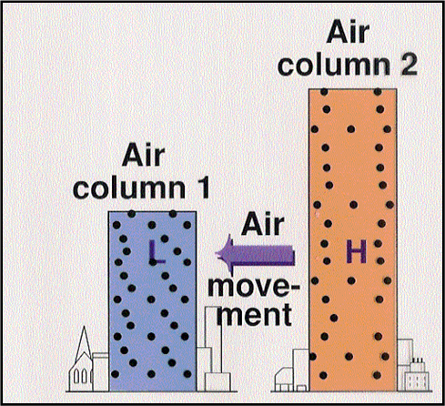  

---

# 1. 位势高度<span style='color:red'>（重点）</span>


定义：单位质量物体从海平面移动到$z$高度处所做的功$\Phi$，称为**重力位势**（简称位势$\Phi$）；__位势高度__$H=\Phi/g_0$，其中：
<br>

$$
\Phi = \sum_{0}^{z}{g_\phi dZ}
$$

- $g_0$: 重力加速度<span style='color:red'>__常数__</span>，$g_0=9.80665 J/kg$，<u>**不随**</u>纬度、垂直高度的变化而变化

- $g_\phi$: 物理学中的重力加速度，<u>**随**</u>纬度、垂直高度的变化而变化

<br>

---

## 1.1. 位势高度$H$与几何高度$Z$的差别

位势高度近似等于几何高度。**不同之处在于：**

- 位势高度$H=\Phi/g_0$，$g_0$为常数；
  
- 几何高度$Z=\Phi/g$，$g$随纬度、垂直高度的变化而变化。

> 位势高度不再考虑重力加速度随<u>**纬度**</u>与<u>**高度**</u>的变化。

<br>

**H和Z的换算**
$$
H = \frac{1}{g_0}\sum_{0}^{z}{g_\phi dZ}, ~~
g_0 dH = g_\phi dZ, ~~(g_\phi: 纬度\phi处的重力加速度，也写作g)
$$

从上式可以看出，位势高度$H$仅和$\phi$和$Z$相关，<span style='color:red'><u>和质量无关</u></span>。

<span style='color:red'>根据上面的定义，你能想象出位势高度和温度之间的关系吗？</span>

---

## 1.2. 位势高度的使用


- __等压面对应的位势高度、位势高度距平__：如500hPa位势高度、500hPa位势高度距平；
  
- **位势高度厚度**：如1000hPa-500hPa位势高度厚度

---

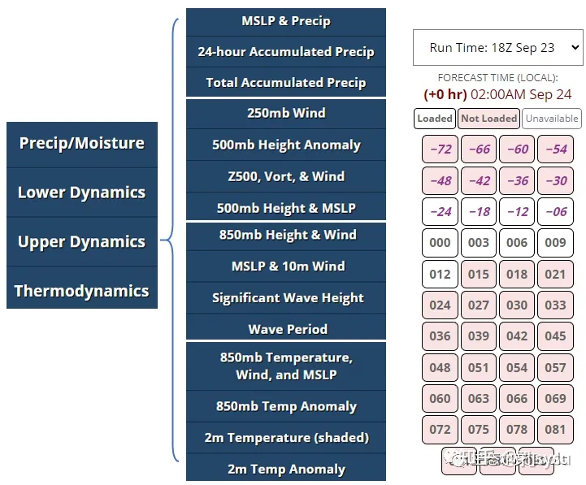  

- 知乎，如何找天气图，<https://www.zhihu.com/question/63785418/answer/2687416982>

- tropicaltidbits，<https://www.tropicaltidbits.com/analysis/models/?model=ecmwf&region=ea&pkg=z500a>


---

# 2. 位势高度的应用

1. 气压高低
    > <u>*位势高度*</u>高（低）意味着同一平面上该点的气压也偏高（低）

2. 大气层平均虚温；
    > 根据压高公式，<u>*位势高度厚度*</u>与虚温$T_v$正相关

3. 风向（平行于等高线）；
    > 气压梯度力和科氏力的影响下，风向平行于<u>*等位势高度线*</u>；摩擦力影响下，逆时针偏转15°~30°

4. 环流形式与天气系统
    > 环流形式，如高低压系统（气旋、反气旋）、槽脊（槽前脊后阴雨）；
    > 天气系统，如副高、南亚高压、阻塞高压、切断低压、冷涡

5. 辐合辐散

---

## 2.1. 位势高度与气压高低

- 气压场：空间点气压组成的场。
  
- 等压面：3维空间中，气压相同的平面。
   > <span style='color:red;background-color:yellow'>通常用位势高度来表示</span>，如500hPa的位势高度空间分布。

- 等高线：2维空间中，等压面上的等位势高度线。

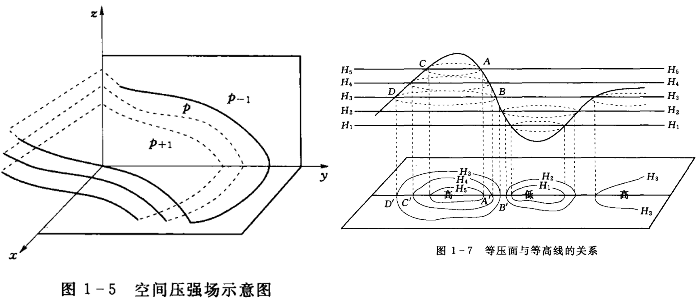  

<!-- 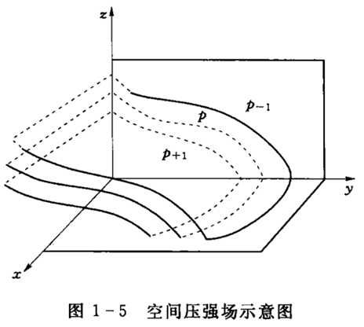   -->

<!-- 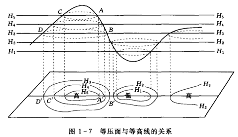   -->

---

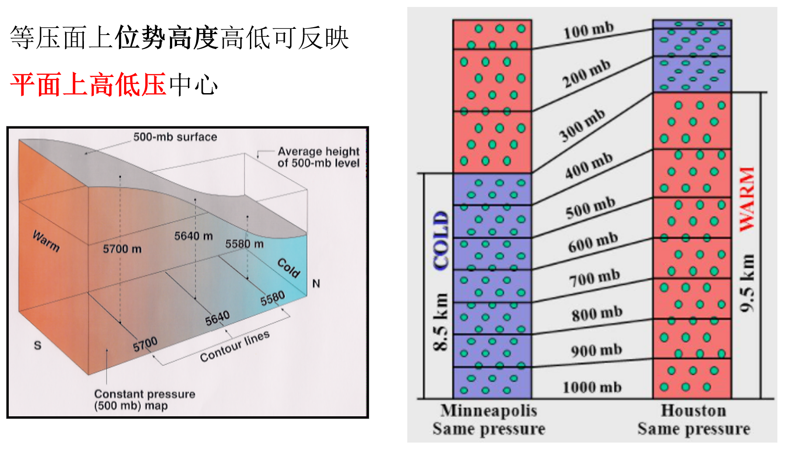  

---

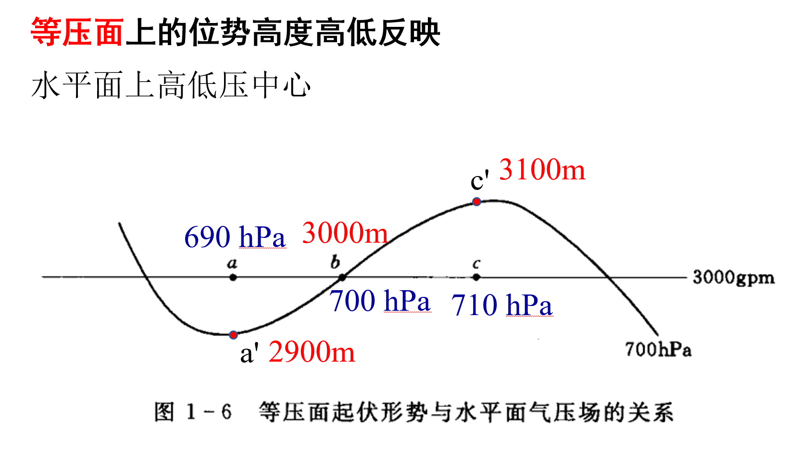  

---

<h3>14 Nov, 2022</h3>

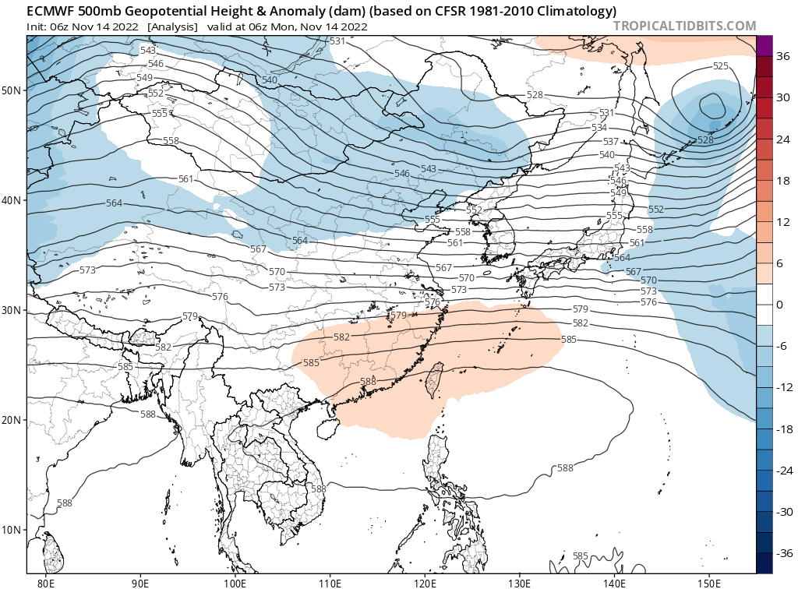  

<https://www.tropicaltidbits.com/analysis/models/?model=ecmwf&region=ea&pkg=z500a&runtime=2021112112&fh=24>

---


## 2.2. 位势高度与大气层平均虚温


### 2.2.1. 回顾

1. 液体的压力（高中）：
$$
P = \rho g h
$$

2. 理想气体状态方程
$$
\begin{align*}
pV &= nR^*T \\
p &= \rho R T \\
%  &= \rho R_d T_v \\
\end{align*}
$$

---

### 2.2.2. 虚温

**虚温($T_v$)**：<u>与湿空气同气压、同密度情况下，干空气对应的温度。</u>

__虚温的意义__：将混合气体的$R$转变为$R_d$，将水汽<u>和干空气的混</u>合转变为<u>干空气</u>。

$$
\begin{align*}
\rho &= \frac{p - e}{R_d T} + \frac{e}{R_v T} \\
     &= \frac{p - e}{R_d T} + \frac{\epsilon e}{R_d T} \\
     &= \frac{p - (1 - \epsilon)e }{R_d T} = \frac{p}{R_d T} (1 - 0.378 \frac{ e }{p}) \\
     &≈ \frac{p}{R_d T (1 + 0.378 \frac{ e }{p})}
\end{align*}
$$

则$T_v$:
$$
T_v = T (1 + 0.378 \frac{e }{p})
$$


---


### 2.2.3. 单位压强高度差

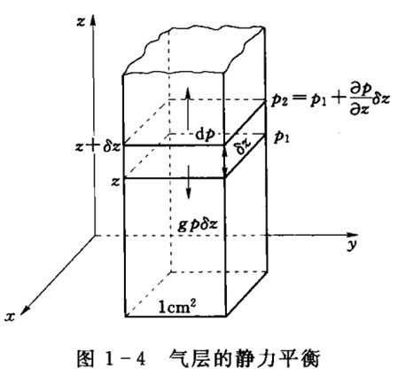  

<h4>大气静力平衡</h4>

(1) **气压**
$p_1$ -> $p_2$：$p_2 = p_1 + \frac{\partial p}{\partial z} \delta z$
<br>

(2) **重力**

厚度为$\delta z$的小气柱受到的重力：$G = -\rho g \delta z$，方向垂直向下。

<br>

二者作用下，气体平衡状态时：

$$
-\rho g \delta z = \frac{\partial p}{\partial z} \delta z, \\
g = - \frac{1}{\rho} \frac{\partial p}{\partial z} \\
$$

微分形式：<span style='background-color:yellow'>$dp = - \rho g dz = - \rho g_0 dH$</span>

---

<h4>单位压强高度差</h4>

<!-- Global style -->
<style>
.katex {
  font-size: 30px;
  line-height: 0.85 !important;
}
</style>

> 单位压强高度差（$h = - \frac{dz}{dp}$），气压下降1单位，z变化多少？

$$
dp = - \rho g dz = - \rho g_0 dH \\
% g = -\frac{1}{\rho}\frac{dp}{dz}
$$

$$
\frac{dp}{dz} = - \rho g = -\frac{g~ p}{R_d T_v}
$$

$$h = -\frac{dz}{dp} = \frac{R_d T_v}{g ~ p}$$

将$g = 980.6 cm /s^2$, $R_d = 0.287 J / (g·K)$带入，并将$T_v$从$K°$换为$C°$，公式变为：

$$
h ≈ \frac{8000}{p}(1+t/273), (m/hPa)
$$

   - $t$：以$C°$为单位的虚温

   > 该式反映的是瞬时状态，是某一压强和温度下，气压的<u><span style='color:red'>瞬时变化速度</span></u>

:::block
1. 温度高，则$h$大，气压下降慢；温度低，则气压下降快
2. 气压高，则$h$小，气压下降快；气压低，则气压下降慢
:::

---

### 2.2.4. 压高公式

> 为获得整层气柱中气压与高度之间的精确关系，采用积分进行求解

$$
\frac{dp}{dz} = - \rho g = -\frac{g~ p}{R_d T_v}, \\
dp / p = -\frac{g~ dz}{R_d T_v}
$$

从$p_1$ -> $p_2$过程，对上式进行积分求解:

$$
\begin{align*}
\int_{p1}^{p2} dp / p &= \int_{z_1}^{z_2}-\frac{g dz}{R_d T_v} \\

ln\frac{p_2}{p_1} &= -\frac{g (z_2 - z_1)}{R_d \overline{T_v}} \\

\Delta z = z_2 - z_1 &= \frac{R_d \overline{T_v}}{g} ln\frac{p_1}{p_2}
\end{align*}
$$

把各个常数带入上述公式，可得：
$$
\Delta z = z_2 - z_1 = 18400 (1 + \frac{\overline{T_v}}{273}) lg \frac{p_1}{p_2}
$$

---

$$
\Delta z = z_2 - z_1 = \frac{R_d \overline{T_v}}{g} ln\frac{p_1}{p_2}
$$

$$
\Delta z = z_2 - z_1 = 18400 (1 + \frac{\overline{T_v}}{273}) lg \frac{p_1}{p_2}
$$

> __应用：__
>
> 1. 飞机测高度
> 2. 气象站点，推算海平面气压
> 3. 推求平均温度

---

<https://www.zhihu.com/question/274531051>

  

---

<h3>实战</h3>


已知$p_1$ = 1000hPa，$p_2$ = 500hPa，$z_1$ = 0，$z_2$ = 5400，求$T_v$

> $$
> \Delta z = z_2 - z_1 = 18400 (1 + \frac{\overline{T_v}}{273}) lg \frac{p_1}{p_2} \\
> \overline{T_v} = 273 (\frac{z_2 - z_1}{18400 lg(p_1 / p_2)} - 1)
> $$

```R
z1 = 0   ; p1 = 1000 # hPa
z2 = 5400; p2 =  500 # hPa

cal_Tv <-function(z2) {
  Rd = 8.31 / 28.97* 1e3 # J/(Kg * K)
  g = 9.81 # m/s^20
  (z2 - z1) / log(p1/p2) * g / Rd - 273.15
}
cal_Tv2 <- function(z2) {
  ((z2 - z1) / 18400 / log10(p1/p2) - 1) * 273
}

cal_Tv(5100) # -21.52
cal_Tv(5400) #  -6.85
cal_Tv(5700) #   8.08
```

<!-- # 温度每升高100m，下降0.6℃
cal_Tv2(5100)
cal_Tv2(5400)
cal_Tv2(5700) -->

---

### 2.2.5. 位势高度厚度

把$g$换为$g_0$（$g dZ = g_0 dH$）即可得到：

$$
\Delta z = z_2 - z_1 = \frac{R_d \overline{T_v}}{g} ln\frac{p_1}{p_2},\\
\Delta H = H_2 - H_1 = \frac{R_d \overline{T_v}}{g_0} ln\frac{p_1}{p_2}
$$

> 此公式可以反映<span style='background-color:yellow'>位势高度厚度</span>的含义，$\Delta H$反映了$H_1$~$H_2$范围内气柱的平均虚温。

__1000hPa~500hPa位势高度厚度__

1. ≤5,100: 北极气团（ arctic air ）

2. ≥5,700: 热带气团（ tropical air ）

3. 5,400: 极地气团（ polar air ）与中纬度气团（ mid-latitude air ）的分界线；也是雨、雪的分界线。

<https://www.weather.gov/source/zhu/ZHU_Training_Page/Miscellaneous/Heights_Thicknesses/thickness_temperature.htm>

---

<h3>推论：</h3>

$$
\Delta H = H_2 - H_1 = \frac{R_d \overline{T_v}}{g_0} ln\frac{p_1}{p_2}
$$

- 位势高度距平偏高：大气层平均虚温$T_v$偏高
   <br>
  > 因此，通过看位势高度距平，可以得出空间上哪些地区温度偏高（<span style='color:red'><u>热浪</u></span>）、哪些地区温度偏低（<span style='color:blue'><u>寒潮</u></span>）。

---

<h3>22 Nov, 2021</h3>

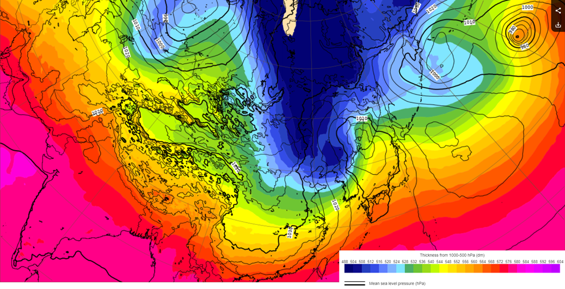  

<https://charts.ecmwf.int/products/medium-thickness-mslp?base_time=202211130000&projection=opencharts_eastern_asia&valid_time=202211150600>

---


## 2.3. 位势高度与风向

### 2.3.1. 作用在气块上的力

#### 2.3.1.1. 气压梯度力 (pressure gradient force, PGF)

   > 由高压指向低压，等压线约密集，PGF越大。

$$
\begin{align*}
PGF &= - \frac{1}{\rho} \nabla p \\
    &= - \frac{1}{\rho} (
            \frac{\partial p}{\partial x} i +
            \frac{\partial p}{\partial y} j +
            \frac{\partial p}{\partial z} k)
\end{align*}
$$

- 水平方向的分量

$$
\begin{align*}
PGF_h &= - \frac{1}{\rho} \nabla_h p = - \frac{1}{\rho} (
            \frac{\partial p}{\partial x} i +
            \frac{\partial p}{\partial y} j)
\end{align*}
$$

  


> **延伸：** <span style='color:red;background-color:yellow'>1. 大风产生的原因; 2. 急流</span>

---

#### 2.3.1.2. 科氏力 (Coriolis Force, CF)


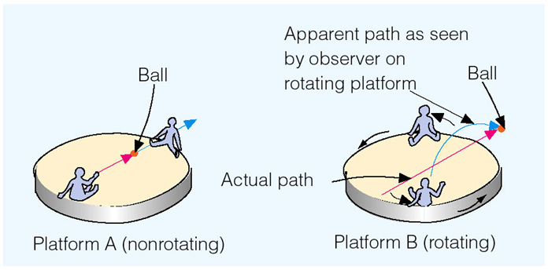  

---

#### 2.3.1.3. 科氏力 (Coriolis Force, CF)
   > 由于地球自转，所形成的一种虚假的力（<span style='color:red;background-color:yellow'>可以充当向心力</span>）。
   > 垂直于$v$，北半球向右；南半球向左。

$$
\begin{align*}
CF_h &= 2 \Omega v sin \phi \boldsymbol{i} - 2 \Omega u sin \phi \boldsymbol{j} \\
     &= 2 \Omega sin \phi(v \boldsymbol{i} - u \boldsymbol{j})\\
     &= -f \boldsymbol{k} × V_h, (f = 2 \Omega sin \phi)
\end{align*}
$$

- $\Omega$: 地球自转的角速度
- $\phi$: 纬度
- $V_h$: 水平方向风速

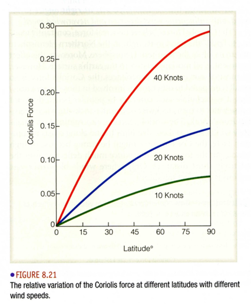  

--- 

#### 2.3.1.4. 摩擦力

摩擦力的作用，使原本的风向，逆时针偏转15°~30°左右。(<u>章节 4.6</u>)

<br>

- 导致高低压中心发生辐散、辐合；

   > 没有摩擦力，台风可能就不会产生降水；

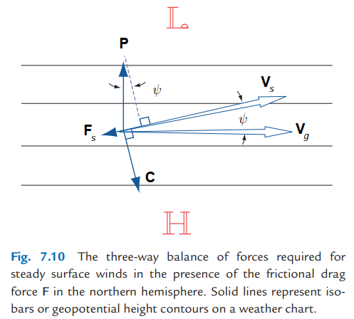  

--- 

#### 2.3.1.5. 惯性离心力


- 与科氏力一样，是<span style='color:red;background-color:yellow'>虚假的力。</span>

- 由气压梯度力、或科氏力，提供向心力，<span style='background-color:yellow'>向心力=离心力</span>，方能维持稳定的圆周运动

$$
C = \frac{V^2}{r}
$$

> 槽脊辐合辐散会用到。

  

---

### 2.3.2. 风

#### 2.3.2.1. 地转风

水平<u>气压梯度力</u>PGF和<u>科氏力CF</u>二者受力均衡，平衡状态下所形成的风。

<br>

<span style='color:red'>__重点：__</span>

- 风向平行于等压线；
  
- 背风而立，__高压在右、低压在左__（主要是科氏力右偏所影响）。

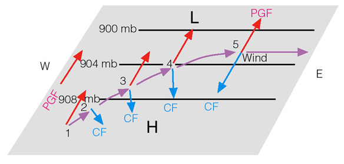  

---

#### 2.3.2.2. 梯度风

气体做圆周运动而形成的风。

<br>

**科氏力影响下：**

- 高压中心（反气旋）：顺时针转动

- 低压中心（气旋）：逆时针转动。

  

<span style='color:red; background-color:yellow'>**注意：南半球旋转方向刚好相反！**</span>

---

#### 2.3.2.3. 风向的作用

- 气温：冷平流 or 暖平流
  
- 水汽：陆地来的风 or 海洋来的风，水汽增加 or 减小？

<hr>

<h4>应用（重点/考点）：</h4>

- 已知等位势高度线，判断风向（从高压指向低压、右偏），高低压中心（顺时针、逆时针），对气温、水汽的影响；

- 已知风向，判断高低压中心。

---

## 2.4. 天气系统与环流型

> 这里我们先主要讲<u>环流型</u>

<style scoped>
p { margin: 0.4em 0em 0.2em 0em }
</style>

__等压面：__ 气压相等的面；

__等高线：__ 位势高度相等的点的连线；
<hr>

__槽脊__：槽前脊后阴雨，反之高温、干旱

__高压中心（反气旋）__：高空辐合、低空辐散，干旱

__低压中心（气旋）__：高空辐散、低空辐合，阴雨

---

### 2.4.1. 槽脊

- <span style='color:blue'>__低压槽（槽线）__</span>
  
   等高线中曲率最大的点的连线，开口指向低压中心。

- <span style='color:red'>**高压脊（脊线）**</span>

  等高线中曲率最大的点的连线，开口指向高压中心。

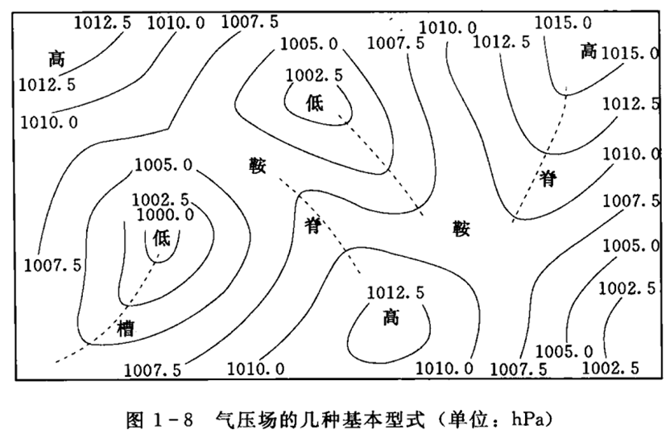  

---

### 2.4.2. 高低压中心

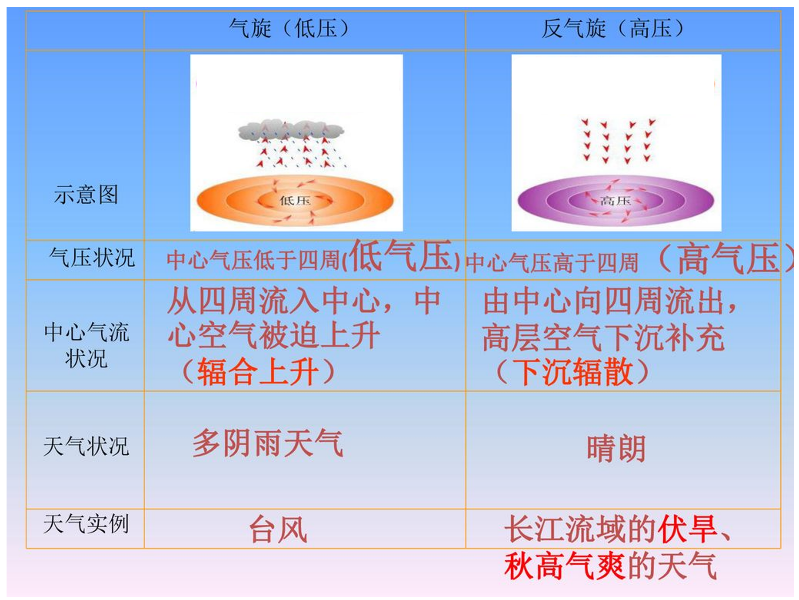  

---

## 2.5. 辐合、辐散

- __辐合(convergence)__：物质积累。有如下类型：
  - 相对而行的风场；
  - 风速从快到慢；
  - 气旋；逆时针转动，摩擦力影响，风向逆时针偏转30°左右，物质向内积累

  > 物质积累，则中心气压变高，有向上运动的趋势，向上运动则产生对流，有利于成云致雨。

  <!-- 、向上运动（对流） -->

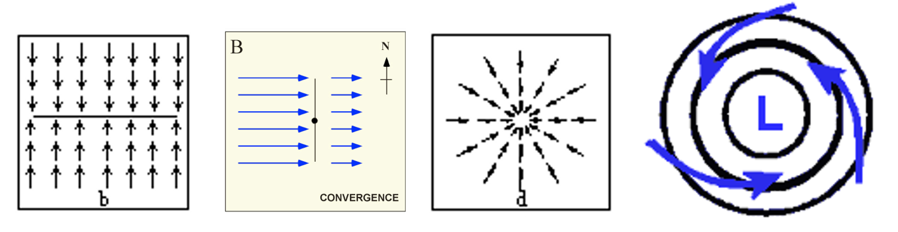  

---

- __辐散(divergence)__：物质丢失。有如下类型：
  - 相背而行的风场；
  - 风速从慢到快（物质丢失）
  - 反气旋；顺时针转动，摩擦力影响，风向逆时针偏转30°左右，物质向外流失
  
  > 物质丢失，则中心气压变低，有向下运动的趋势，空气向下运动不易降水

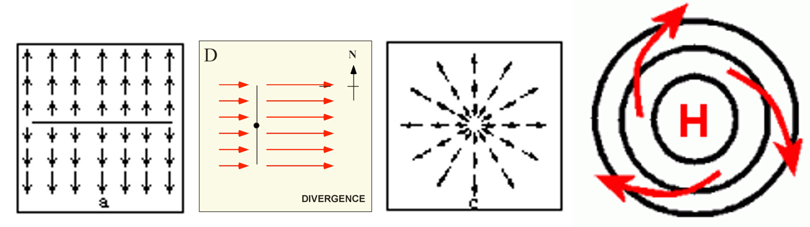  

  <!-- 、中心气压下降、向下运动 -->

---

### 2.5.1. 高空与地表的辐合、辐散

> <span style='color:red'>天之道，损有余而补不足</span>

- 地表辐合、高空辐散；
  
- 反之则，地表辐散、高空辐合。

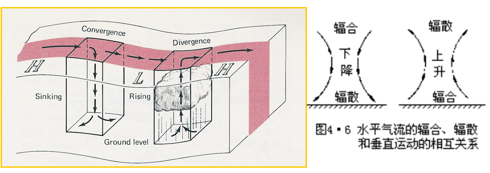  

---

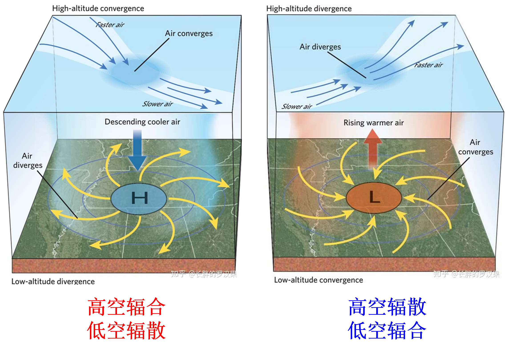  

---

### 2.5.2. 槽脊的辐合、辐散

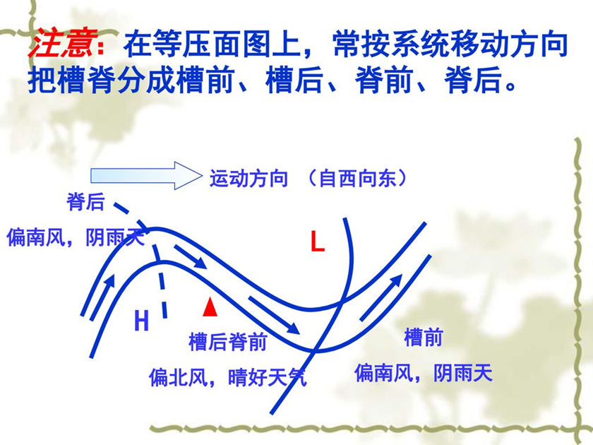  

---

<style scoped>
p { 
  margin: 0.4em 0em 0.4em 0em;
  font-size: 30px
}
</style>

- 高空槽前脊后：
  > 高空幅散、地表辐合，阴雨区。

<br>

- 高空槽后脊前：
  > 高空辐合、地表幅散，晴朗区。

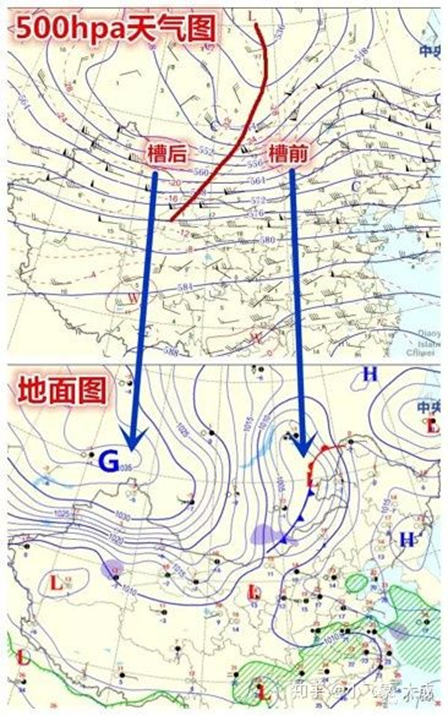  


---

<h4>原理：</h4>

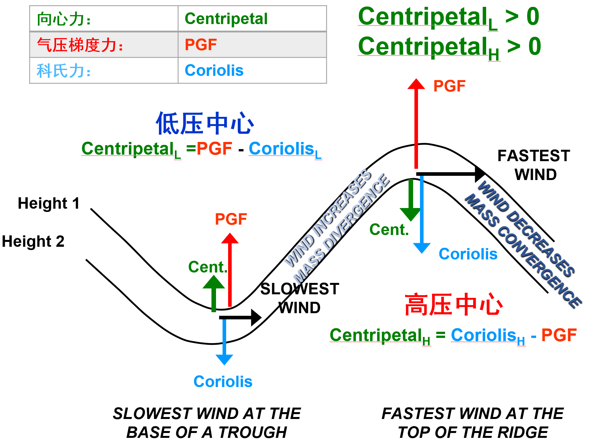  

---

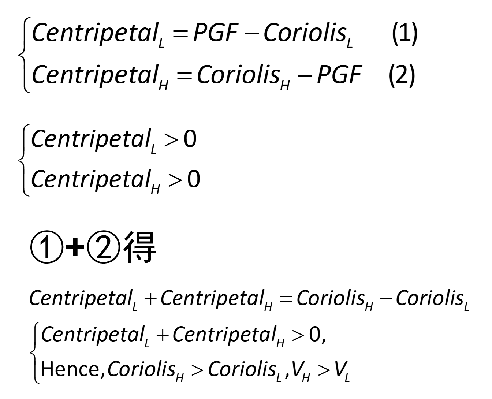  

--- 

### 2.5.3. 急流的辐合与辐散

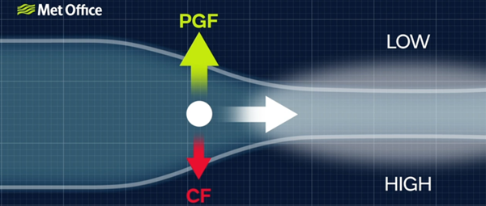  

<span style='color:red'>__结论：__</span><u>__入口的右侧、出口的左侧对应着阴雨__（左右是相对于前进方向）</u>

> 两条白线表示等位势高度线。根据风向，可以判断右边为高压。

<u>*Recall: 位势高度线密集的地方，风速大。风对气压梯度力的响应比对科氏力的响应快。*</u>

1. 进入急流入口之前，科氏力CF与气压梯度力PGF达到平衡；

2. 进入急流入口时，PGF骤增，物质右→左移动；

3. 因此，急流入口右侧物质丢失（辐散）、左侧物质积累（辐合）；

4. 高空辐散（地表辐合），有利于降水；反之则抑制。

---

<span style='color:red'>__结论：__</span><u>__入口的右侧、出口的左侧对应着阴雨__（左右是相对于前进方向）</u>
> 可用同样的方法分析急流的出口。

<span style='background-color:yellow'>学会判断急流的出口和入口。</span>

<br>

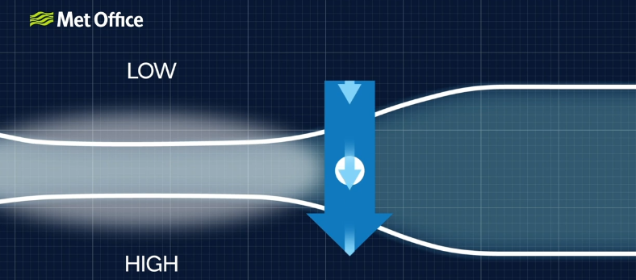  


---

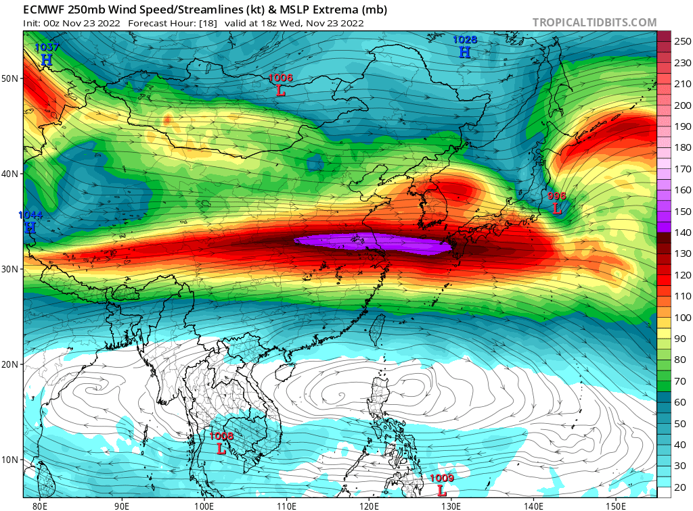  

---

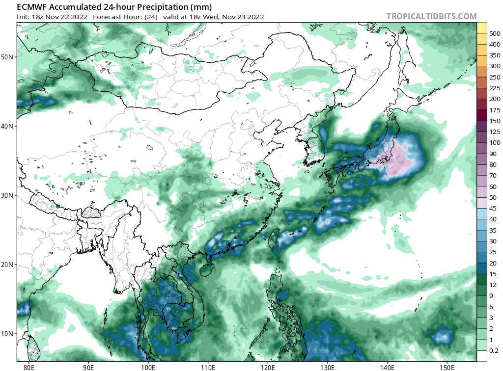  

---

# 3. 补充--风速的公式推导

- 地转风公式

- 热成风

---

## 3.1. 地转风 ($V_g$)

- 气压梯度力

$$
\begin{align*}
PGF_h & = - \frac{1}{\rho} (
            \frac{\partial p}{\partial x} i +
            \frac{\partial p}{\partial y} j)
        = - \frac{1}{\rho} \nabla_h p
\end{align*}
$$

- 科氏力

$$
\begin{align*}
CF_h &= 2 \Omega v sin \phi \boldsymbol{i} - 2 \Omega u sin \phi \boldsymbol{j} \\
     &= 2 \Omega sin \phi(v \boldsymbol{i} - u \boldsymbol{j})\\
     &= -f (v \boldsymbol{i} - u \boldsymbol{j}) 
     = -f \boldsymbol{k} × V_h, (f = 2 \Omega sin \phi)
\end{align*}
$$

可以得到

$$
\begin{align*}
- \frac{1}{\rho} \frac{\partial p}{\partial x} + fu = 0 \\
- \frac{1}{\rho} \frac{\partial p}{\partial y} - fv = 0
\end{align*}
$$

即：$V_g = V_h = -\frac{1}{f \rho} \nabla_h p  ×  \boldsymbol{k}$

---

- z坐标中（$t, x, y, z$）

$$
V_g = -\frac{1}{f \rho} \nabla_h p  ×  \boldsymbol{k}
$$

- p坐标中（$t, x, y, p$）

$$
V_g = -\frac{g_0}{f} \nabla_p H  ×  \boldsymbol{k}
$$

> $H$: 位势高度

> 关于公式的解释，详见章节4.4, Eq. 4-33

采用位势高度的形式，更容易解释<span style='background-color:yellow'>**寒潮时的大风**</span>和<span style='background-color:yellow'>**高空急流**</span>

---

## 3.2. 热成风

地转风随高度（或气压）的变化，两层地转风之差$V_{g,p_2} - V_{g,p_1}$，称为热成风。

$$
V_T = \Delta V_g = V_{g,p_2} - V_{g,p_1}
$$

- p坐标下的形式

$$
V_T = -\frac{g_0}{f} \nabla_p \Delta H  ×  \boldsymbol{k}
$$

:::info: Recall: 位势高度与虚温
$$
\Delta H = H_2 - H_1 = \frac{R_d \overline{T_v}}{g_0} ln\frac{p_1}{p_2}
$$
:::

带入可得：

$$
V_T = -\frac{g_0}{f} \frac{R_d }{g_0} ln\frac{p_1}{p_2} \nabla_p \overline{T_v}  ×  \boldsymbol{k}
$$

---

### 3.2.1. 风向判断法则

> 热成风的公式与地转风的形式非常一直，这导致风向的判断方法也相同：


- 地转风：起始风向，从高压指向低压；北半球右偏，最终与等压线平行

- 热成风：起始风向，从高温指向低温，北半球右偏，最终与等温线平行

背风而立，低压（温）在左，高压（温）在右

---

### 3.2.2. 小试牛刀


<h4>a. 温度梯度与气压梯度平行</h4>

- 温度梯度和气压梯度**方向相同**，从地表到高空，**梯度风加强**


- 温度梯度和气压梯度**方向相反**，从地表到高空，**梯度风减弱、甚至转变方向**


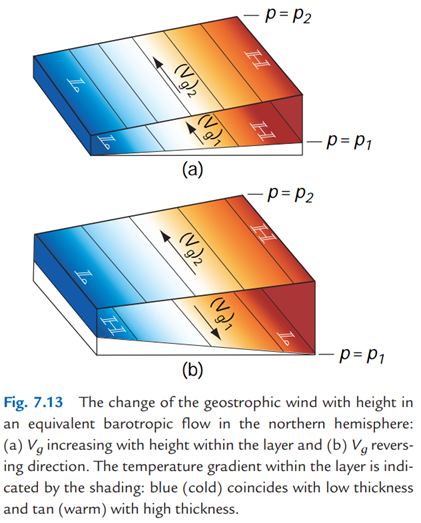  

---

<h4>b. 温度梯度与气压梯度交叉</h4>

- __暖平流__，从地表到高空，梯度风**顺时针转动**

- __冷平流__，从地表到高空，梯度风**顺时针转动**

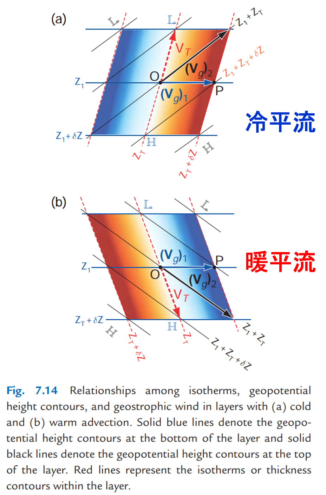  

---

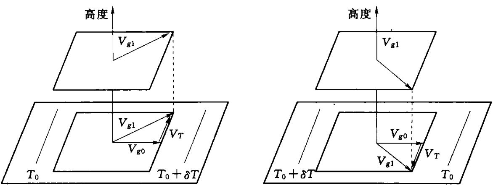  

<p style="text-align: center;">
  （a）气层中有冷平流；（b）气层中有暖平流
</p>

<h4>上图可以判断出：</h4>

1. 高压在靠近我们的一侧，根据$V_{g0}$
2. 根据$T_0 + \delta T$，可以判断$V_T$的方向
3. 两者合成，得到高空的热成风是顺时针还是逆时针运动

<!-- 图4-12，两种不同平流情况下风随高度的变化 -->

---

<h2>总结：位势高度的作用</h2>

1. 气压高低
    > <u>*位势高度*</u>高（低）意味着同一平面上该点的气压也偏高（低）

2. 大气层平均虚温；
    > 根据压高公式，<u>*位势高度厚度*</u>与虚温$T_v$正相关

3. 风向（平行于等高线）；
    > 气压梯度力和科氏力的影响下，风向平行于<u>*等位势高度线*</u>；摩擦力影响下，逆时针偏转15°~30°

4. 环流形式与天气系统
    > 环流形式，如高低压系统（气旋、反气旋）、槽脊（槽前脊后阴雨）；
    > 天气系统，如副高、南亚高压、阻塞高压、切断低压、冷涡

5. 辐合辐散
