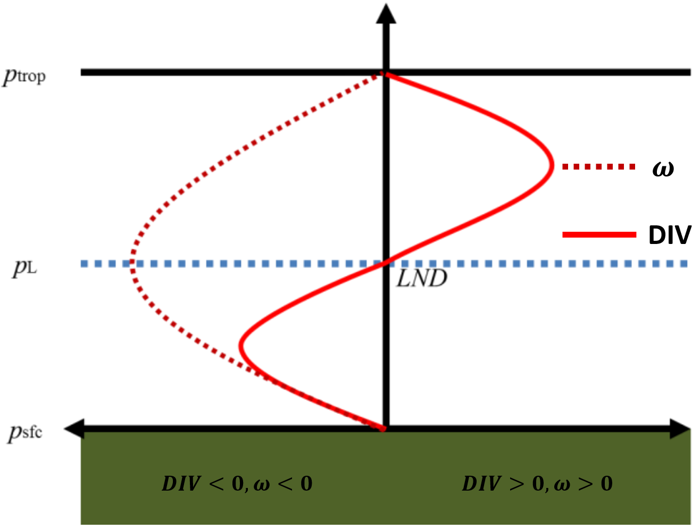
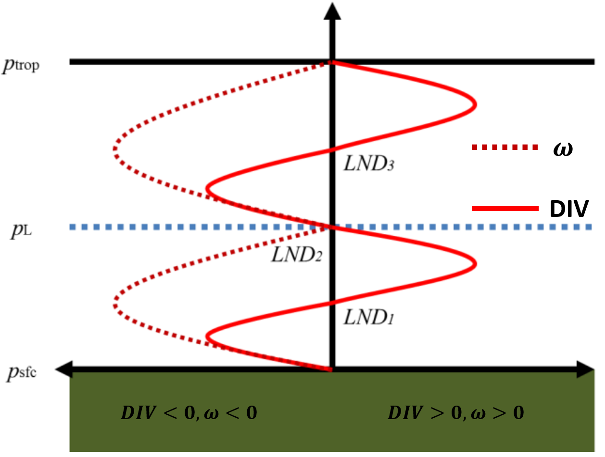
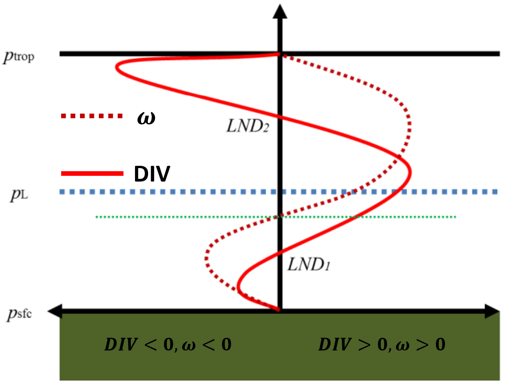
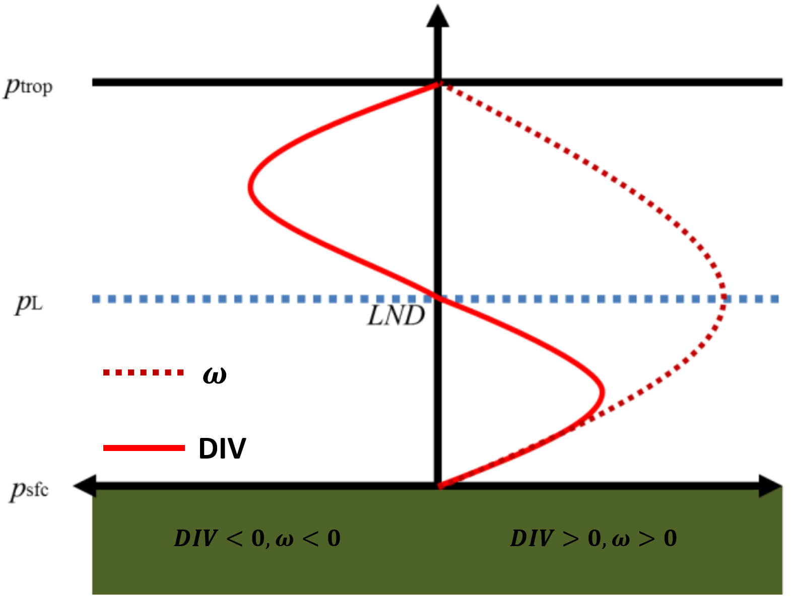

## 1. 水汽通量公式总结

<h4>a. 水汽含量</h4>

P = F/A, F = mg (力的单位N = kg m s-2，气压的单位Pa = N /m2 = kg m-1 s-2)

> $dp/g$单位：$kg$，因此W的单位也是$kg/m^2$.

$$
\begin{align*}
W &= \int_{P_s}^{P_t} dW = -\frac{1}{g} \int_{P_s}^{P_t} q dp  \\
  % &= \frac{1}{g} \sum_{P_t}^{P_s} q dp
\end{align*}
$$

<h4>b. 水汽通量</h4>

$$
\begin{aligned}
&F=\int_{z_s}^{z_t} q \rho v d z,(d p=-\rho g d z) \\
&=-\int_{p_s}^{p_t} q \rho v \frac{d p}{\rho g}
% =-\int_{p_s}^{p_t} q v \frac{d p}{g}
=-\frac{1}{g} \int_{p_s}^{p_t} q v d p
\end{aligned}
$$

> F的单位: $kg ~m/s / m^2$ = $kg~m^{-1} s^{-1}$
---

<h4>c. 水汽通量散度</h4>

<!-- 
 -->
$$
\begin{align*}
d &= \nabla_h (q \rho v) \\
\mathbf{Div} &= -\frac{1}{g} \int_{p_s}^{p_t} \nabla_h(q v) d p
\end{align*}
$$

> $\mathbf{Div}$的单位: $kg ~s^{-1} / m^2$ = $kg~m^{-2} s^{-1}$

---

### 1.1. 变量的单位

<h4>水汽通量散度</h4>

- $100×kg ~m^{-2} s^{-1}$转化为$mm/d$

<!-- > 8.64 mm/d -->

- $1×10^{-6} g·cm^{-2}·s^{-1}·hPa^{-1}$转化为$mm/d$

  假设$850hPa$，可近似认为代表900hPa~800hPa的平均状态，即气压层厚度可以认为是100hPa。若该层的水汽通量散度为$1×10^{-6} g·cm^{-2}·s^{-1}·hPa^{-1}$，转化为$mm/d$大概是多少？

---

$$
\begin{align*}
10^{-6} g·cm^{-2}·s^{-1}·hPa^{-1} &=10^{-6}·10^{-3}~ kg · 10^{4} m^{-2}·s^{-1}·hPa^{-1} \\
&= 10^{-6} · 10 ~kg · m^{-2} · s^{-1}·hPa^{-1} \\
&= 0.864 ~kg · m^{-2} · d^{-1}·hPa^{-1} \\
&= 0.864 ~mm ~d^{-1} hPa^{-1} \\
&= 0.036 ~mm ~d^{-1} hPa^{-1}
\end{align*}
$$

然后乘气压层的厚度，转化为mm；

---

### 1.2. 实战

- 大气河流（丁一汇）

- 2011-08-01河南暴雨

- 2021-07-21河南暴雨

---

## 2. 水平运动与垂直运动的关系

<h3>理论</h3>

- z坐标中($t, x, y, z$), $w = \frac{dz}{dt}$
- p坐标中($t, x, y, p$), $\omega = {\partial p \over \partial t}$
  $$
  {\partial u \over \partial x} +
    {\partial v \over \partial y} = -
    {\partial \omega \over \partial p}
  $$

左侧为散度$\mathbf{Div} = {\partial u \over \partial x} +
    {\partial v \over \partial y}$，
$$
\begin{align*}
\sigma &= \mathbf{Div} = -{\partial w \over \partial z}
  =  -{\partial \omega \over \partial p}, \\

\end{align*}
$$

$$
\mathbf{Div} + {\partial w \over \partial z} = 0
$$

---

从地表($p_1, \omega_1$) -> 高层($p_2, \omega_2$)，对上式进行积分：
> 地表，$\omega_1 ≈ 0$
$$
\int_{p_1}^{p_2}({\partial u \over \partial x} +
    {\partial v \over \partial y}) dp = - \int_{p_1}^{p_2}{\partial \omega \over \partial p} dp
$$

$$
\begin{align*}
\omega_{p_1} - \omega_{p_2} &= \int_{p_1}^{p_2}({\partial u \over \partial x} +
    {\partial v \over \partial y}) dp \\
- \omega_{p_2} &≈ \int_{p_1}^{p_2}({\partial u \over \partial x} +
    {\partial v \over \partial y}) dp
\end{align*}
$$

  <!-- > $\omega = \frac{dp}{dt}$：p坐标中，垂直方向上的速度
  >
  > - $\omega < 0$，向上运动；
  > - $\omega > 0$，向下运动。 -->

---

### 2.1. 地表辐合

<h4>地表辐合</h4>

$$
\begin{align*}
\mathbf{Div} = -{\partial w \over \partial z}
  =  -{\partial \omega \over \partial p}, (\omega = {\partial p \over \partial t}) \\

\end{align*}
$$

$$
\mathbf{Div} + {\partial w \over \partial z} = 0
$$

> <u>__地表__</u>和<u>__对流层顶__</u>$w=0$

- 地表辐合，$\mathbf{Div} < 0$, $\mathbf{a_w} > 0$，速度$w$不断变大（如$-2m/s$到$1m/s$）；
  地表速度为0，高处走速度$w$为正，上升运动

- 中间层$w$不确定

- 高空辐散，$\mathbf{Div} > 0$, $\mathbf{a_w} < 0$，$w$不断减小。

---

<h4>几种辐合不同情景：</h4>

1. 地表辐合 = 上层辐散
   
   从地表到高空一直是上升运动（如右图情景），在中间层$w$速度最大。

  <!-- - 如果辐合运动足够强，对流层中层(如500hPa)依然是辐合，依然是上升运动。 -->

  

<!-- - 要看辐散的强度 -->

---

2. 浅薄系统，地表辐合 = 上层辐散（多层过程）

   > 地表辐合、中层辐散、之后转辐合、高空辐散

  

--- 

3. 浅薄系统，地表辐合 < 上层辐散

   > 速度$w$由上升转为下沉。

  

---

### 2.2. 地表辐散

$$
\begin{align*}
\mathbf{Div} &= -{\partial w \over \partial z}
  =  -{\partial \omega \over \partial p}, (\omega = {\partial p \over \partial t}) \\
\mathbf{a_w} &\propto {\partial w \over \partial z},
\mathbf{Div} + {\partial w \over \partial z} = 0
\end{align*}
$$

> <u>__地表__</u>和<u>__对流层顶__</u>$w=0$

- 地表辐散，$\mathbf{Div} > 0$, $\mathbf{a_w} < 0$，$w$不断减小（如$-2m/s$到$-3m/s$）；地表速度为0，高处走速度为负，因此地表下沉运动

- 中间层不确定（可参考辐散的情景）

- 高空辐合，$\mathbf{Div} < 0$, $\mathbf{a_w} > 0$，垂直方向速度不断变大。

  

---

<h4>几种<u>辐散</u>不同情景：</h4>
 

1. 深厚的地表辐散，地表到高空，一直是下降运动；

 

1. 浅薄的地表辐散，中间或者高空，有可能是上升运动。

---

## 3. 案例分析

- 长江流域热浪（辐合辐散与垂直运动）
