<!-- page_number: true -->

<h1>水文气象学</h1>
<h2>ch05. 辐射与热量平衡</h2>

 

> 葛朝霞等，__气象学与气候学教程__，中国水利水电出版社（第2版）
>
> - 2 辐射与热量平衡
<!-- > - 3.7 局地温度变化 -->

 

孔冬冬，__kongdongdong@cug.edu.cn__

办公室：环境学院416

中国地质大学大气科学系 · 武汉

---

<h1>目录：</h1>

1. 辐射与辐射能

2. 辐射的基本定理

3. 大气能量平衡

   <!-- > 辐射与大气运动 -->

4. 地表能量平衡

---
<h4>能量的形式</h4>

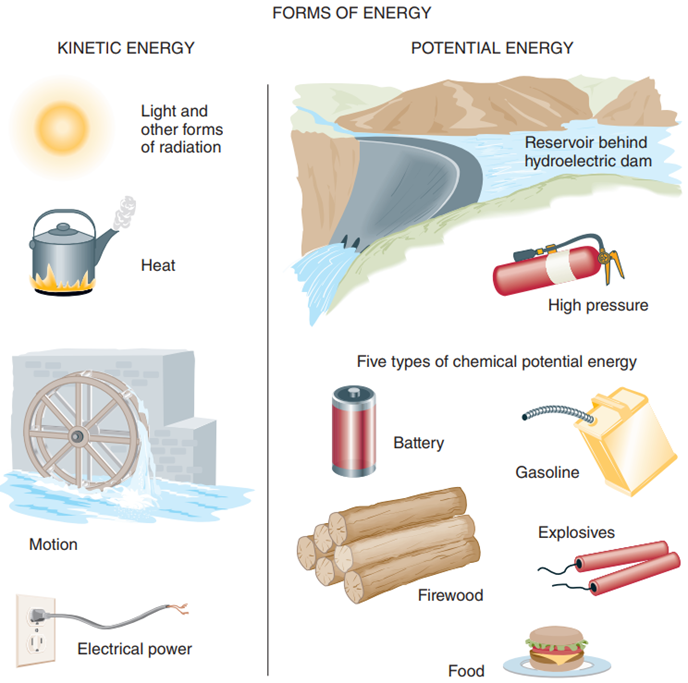  

---

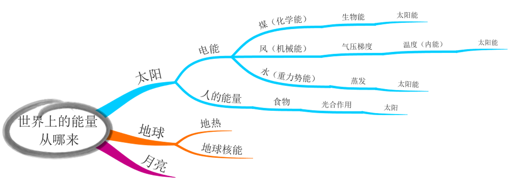  

---

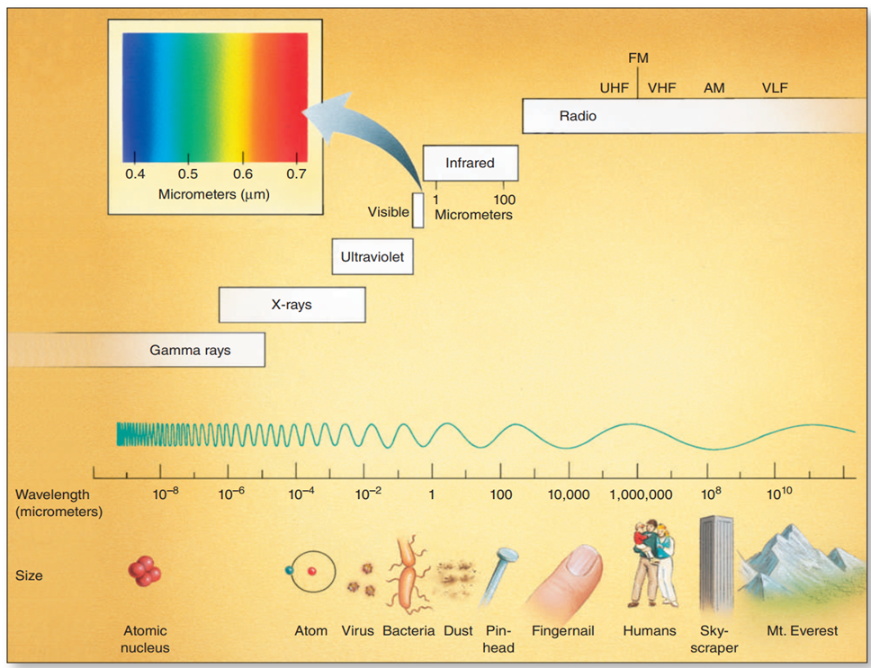  

---

# 1. 辐射与辐射能

| 变量         | 说明                                         | 单位 |
| ------------ | -------------------------------------------- | ---- |
| 辐射能$\Delta F$| 辐射的总能量                                 | $J$  |
| 辐射通量     | 单位时间通过的辐射能                         | $W$  |
| 辐射通量密度 $F$| 单位时间、单位面积通过的辐射能               |$W m^{-2}$|
| 辐射强度 $I$    | 单位时间、单位面积、单位弧度角，通过的辐射能 |$W m^{-2} sr^{-1}$|

  $$I = \frac{\Delta F}{ \Delta t ~\Delta S ~\Delta \omega}$$

> 注：此处的$\Delta S$是正交投影面积

---

## 1.1. 立体角

$$
d w=\frac{d A}{r^2}=\frac{r d \theta \cdot r \sin \theta d \varphi}{r^2}=d \theta \sin \theta d \varphi
$$

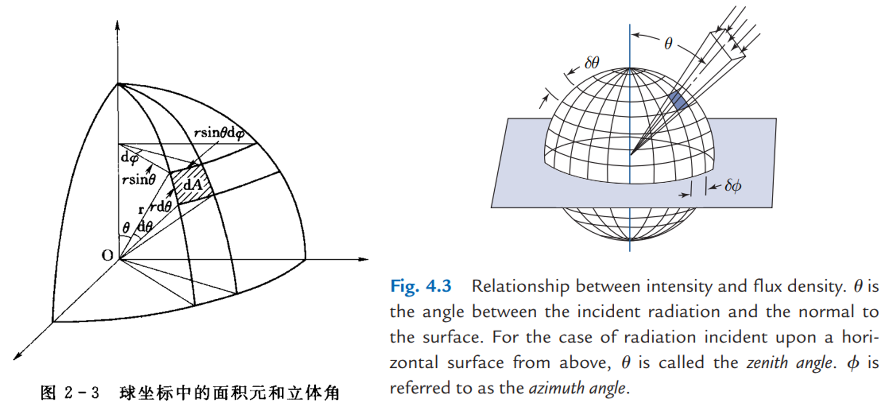  

---

<h4>应用：</h4>

- 日地距离，辐射通量密度的关系

  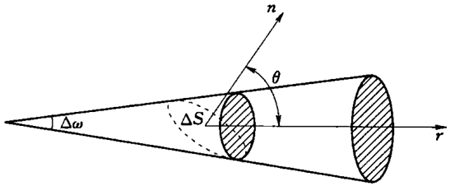  

---

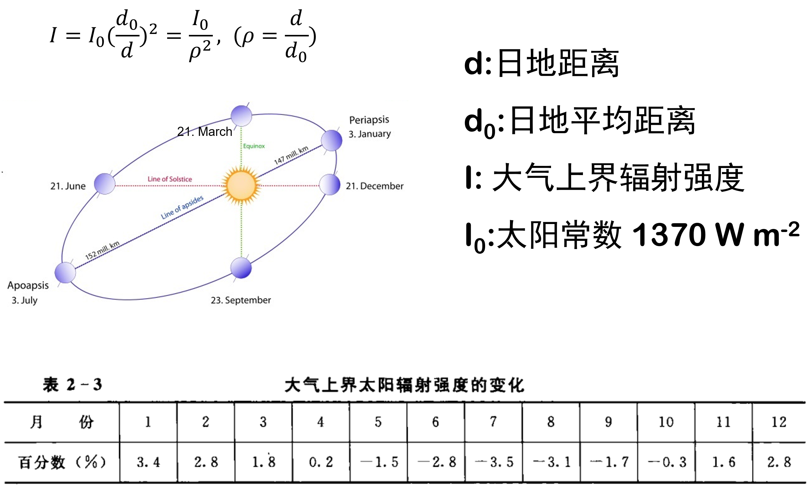  

---

## 1.2. 辐射通量密度$F$与辐射强度$I$的关系

$$
\begin{aligned}
F &= \int_{2 \pi} dF, (dF = I cos \theta ~ dw) \\
 &=\int_{2 \pi} I \cos \theta d \omega =\int_{\phi=0}^{2 \pi} \int_{\theta=0}^{\pi / 2} I \cos \theta \sin \theta d \theta d \phi \\
&=2 \pi I \int_0^{\pi / 2} \cos \theta \sin \theta d \theta \\
&=\pi I\left[\left(\sin ^2(\pi / 2)-\sin ^2(0)\right]\right.\\
&=\pi I
\end{aligned}
$$

- $cos \theta$: 从球面面积转为正交投影面积

- $dw$: 弧度角的积分

结论：对于球面，$F = \pi I$

---

# 2. 辐射的基本定理

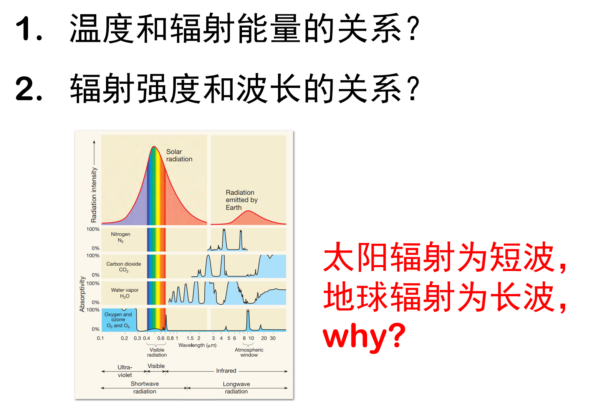  

---

<h2>黑体 (Blackbody)</h2>

基尔霍夫1862年提出，只能吸收和向外辐射电磁波，不能反射和投射。

  

---

## 2.1. 普朗克定律

  

---

## 2.2. 维恩位移定律

  

---

## 2.3. 斯提芬-波尔茨曼定律

  

---

## 2.4. 基尔霍夫定律

  

---

<h4>应用：</h4>

- 根据地表辐射通量，反推太阳温度

- 地球的均衡温度

---

  

---

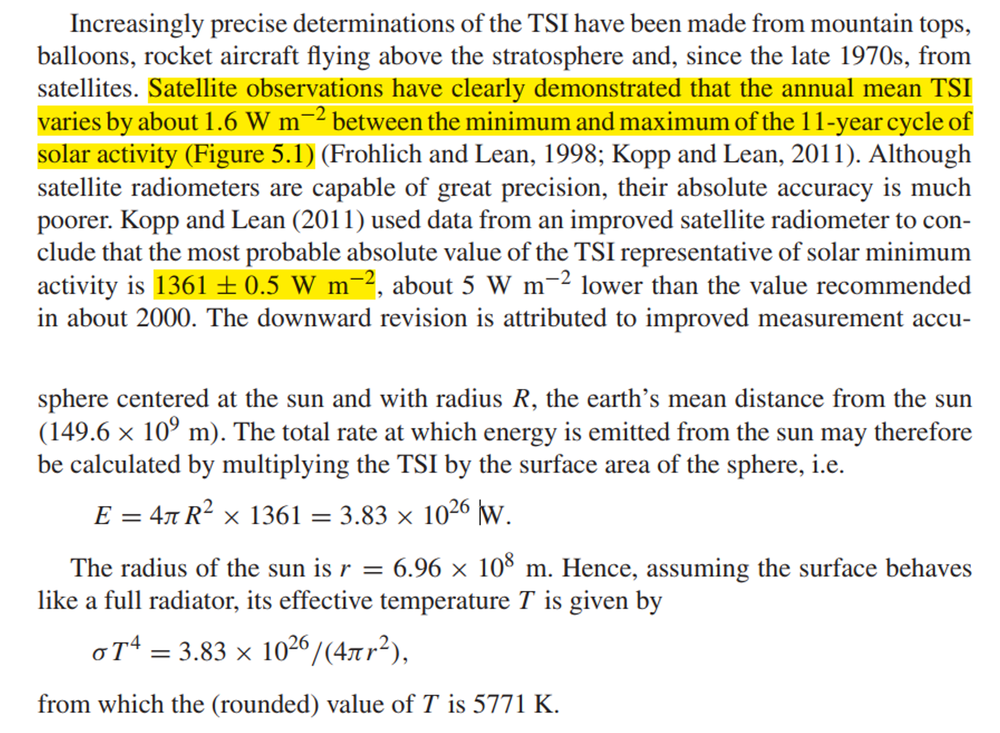  

---

概念

# 3. 能量平衡中的主要成员

<h4>短波辐射</h4>

- 反射与反射率$\alpha$
  > 大气层与地表的反射率$\alpha$
- 散射
  > 入射短波辐射$Rs$包含直射和散射

<h4>长波辐射</h4>

- 长波辐射与发射率$\epsilon$
  > 发射率$\epsilon$针对的是地表。根据基尔霍夫定量，吸收率等于发射率，吸收的入射长波辐射为$\epsilon Rl_{in}$

---

## 3.1. 散射

  

---

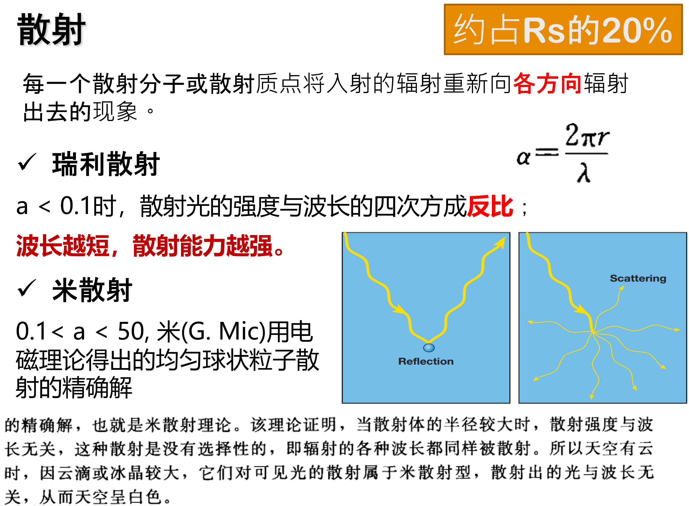  

> 为了区分二者，瑞利散射和米散射分别被称为散射与漫射。

---

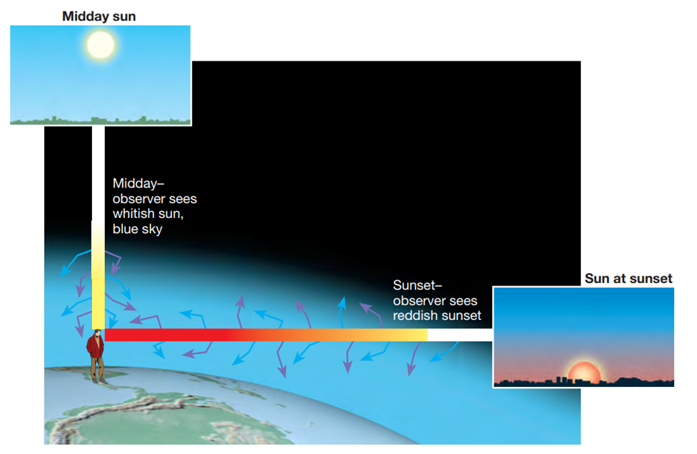  

---

## 3.2. 反射率(Albedo，$a$)

定义：短波辐射中反射的部分（未被吸收的部分）。

地球全球平均反射率约为0.3。

 

  

  

---

## 3.3. 发射率(Emissivity，$\epsilon$)

定义：辐射通量密度与同温度下黑体的辐射通量密度之比（也叫比辐射率）。

 

<!--    -->
<!--    -->

  

---

<h4>温室效应</h4>

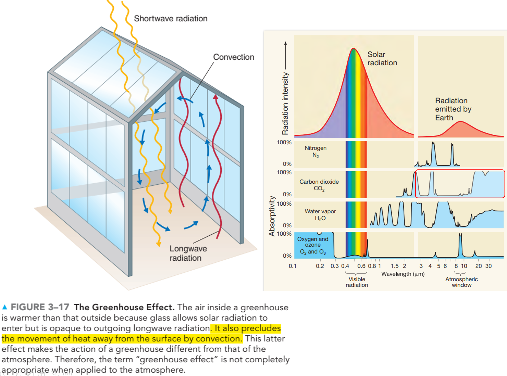  

---

<h4>短波净辐射Rns:</h4>

$$
Rns = Rs_{in}  (1 - albedo)
$$

<h4>长波净辐射Rnl:</h4>

$$
\begin{align*}
Rnl &= Rl_{in} - Rl_{out} \\
    &= Rl_{in} - [(1 - \epsilon)Rl_{in} + \sigma T_s^4] \\
    &= \epsilon (Rl_{in} - \sigma T_s^4)
\end{align*}
$$

<h4>地表净辐射Rn:</h4>

$$
\begin{align*}
Rn &= Rns + Rnl \\ 
   &= Rs_{in}  (1 - albedo) + \epsilon (Rl_{in} - \sigma T_s^4)
\end{align*}
$$

> - $Rs_{in}$: 入射短波辐射；$Rl_{in}$: 入射长波辐射；
> - $albedo$: 反射率；$\epsilon$：发射率
> - $Rl_{out}$: 出射长波辐射；$Ts$：地表温度

---

# 4. 太阳辐射

- 太阳高度角：太阳入射光线与地平面所形成的夹角。

- 方位角：与正北方向的夹角，顺时针为正；正北方向为0°，正东为90°。

- 天文辐射总能量Qs

<!-- - 太阳日辐射量 -->

---

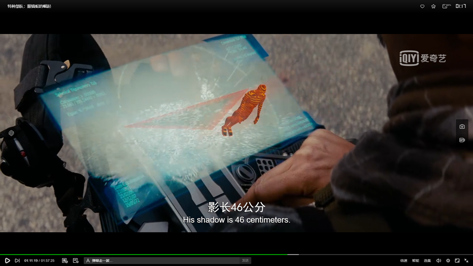

<https://www.bilibili.com/bangumi/play/ep257070>
<!-- <https://v.qq.com/x/cover/mzc00200pvx5m4u.html>
<https://www.iqiyi.com/v_19rrg52ock.html> -->

---

## 4.1. 太阳高度角与方位角

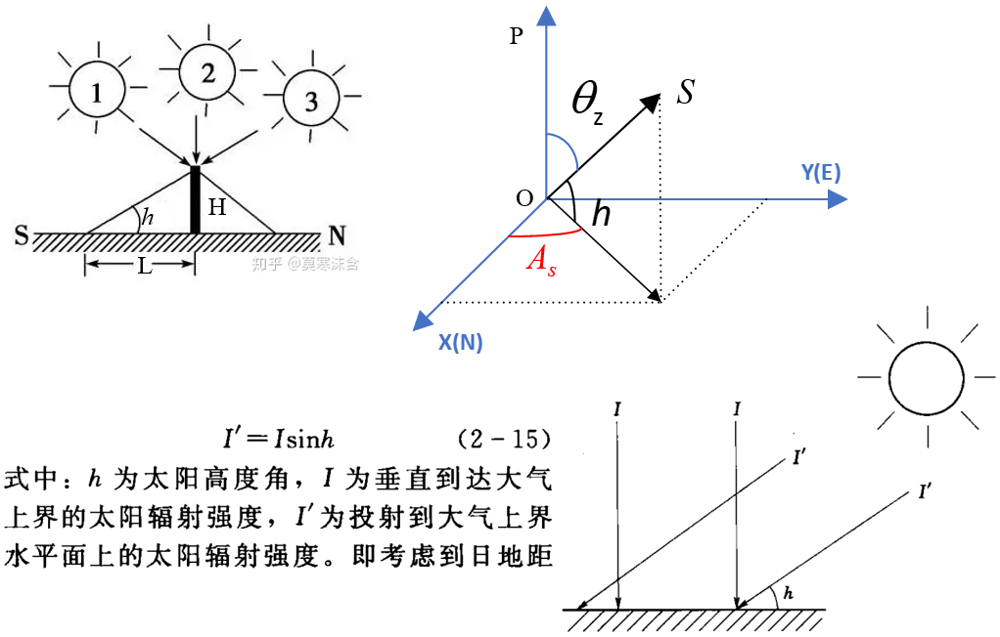  

---

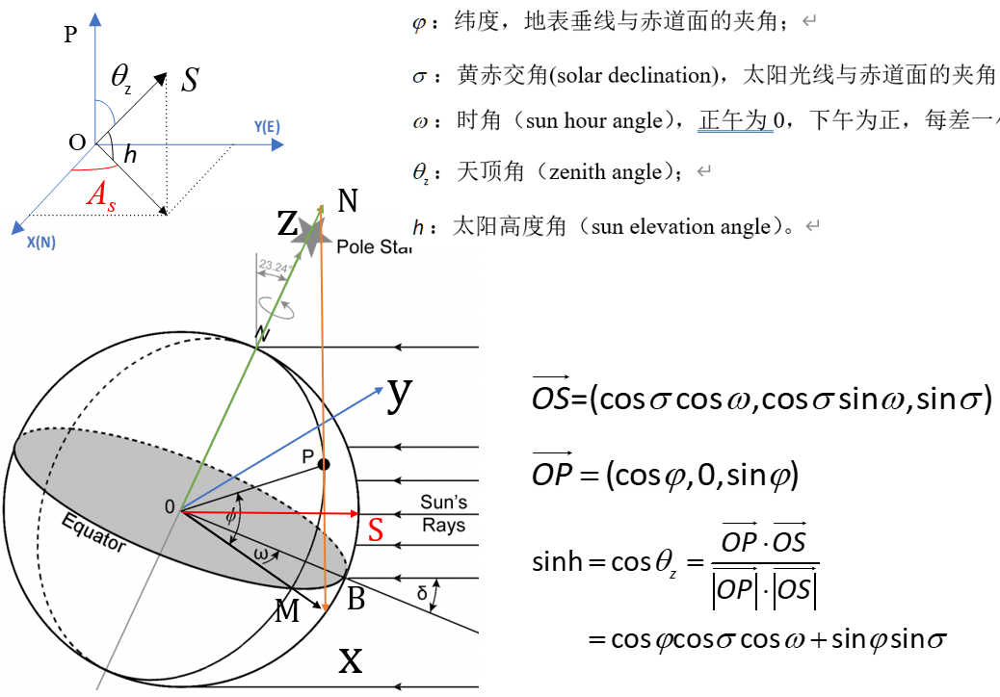  

<https://www.zhihu.com/question/51315574>
<https://zhuanlan.zhihu.com/p/396807910>
<!-- <https://www.itacanet.org/the-sun-as-a-source-of-energy/part-1-solar-astronomy/> -->

---

### 4.1.1. 应用

$$
sinh = cos\phi cos\sigma cos\omega + sin\phi sin\sigma
$$

  > $\phi$：纬度，OP与赤道面的夹角
  $\sigma$：黄赤交角，太阳光线与赤道面的夹角，近似为常数23°26'。
  $\omega$：时角，上午为负、下午为正、正午为0；每1小时，相差15°。

- 根据太阳高度角的年内变化特征，划分24节气；

  正午是$\omega = 0$，则

  $$
  sinh_{12} = cos \phi cos \sigma + sin \phi sin \sigma
  $$

- 计算日出时间、日落时间

$$
\begin{align*}
sinh &= cos\phi cos\sigma cos\omega_0 + sin\phi sin\sigma = 0 \\
cosw_0 &= -\frac{sin \phi sin \sigma}{cos\phi cos\sigma } = -tan\phi tan\sigma\\
w_0 &= arccos(-tan\phi tan\sigma)
\end{align*}
$$

---

<h4>方位角</h4>

- 太阳高度角可以用来确定影子的长度；

- 方位角可以用来确定影子方向。

  > 23°26'以北，太阳始终在南方；中午之前，太阳在东；中午之后，太阳在西；

<h4>日晷</h4>

  

<https://www.gaohaipeng.com/3362.html>

---

## 4.2. 天文辐射总能量Qs

$$
\frac{dQ_s}{dt} = \frac{I_0}{\rho^2} (cos\phi cos\sigma cos\omega + sin\phi sin\sigma)
$$

$$
\begin{align*}
Q_s &= \int_{-w_0}^{w_0}{\frac{dQ_s}{dt}} dt
  = \int_{-w_0}^{w_0}{\frac{dQ_s}{dt}} \frac{1440}{2\pi} d\omega \\
 &= \int_{-w_0}^{w_0}{\frac{I_0}{\rho^2} (cos\phi cos\sigma cos\omega + sin\phi sin\sigma)} \frac{1440}{2\pi} d\omega \\
 &= \frac{T}{\pi}\frac{I_0}{\rho^2} (cos\phi cos\sigma sin\omega_0 + \omega_0sin\phi sin\sigma)
\end{align*}
$$

> $\rho = \frac{r}{r_0}$；$r$为日地距离，$r_0$为日地平均距离。$I_0≈1365 W/m^2$

---

<h4>天文辐射总能量Qs</h4>

 

$Q_s$可以认为是大气层顶接收到的理论太阳辐射，但经过大气吸收、大气反射、地表反射，到达地表的入射短波辐射$Rs$仅有$Q_s$的45%左右。

 

当缺乏$R_s$观测资料时，可以采用$Q_s$ + 光照时数（或者云量）来估计。

---

# 5. 大气能量平衡

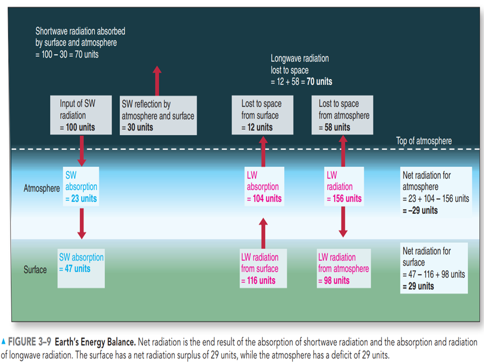  

---

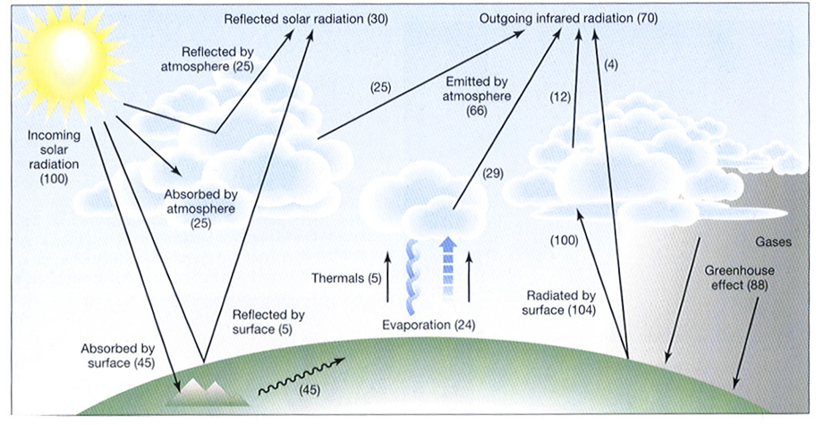  

---

- 地表
  $$
  Rns = 45, \\
  Rl_{in} = 88, Rl_{out} = 104 \\
  Rn = 45 + 88 - 104 = 29 \\
  Rn = H + \lambda E
  $$

- 大气

---

# 6. 地表能量平衡

  

---

$$
\begin{align*}
Rn - G = \lambda E + H
\end{align*}
$$

   > $G$：土壤热通量
   > $\lambda E$：潜热，相态的变化
   > $H$：感热，温度的变化

$\lambda E$和$H$，一般指的是湿表面到2m处的地表，传递的感热与潜热。

湿表面和地表的<u>空气温度</u>和<u>水汽密度</u>：

- 湿表面($T_w, \rho_w$)

- 2m地表($T_a, \rho$)

---

## 6.1. 感热($H$)

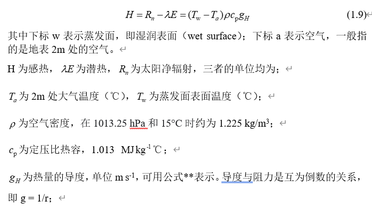  

---

## 6.2. 潜热($\lambda E$)

$$
\begin{align*}
  & \lambda E=\lambda ({{\rho }_{w}}-\rho ){{\text{g}}_{w}} \\
 & =\lambda (\frac{{{e}_{s}}({{T}_{w}})}{{{P}_{a}}}\varepsilon \rho -\frac{e}{{{P}_{a}}}\varepsilon \rho ){{\text{g}}_{w}} \\
 & =\lambda \varepsilon \rho {{\text{g}}_{w}}\frac{{{e}_{s}}({{T}_{w}})-e}{{{P}_{a}}} \\
 & =\lambda \varepsilon \rho {{\text{g}}_{w}}\frac{{{e}_{s}}({{T}_{w}})-{{e}_{s}}({{T}_{a}})+{{e}_{s}}({{T}_{a}})-e}{{{P}_{a}}} \\
 & \simeq \lambda \varepsilon \rho {{\text{g}}_{w}}\frac{\Delta ({{T}_{w}}-{{T}_{a}})+D}{{{P}_{a}}}  
\end{align*}
$$

> 详细解释见：《补充--蒸散发的基本原理》

---

<!-- <h4>能量的分配</h4> -->
  

---

<h4>感热潜热比例随温度的变化</h4>

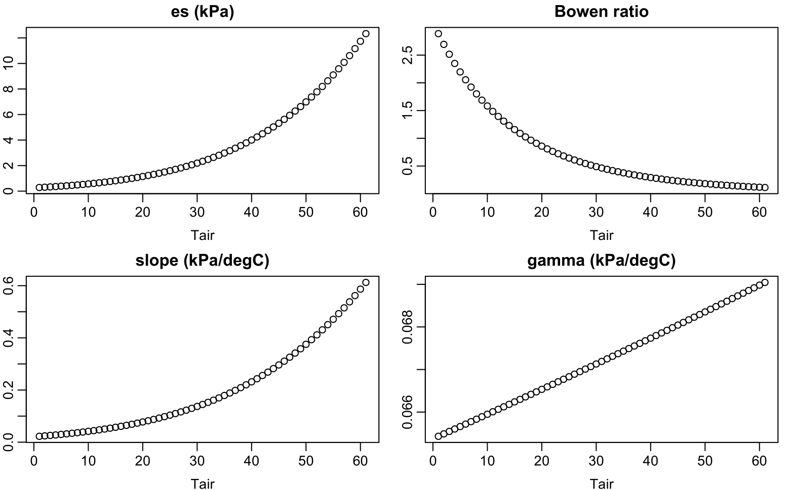  

---

<h3>QA: </h3>

1. 已知热水壶加热的功率、壶内水的初始温度$T_0$，给定时间，能否知道水的温度？

2. 知道了总能量，能否推求日温度变化？
   > 为了简化问题
   > - 假设是沙漠地区，忽略蒸发项
   > - 假设静止为风，忽略平流项对温度的影响

3. 撑伞与否人体感知温度差别？

4. 空气温度与地表温度
