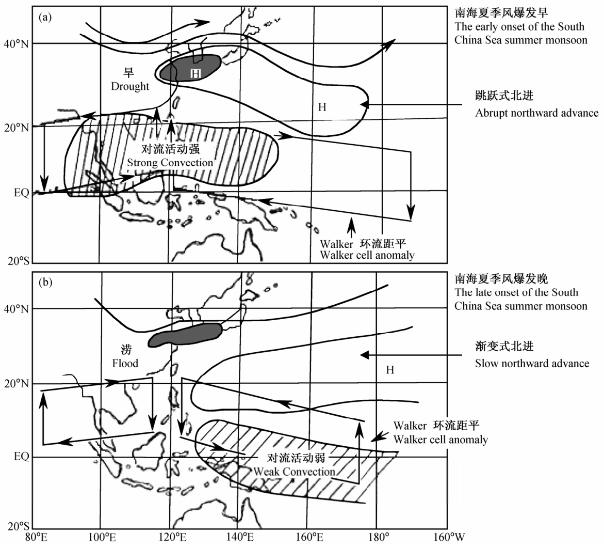
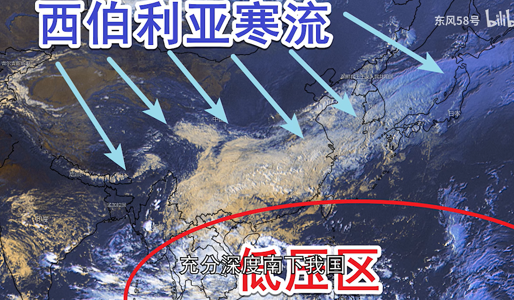

<!-- page_number: true -->

<h1>水文气象学</h1>
<h2>ch8. 大气环流</h2>

 

> 葛朝霞等，__气象学与气候学教程__，中国水利水电出版社（第2版）
>
> - 6 大气环流

 

孔冬冬，__kongdongdong@cug.edu.cn__

办公室：科教六楼307

中国地质大学大气科学系 · 武汉

---

## 1. 大气环流

> 太阳辐射对**大气系统加热不均**是大气产生大规模运动的**根本原因**；
> 
> 大气在**高低纬间的热量收支不平衡**是产生和维持大气环流的**直接原动力**。

**对于地表：高温低压，低温高压。**

  

---

### 1.1. 三圈环流——地球自转

  

---

  

  

---

<!-- <h4>海陆风与季风</h4> -->
### 1.2. 海陆风

> 原理: __高温__低压；__低温__高压。

- 白天：海洋→陆地

- 晚上：陆地→海洋

  

---

### 1.3. 季风

<!-- <h4>季风</h4> -->

- **定义**：大陆与海洋之间由于热力差异形成的大尺度热力环流，有季节性，以一年为周期。

  

> 原理: __高温__低压；__低温__高压。

---

<h4>全球季风区</h4>

  

---

  

<!--   -->
<!--    -->

---

### 1.4. 海陆热力差异

> 原理: **高温**低压；**低温**高压。

- 冬季：海洋降温慢（低压），大陆降温快（高压）
- 夏季：海洋升温慢（高压），大陆升温快（低压）

1. 完整的纬向气压带分裂成一个个闭合的高压和低压中心。

2. 冬季，大陆东岸→温度槽、大陆西岸→温度脊；
   夏季，大陆东岸→温度脊、大陆西岸→温度槽；

   > 高空气压场与温度场的槽脊相对应。

3. 冬夏海、陆间的热力差异引起的气压梯度驱动着季风的形成。

  

---

<h3>地形起伏的影响</h3>

<h4>动力作用</h4>

- 在高山迎风侧受阻，造成空气质量辐合，形成高压脊；

- 在高山背风侧，则利于空气辐散，形成低压槽。

  > 东亚沿岸和北美东岸的高空大槽，其形成虽与海陆温差有关，但同西风气流爬越巨大的青藏高原和落基山脉的动力减压亦有一定关系。

- 但如果地形过于高大，山地迎风面发生绕流或分支现象，在背风面发生气流会合现象。

---

<h4>热力作用</h4>

热力作用：突出的地形对大气还有加热和__制冷__作用。
 

>
> 如青藏高原：
>
> 1. 动力作用：高原大地形的直接阻碍与扰动（也叫机械胁迫或动力作用）所造成的环流异常；
>
> 2. 热力作用：高原表面气流加热抬升（也叫热力作用）对环流形势造成的影响，青藏高原相对于四周自由大气来说，__夏季时高原面是热源__，__冬季时是冷源__。这种热力效应对南亚和东亚季风环流的形成、发展和维持都有重要影响。

---

青藏高原使西风带分裂为南北两支，绕过高原后，在东侧汇合。

  

---

<h4>海陆差异对环流的影响:</h4>

<h3>(a) 平直/规则的三圈环流被割裂</h3>

  

- **海洋低压**：阿留申、冰岛

- **北半球高压**：
  陆地：西伯利亚、北美（加拿大）；
  海洋：太平洋、大西洋

- **南半球低压**：
  澳大利亚大陆、非洲南部、南美南部

- **南半球高压**：
  副热带高压三分：南太平洋、印度洋、南大西洋

---

  

  

- **北半球大陆低压**：亚洲南部、北美西南部低压。原在海洋上势力很强的低压（如冰岛）仍然存在，但强度已大为减弱，有些甚至消失（如阿留申）。

- **海洋上**的北太平洋高压（夏威夷高压）、北大西洋高压（亚速尔高压）强度增强，范围扩大，位置北移。

- **南半球高压**带几乎环绕全球。

---
<!--  -->

  

<!--    -->
  

---

<h3>(b) 大陆东西岸槽脊</h3>

> 高空看槽脊，地表看高低压中心

  

---

> 高空看槽脊，地表看高低压中心

  

---

  

---

<h3>(c) 海陆风与季风</h3>

<h4>海陆风</h4>

> 原理: __高温__低压；__低温__高压。

- 白天：海洋→陆地

- 晚上：陆地→海洋

  

---

### 1.5. 沃克环流

沃克环流：赤道地区，东西方向的热力环流（海洋热力效应）。

  

<https://www.bilibili.com/video/BV1oz4y1Z7qM>

---

1. **沃克环流增强**：拉尼娜。
   > 夏季华北地区洪水，长江干旱；冬季寒冷
   1. 东北信风增强；
   2. 东太平洋海温异常升高；
   <!-- 3. 西太平洋海Hadley环流旺盛。 -->
 

2. **沃克环流减弱**：厄尔尼诺。
   > 夏季长江洪水，华北干旱。
   1. 东北信风减弱；
   2. 东太平洋海温异常升高、西偏低
   3. 西太平洋海Hadley环流疲弱，副高偏南

<!--    -->

  

---

<h4>拉尼娜与冷冬</h4>

  

<https://www.bilibili.com/video/BV165411578U>

海陆热力差异。海陆温度梯度大，则季风强，西部风强盛。

---

## 2. 实战

- 气候分布

---

  

---

  

<!-- 人教版高中地理-自然地理基础，图3.20 -->

---

  

---

  

---

<h4>作业3</h4>

1. 采用位势高度分析中国的一场天气过程（降温、降雨）

Clue: 
> - 水汽的分析方法
> - 温度的分析方法
