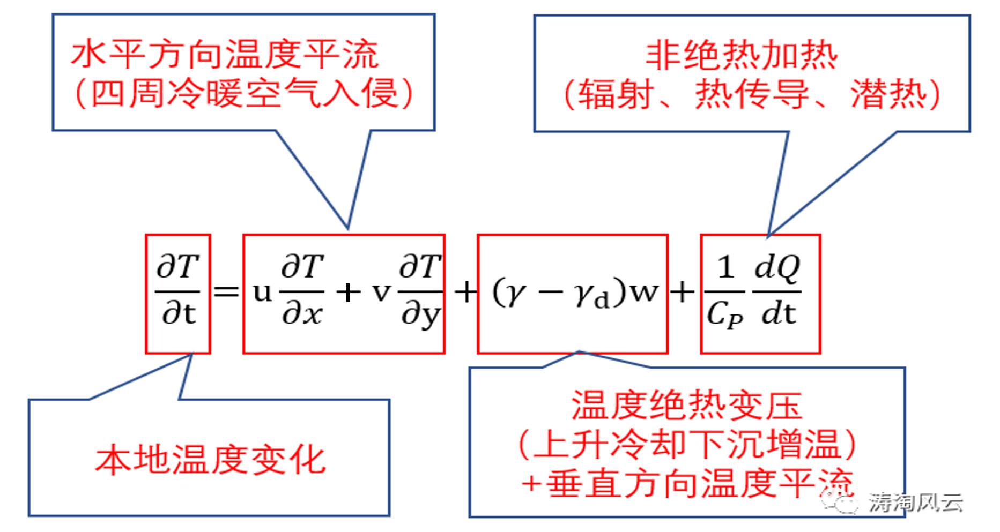
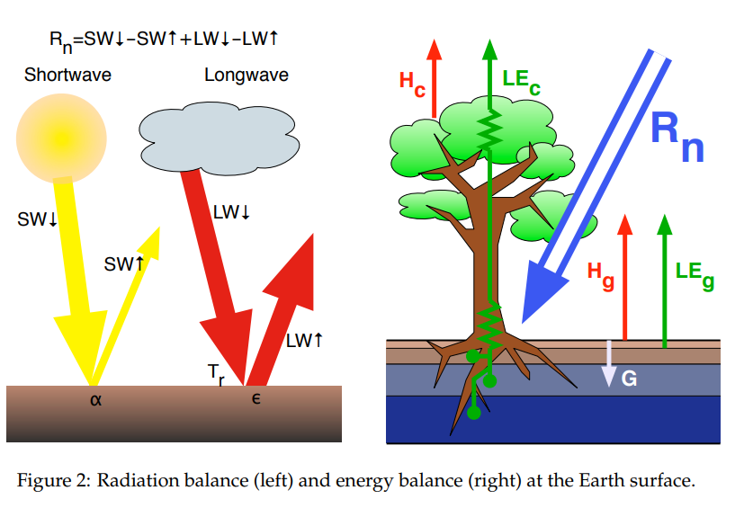
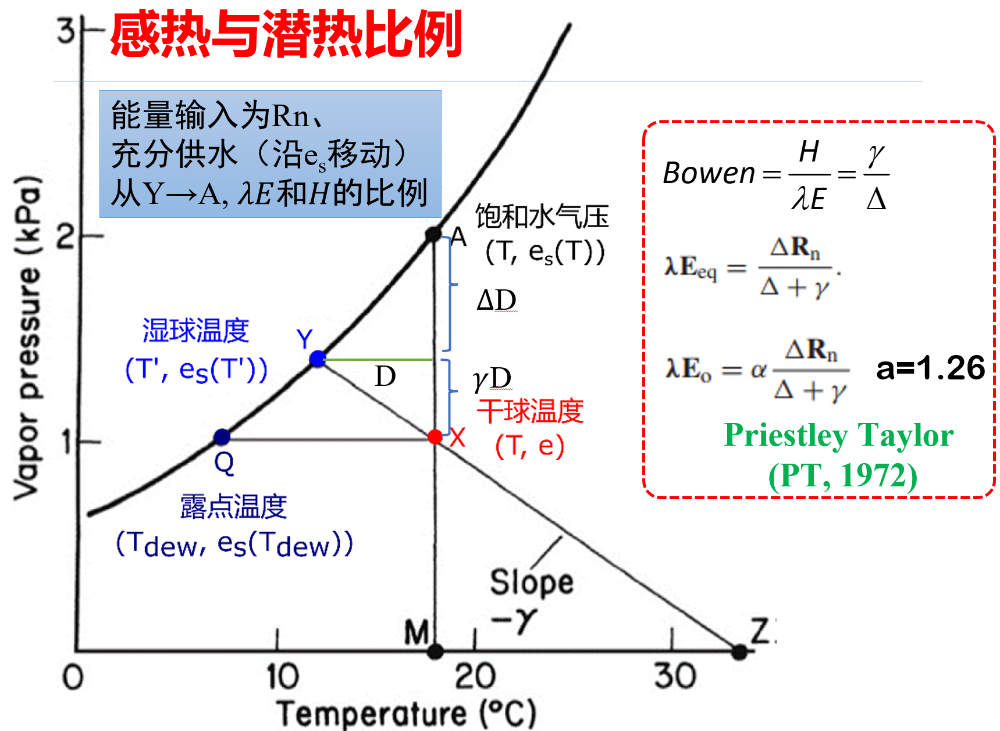
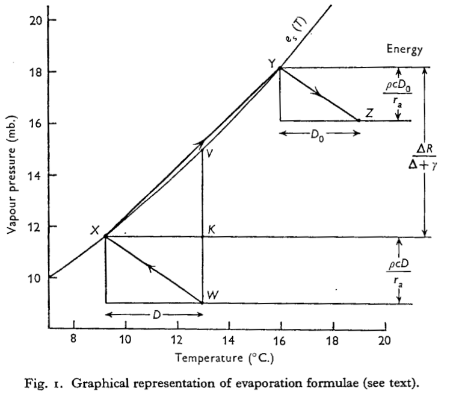
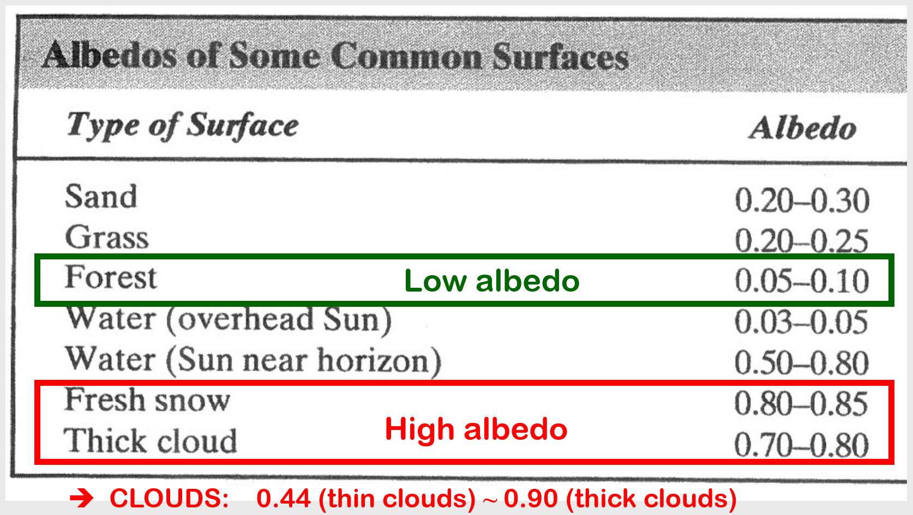
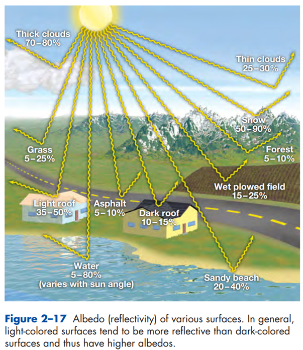
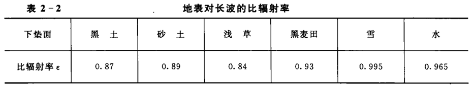

<!-- page_number: true -->

<h1>水文气象学</h1>
<h2>ch09_热浪研究方法</h2>

> 葛朝霞等，__气象学与气候学教程__，中国水利水电出版社（第2版）
>
> - 3.7 局地温度变化

 

孔冬冬，__kongdongdong@cug.edu.cn__

办公室：环境学院416

中国地质大学大气科学系 · 武汉

---

# 1. 热流量方程

根据热力学第一定律：

$$
\frac{\mathrm{d} Q}{\mathrm{~d} t}=c_p \frac{\mathrm{d} T}{\mathrm{~d} t}-\frac{R T}{p} \frac{\mathrm{d} p}{\mathrm{~d} t} ~~~(Eq. 3.3)
$$

温度和压力的变化：

$$
\begin{aligned}
\frac{\mathrm{d} T}{\mathrm{~d} t} & =\frac{\partial T}{\partial t}+\boldsymbol{V} \cdot \nabla_h T+w \frac{\partial T}{\partial z} \\
\end{aligned}
$$

$$
\begin{aligned}
\frac{\mathrm{d} p}{\mathrm{~d} t} & =\frac{\partial p}{\partial t}+\boldsymbol{V} \cdot \nabla_h p+w \frac{\partial p}{\partial z} \\
& \approx -\rho g w=-\frac{g p}{R T} w
\end{aligned}
$$

把后面两个公式，带入热力学公式，整理可得：

$$
\begin{align*}
\frac{\partial T}{\partial t}
  &= -V \cdot \nabla_h T + (-\frac{\partial T}{\partial z} - \frac{g}{c_p}) w+\frac{1}{c_p} \frac{\mathrm{d} Q}{\mathrm{~d} t} \\
  &= -V \cdot \nabla_h T+(\gamma - \gamma_d) w+\frac{1}{c_p} \frac{\mathrm{d} Q}{\mathrm{~d} t}

\end{align*}
$$

---

  

---

# 2. 热浪的影响因素

> 热浪：指的是持续一定时间的气温或体感温度异常偏高的异常时间。

<h4>直接影响因素：</h4>

- 气温
- 比湿

<h4>间接影响因素：</h4>

- 高低压中心
- 风场
- 温度平流
- 垂直速度
- 水汽输送

---

# 3. 用到的理论

## 3.1. 迁移项：冷暖平流与水汽输送

<h4>冷暖平流</h4>

- 风向 -> 高纬度 / 低温度 -> 冷暖平流

  > 另外，垂向方向，存在下沉增温

<h4>水汽输送</h4>

- 风向 -> 陆地 / 海洋 -> 水汽输送

:::info:Recall
水汽含量、水汽通量、水汽散度
:::

---

<h4>Recall: 位势高度的分析方法</h4>

1. 气压高低
    > <u>*位势高度*</u>高（低）意味着同一平面上该点的气压也偏高（低）

2. 大气层平均虚温；
    > 根据压高公式，<u>*位势高度厚度*</u>与虚温$T_v$正相关

3. 风向（平行于等高线）；
    > 气压梯度力和科氏力的影响下，风向平行于<u>*等位势高度线*</u>；摩擦力影响下，逆时针偏转15°~30°

4. 环流形式与天气系统
    > 环流形式，如高低压系统（气旋、反气旋）、槽脊（槽前脊后阴雨）；
    > 天气系统，如副高、南亚高压、阻塞高压、切断低压、冷涡

5. 辐合辐散

---

## 3.2. 局地项：辐射与温度

### 3.2.1. 能量平衡公式

 
 

$$
Rn - G = LE + H
$$

 

:::info:注意
$\lambda E$和$H$：湿表面到2m处的地表，传递的感热与潜热。

- 湿表面($T_w, \rho_w$)

- 2m地表($T_a, \rho$)

:::

  

---

<!-- <h4>能量的分配</h4> -->
  

---

<h4> a=1.26矫正的原因</h4>

 
 

$$
\lambda \mathbf{E}_{\mathrm{o}}=\alpha \frac{\Delta \mathbf{R}_{\mathrm{n}}}{\Delta+\gamma}
$$

:::info:
真实大气中水汽不可能达到饱和，这就贡献了额外的蒸发项$\frac{\rho c D}{r_a}$

$$
\lambda E=\lambda\left(E_1+E_2\right)=\frac{\Delta \mathbf{R}_{\mathrm{n}} }{\Delta+\gamma}+\frac{\rho c D}{r_a}
$$
:::

:::footnote
1. Monteith 1965
2. 杨汉波, 2009, 科学通报
:::

---

  

### 3.2.2. 地表净辐射公式

 

$$
\begin{align*}
Rn &= (1 - a) Rs + \epsilon (Rl_{in} - \sigma T^4) \\
\end{align*}
$$

 

   > $G$：土壤热通量
   > $\lambda E$：潜热，相态的变化
   > $H$：感热，温度的变化
   > $Rs$: 入射短波辐射, $Rl_{in}$: 入射长波辐射
   > $\alpha$: 反射率；$\epsilon$: 发射率

---

#### 3.2.2.1. 反射率(Albedo，$a$)

定义：短波辐射中反射的部分（未被吸收的部分）。

地球全球平均反射率约为0.3。

 

  

  

---

#### 3.2.2.2. 发射率(Emissivity，$\epsilon$)

定义：辐射通量密度与同温度下黑体的辐射通量密度之比（也叫比辐射率）。

 

<!--    -->
<!--    -->

  

---

<h4>短波净辐射Rns:</h4>

$$
Rns = Rs_{in}  (1 - \alpha)
$$

<h4>长波净辐射Rnl:</h4>

$$
\begin{align*}
Rnl &= Rl_{in} - Rl_{out} \\
    &= Rl_{in} - [(1 - \epsilon)Rl_{in} + \epsilon \sigma T_s^4] \\
    &= \epsilon (Rl_{in} - \sigma T_s^4)
\end{align*}
$$

<h4>地表净辐射Rn:</h4>

$$
\begin{align*}
Rn &= Rns + Rnl \\
   &= Rs_{in}  (1 - \alpha) + \epsilon (Rl_{in} - \sigma T_s^4)
\end{align*}
$$

> - $Rs_{in}$: 入射短波辐射；$Rl_{in}$: 入射长波辐射；
> - $\alpha$: 反射率；$\epsilon$：发射率
> - $Rl_{out}$: 出射长波辐射；$T_s$：地表温度

---

# 4. 实战与案例分析
