<!-- page_number: true -->

<h1>水文气象学</h1>
<h2>ch11. 天气系统</h2>

 

> 葛朝霞等，__气象学与气候学教程__，中国水利水电出版社（第2版）
>
> - 7 天气系统

 

孔冬冬，__kongdongdong@cug.edu.cn__

办公室：环境学院416

中国地质大学大气科学系 · 武汉

---

<h4>目录</h4>

1. __气团__

2. __锋__

3. __中纬度天气系统__
   - 西风带（大气长波、大气短波）
   - 阻塞高压与切断低压
   - 温带气旋与反气旋
  
4. __低纬度天气系统__
   - 副热带高压
   - 赤道辐合带
   <!-- - 热带气旋 -->

---

<h4>引言</h4>

- 锋面结构，澳洲气象局，<https://www.youtube.com/watch?v=OFeN5nMqT7M>

- 天气预报，英国气象局，<https://www.youtube.com/watch?v=dGB2aCAcMQg>

---

<h4>为何高压覆盖区会成云致雨？</h4>

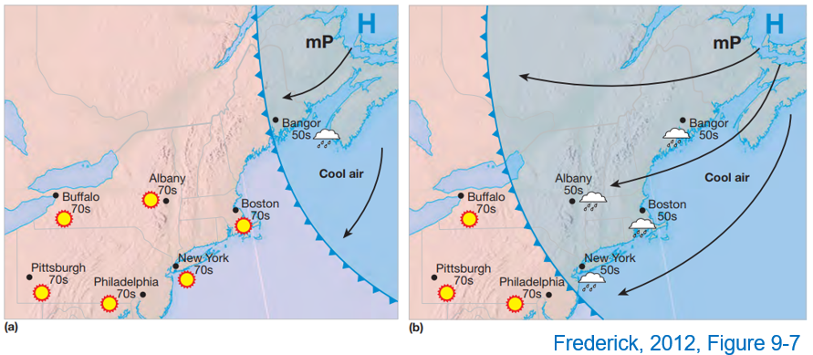  

<!-- 冷锋入镜，其将气流抬升，水汽凝结，形成降水 -->

---

# 1. 气团

:::info:气团
气象要素（主要指温度、湿度和大气静力稳定度）在水平分布上比较均匀的大范围空气团。
:::

> 气团特征：水平范围可跨越20°，从几百km到几千km；垂直范围可达几km到十几km；同一气团内的温度水平梯度一般小于1~2℃/100km；垂直稳定度及天气现象也都变化不大。

---

## 1.1. 气团的分类

地理分类法：根据气团源地的地理位置和下垫面性质进行分类。

- 首先按源地的纬度位置把北（南）半球的气团分为4个基本类型：<u>冰洋（北极和南极）气团、极地（中纬度）气团、热带气团和赤道气团</u>。

- 再根据源地的海陆位置，把前三种基本类型又分为<u>海洋型和大陆型</u>。赤道气团源地主要是海洋，就不再区分海洋型和大陆型。

---

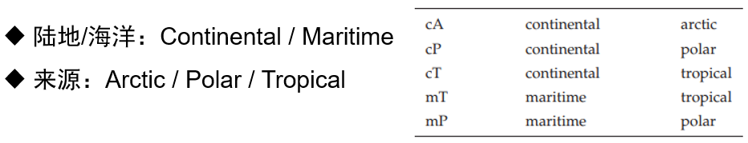  

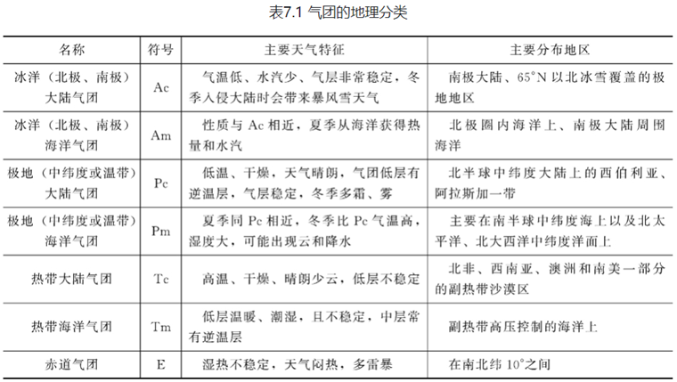  

---

## 1.2. 气团的变性

冬季极地气团势强；夏季热带气团势强。

 

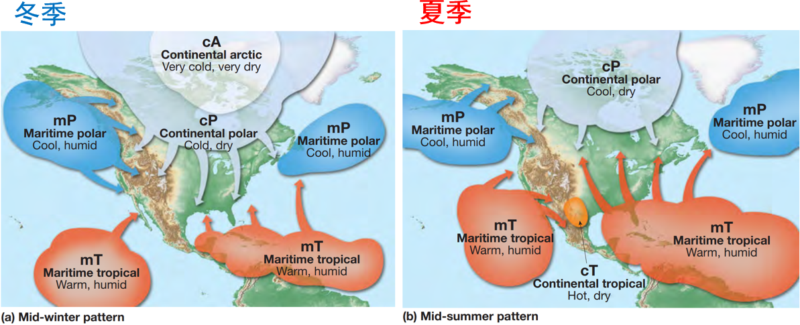  

> 气团的移动，受气压梯度力、风速、风向的控制

---

气团移动过程，逐渐被当地气象条件同化，多数情况下移动过程中势力变弱。

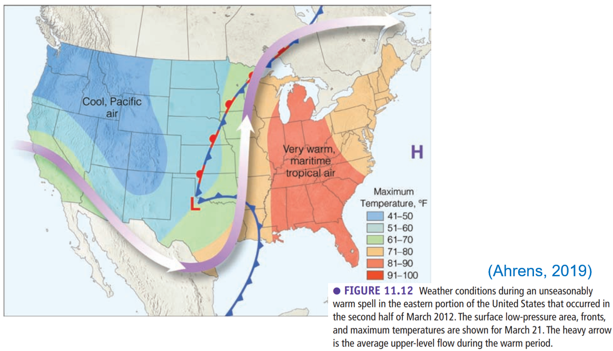  

---

气团移动过程，逐渐被当地气象条件同化，多数情况下移动过程中势力变弱。

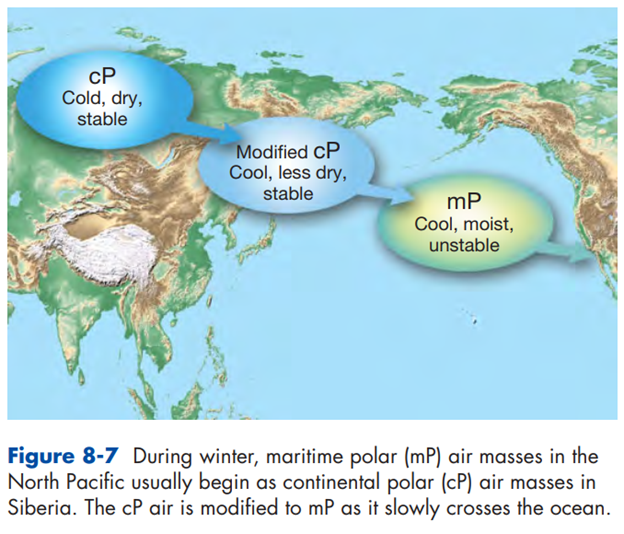  

---

# 2. 锋

:::info:锋
当两个性质不同的气团相接触时，其间存在一个比较狭窄的过渡区，这个区域叫做锋。
:::

- 锋面：冷暖气团的交界面

- 锋线：锋面与地面的交线。

> 锋包含锋面与锋线。**锋是温带地区重要的天气系统**，是冷、暖气团之间的过渡区，是三维空间的天气系统 。

:::block
锋面过程，常形成云系和降水天气，有时还出现大风、降温和雷暴等剧烈天气现。
:::

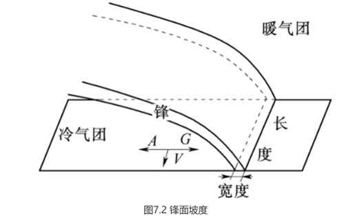  

---

<h4>锋的类型与天气</h4>

(1) 根据锋两侧冷、暖气团移动方向和结构状况，锋分为:

1. 冷锋(cold front)

2. 暖锋(warm front)

3. 准静止锋(stationary front)

4. 锢囚锋(occluded front)

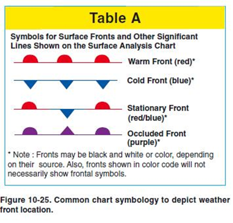  

---

## 2.1. 冷锋

:::block
冷锋(cold front)：是锋在移动过程中，锋后冷气团占主导地位，推动着锋面向暖气团一侧移动的锋。
:::

> 冷锋又因移动速度快慢不同，分为<u>__一型冷锋（慢）__</u>和<u>__二型冷锋（快）__</u>。

### 2.1.1. 一型冷锋

暖气团比较稳定、水汽比较充沛，冷锋移动缓慢、坡度较小(约1/100)，多为稳定性降水（一般锋后降水）。当锋前暖气团不稳定时，在地面锋线附近出现积雨云和雷阵雨天气。

> 在我国境内一般由西北向东南移动。夏季多为此类，影响范围较小，一般只达黄河流域。

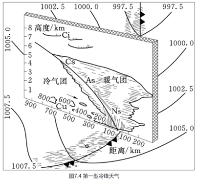  

---

### 2.1.2. 二型冷锋

:::block
二型冷锋：移动快、坡度大(1/40~1/80)、对流旺盛，对流性降水天气。冬季多为二型冷锋，影响可至华南，之后转为一型冷锋或准静止锋。
:::

- 夏季时，空气受热不均，对流旺盛，冷锋常狂风骤起、暴雨倾盆、雷电交加，气象要素发生剧变。但是，这种天气历时短暂，锋线过后气温急降，天气豁然晴朗。

- 冬季时，由于暖气团湿度较小、气温较低，不可能发展成强烈不稳定天气，只在锋前方出现卷云、卷层云、高层云、雨层云等云系。当水汽充足时，地面锋线附近可能有很厚、很低的云层和宽度不大的连续性降水。锋线一过，云消雨散，出现晴朗、大风、降温天气。

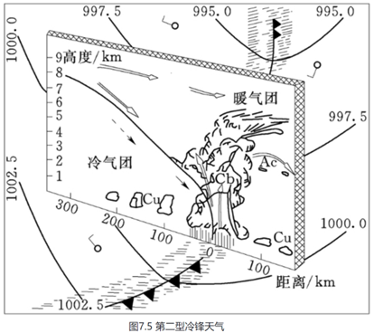  

---

## 2.2. 暖锋

:::block
暖锋是锋在移动过程中，锋后暖气团起主导作用，推动着锋面向冷气团一侧移动的锋。
:::

> 基本特点：①暖气团滑行在冷气团之上； ②暖锋坡度较小，一般小于1/100； ③覆盖的范围广。<u>**锋前降水**</u>

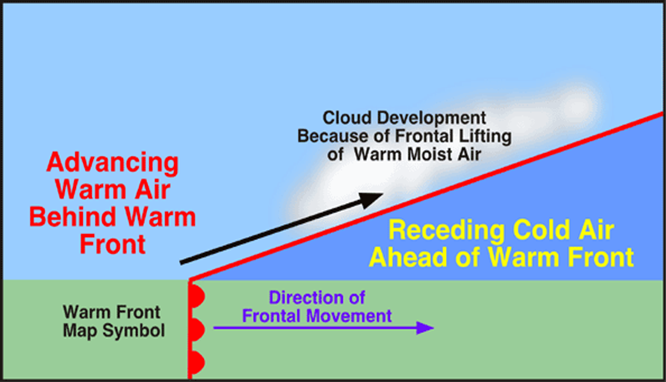  

---

## 2.3. 准静止锋

准静止锋是冷、暖气团势力相当或有时冷气团占主导地位，有时暖气团又占主导地位，锋面很少移动或处于来回摆动状态的锋。

 

准静止锋运动缓慢，并常常来回摆动，使阴雨天气持续长达10d至半个月，甚至一个月以上，<u>“清明时节而纷纷”</u>就是江南地区这种天气的写照。常出现在江淮流域梅雨时期。

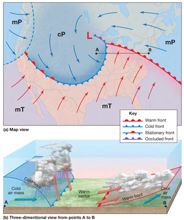

---

## 2.4. 锢囚锋

锢囚锋是当冷锋赶上暖锋，两锋间暖空气被抬离地面锢囚到高空，两锋间的冷气团合并形成的锋。

两侧降水

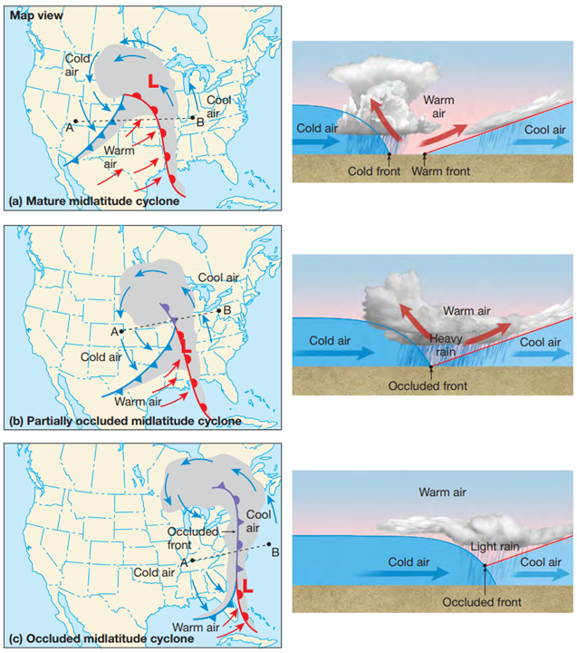  

---

# 3. 中纬度天气系统

- 西风带（大气长波、大气短波）
- 阻塞高压与切断低压
- 温带气旋与反气旋

---

## 3.1. 西风带

:::block
**西风带：地表到对流层高空 盛行西风的中纬度环流带。**
:::

- **纬向环流**： 平直西风气流

- **经向环流**： 波状流型具有较大南北向气流或出现大型暖高压，冷低压

  

---

<h4>西风带的波动产生天气现象！</h4>

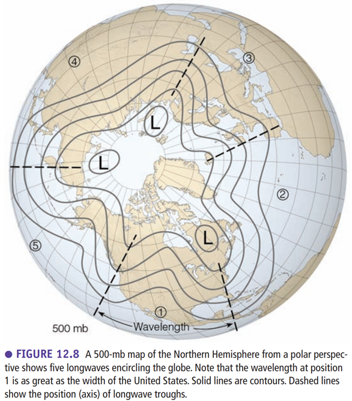
<u>(Ahrens, 2019)</u>

---

<!-- :::block -->
- **长波**：波长3000~10,000km，50~120经距，北半球3~7波，由行星锋区长波扰动引起
- **短波**：波长几百~3000km，由锋区中的短波扰动引起；一个大气长波中可能会存在多个大气短波
<!-- ::: -->

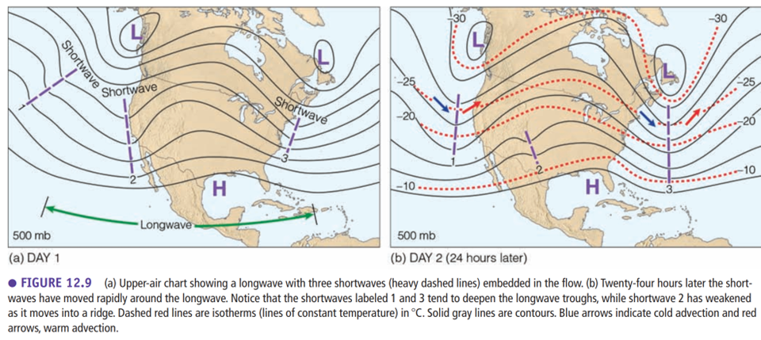  

---

- **长波**：具有冷槽、暖脊的温压结构。槽前暖平流，槽后冷平流。高空槽前对应低压，槽后为高压。

 

- **短波**：槽前盛行暖湿的西南气流（上升气流），常成云致雨；槽后盛行干冷的西北气流（下沉气流），多晴冷天气。

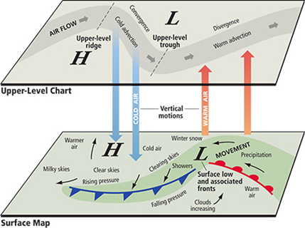  

---

## 3.2. 切断低压与阻塞高压

- **切断低压（冷涡）**：温压场结构比较对称的冷性气压系统。

  > 和阻高相伴，位于阻高的东南或西南，与阻高共同构成了大气环流中阻塞形势。也有单独出现，两侧有明显的高压脊或高压。

:::block
天气：低压前部（东和东南侧）因低层有冷暖空气交汇，常有锋面气旋波动发生，有云雨天气出现。后部（西侧）因不断有冷空气南下，常有冷锋和切变线生成，有阵性降水出现。
:::

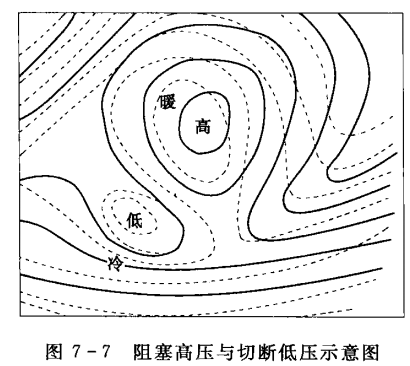  

---

- **阻塞高压（阻高）**：温压场比较对称的深厚的暖性高压。
   > 特征：①位于50°N以北。②5~7天，有时可达20天以上。③沿纬向移动每天不超过7~8个经度，常呈准静止状态，有时甚至向西倒退。
:::block
天气：高压东部盛行偏北气流，有冷平流和下沉运动，天气以冷晴为主；西部盛行偏南气流，有暖平流和上升运动，天气较暖且多云雨。南北两侧多稳定的西风气流，并常伴有短波活动，天气时阴、时晴。
:::

  

---

<h4>两种类型：</h4>

  

---

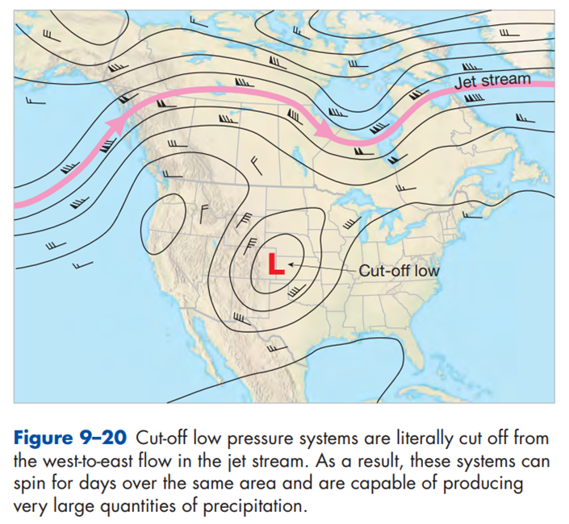  

(Frederick, 2012)

---

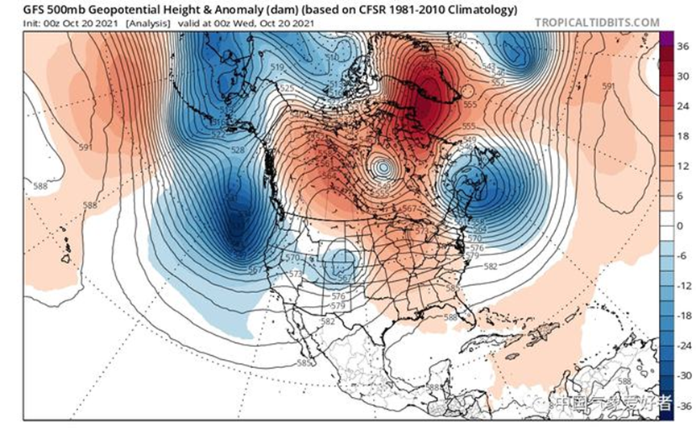  

2021年10月中旬末，强烈的阻塞高压在加拿大北部、格陵兰一带发展，大量暖空气突入北极，迫使北极涡旋分裂，并南下阿拉斯加、白令海，阿留申群岛附近强风暴不断。

<https://zhuanlan.zhihu.com/p/456850903>

---

## 3.3. 温带气旋与反气旋

### 3.3.1. 温带气旋

:::block
气旋：指的是低压系统，又称旋涡。

温带气旋：具有锋面结构的低压系统（又称锋面气旋）；半冷半暖的温度不对称系统（__与冷涡的区别__）。降水区域：中心、冷锋后部、暖锋前部。
:::

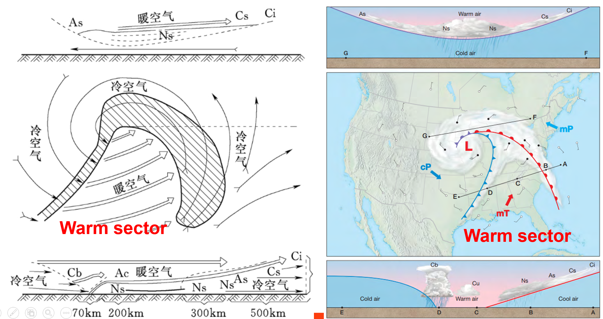  

---

:::info:主要发生地
东亚（东亚气旋）、北美以及地中海等地区。
:::

  > 东亚气旋主要发生于我国东北地区，约北纬45°~55°之间（称东北低压）；偏南部的江淮地区（称江淮气旋）；日本南部海域三个地区。

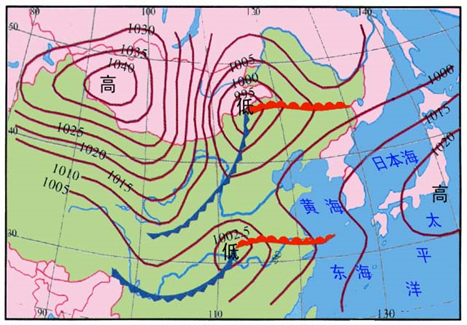  

---

<h4>温带气旋形成过程</h4>

形成过程：初生阶段、成熟阶段、锢囚阶段、消亡阶段

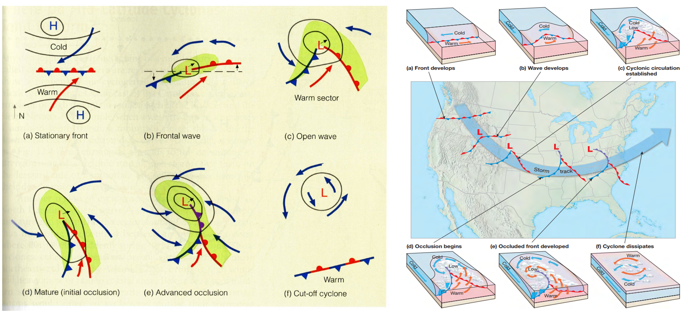 

1. 势均力敌的冷暖气流相遇，冷气流从北向南、暖气流从南向北。势均力敌，意味着开始时等高线近似平直，在科氏力的影响下，冷气流行东风，暖气流行西风；也意味着可能会存在准静止锋。

2. 相反反向的风产生切应力，切应力作用下系统会旋转起来（如玩具蜻蜓）。

3. 系统旋转，意味着冷空气南下，暖空气北上，形成冷锋和暖锋。

---

4. 冷锋移动速度快，暖锋慢，冷锋会逐渐追赶上暖锋。

5. 当冷锋会逐渐追赶上暖锋，形成锢囚锋，暖空气被被连根铲起，暖空气的雨水很快被抖落干净，锋面过程进入消亡阶段。

6. 锋面过程消失，地表低压中心的暖空气被替换为冷空气，形成深厚的冷低压系统（冷涡）。气压升高，云雨减少。

---

:::block
降水区域：低压中心、2型冷锋锋前（1型冷锋后部）、暖锋前部
:::

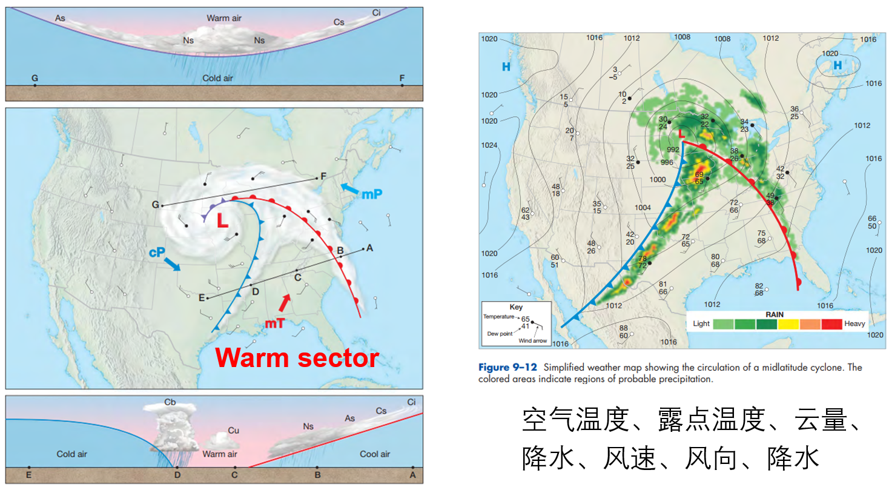  

---

<h4>高空槽脊与气旋之间的关系</h4>

> 槽前脊后，对应着阴雨；高空幅散，地表气流辐合。

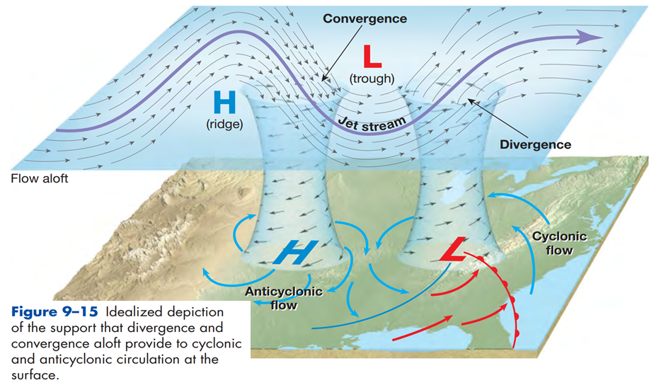  

(Frederick, 2012)

---

### 3.3.2. 温带反气旋

:::warn:温带反气旋
反气旋指的是<u>高压系统</u>。温带反气旋指的是活动在中、高纬度地区的高压系统。
:::

:::info:冷性反气旋
<u>是一种浅薄天气系统</u>，出现在近地面层内，中心气压值达1030~1040hPa，强时达1080hPa。平均厚度不到 3~4km，700hPa以上不清，500hPa以上消失。
:::

 

__源地__：极寒冷的中纬度和高纬度地区：格陵兰、加拿大、   北极、西伯利亚和蒙古等地。
冬季最多见。中、高纬地区冬季最突出的天气过程。

 

__天气现象__：常见的有冬季寒潮（给活动地区造成降温、大风和降水）

---

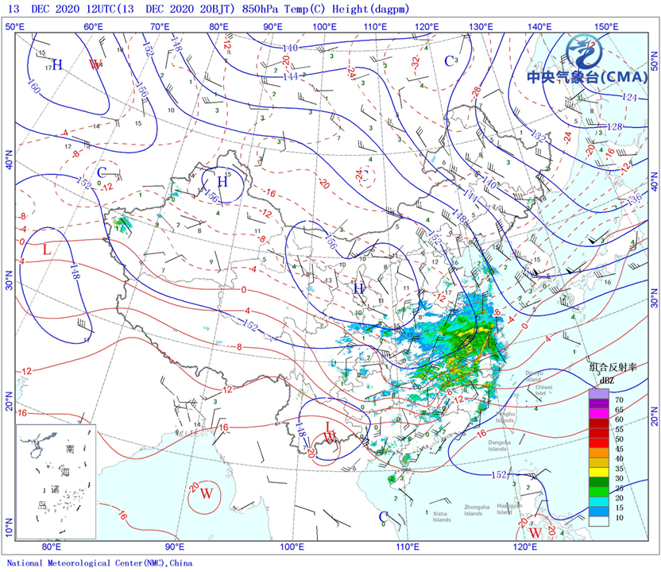  

---

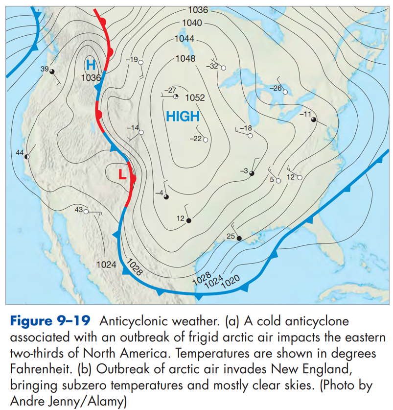  

(Frederick, 2012)

---

# 4. 低纬度天气系统

<!-- - 副热带高压
- 赤道辐合带
- 热带气旋 -->

## 4.1. 副热带高压

<!-- :::block
定义：三圈环流中的副热带高压带，活跃于亚热带地区，分布于南北纬30°左右，是一股经常存在但位置不固定的暖高压气团。
::: -->

<!-- _header: 副热带高压 -->

### 4.1.1. 分析方法

1. 水汽压达到饱和的有利条件

    地形抬升、空气对流、高纬度气流→低纬度

    > 冷→暖，es升高，RH下降，水汽难以饱和，难以降水；反之，则易于降水。

2. 气流运动方向
  
    > 科氏力作用下，气流运动过程中北半球右偏，高压系统顺时针旋转。

---

### 4.1.2. 副高的天气特征

1. 控制区域内为下沉气流、多高温干旱。

   > 冷→暖，es升高，RH下降，水汽难以饱和，难以降水。

2. 北、西北部边缘因与西风带天气系统（锋面、气旋、低槽）相交绥，气流上升运动强烈，水汽比较丰富，因而多阴雨天气。

   > 科氏力的影响，气流右偏，冷暖气流最有可能在北侧、西北侧相遇

3. 南侧是东风气流，晴朗少云，低层潮湿、闷热，但当热带气旋、东风波等热带天气系统活动时，也可能产生大范围暴雨和中小尺度雷阵雨及大风天气。

   > 东风可以将太平洋的暖湿气流运送到西部，但同纬度气温变化不大，因此东风气流并不会促进降水；但如遇地形起伏，则易于降水

4. 东部受北来冷气流的影响，形成较厚逆温层，产生少云、干燥、多雾天气，长期受其控制的地区，久旱无雨，出现干旱，甚至变成沙漠气候。

   > 冷→暖，es升高，RH下降，水汽难以饱和，难以降水。

---

### 4.1.3. 副高与我国雨季的移动规律

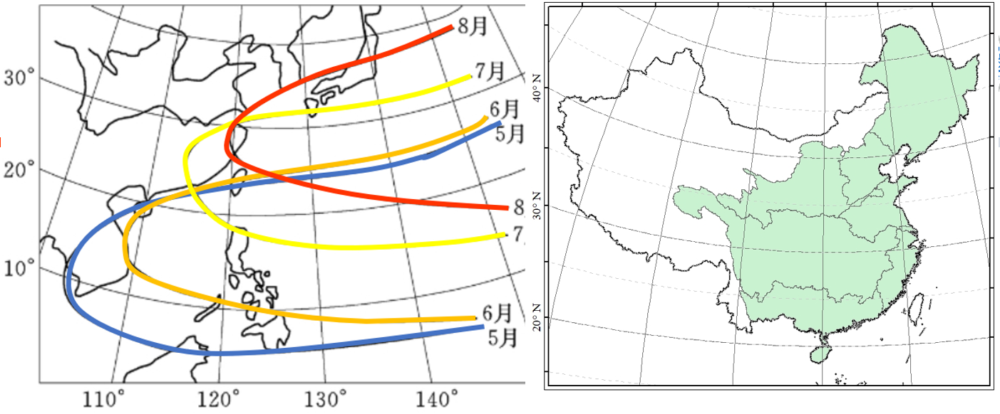  

- 4、5月，华南雨季（***脊线15°N以南***）；
- 6月（***北跳越过20°N***），江淮准静止锋，长江中下游梅雨；
- 7月上、中（***二次跳过25°N***），梅雨结束，雨带转黄河流域；
- 7月底、8月初（***越过30°N***），雨带继续北移，华北、东北雨季；江淮地区副高控制，伏旱；
- 9月退（***25°N以南***），江淮地区秋雨绵绵，长江以南秋高气爽；
- 10月份退回冬季形式（***20°N以南***）。

> **口诀**: 华南5，江淮6，两北7、8，9回头
> 
> 祁连山地理, 2020, *中国锋面雨带的移动规律*，<https://www.bilibili.com/video/BV1gk4y117HM>

---

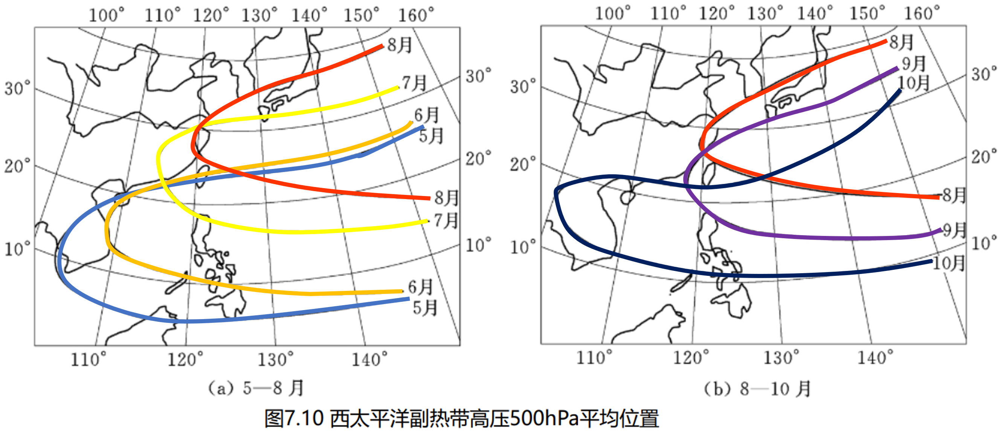  

> **口诀**: 华南5，江淮6，两北7、8，9回头
> 
> 祁连山地理, 2020, *中国锋面雨带的移动规律*，<https://www.bilibili.com/video/BV1gk4y117HM>

---

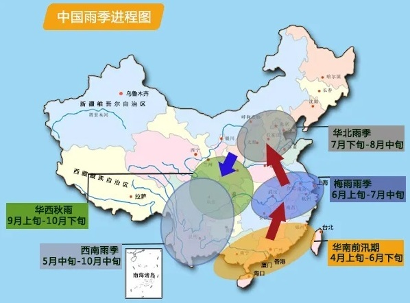

---

### 4.1.4. 副高异常对降水的影响

<!-- mermaid.js -->
<!-- 
 -->

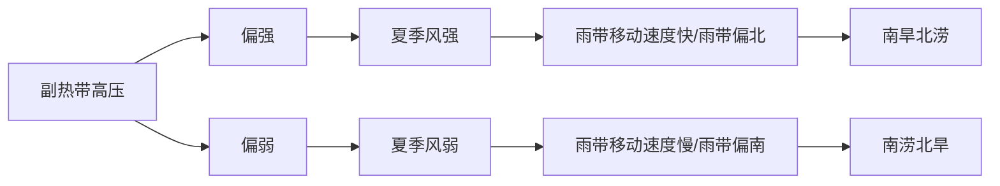
```mermaid
graph LR;
    副热带高压-->偏强 --> 夏季风强 --> 雨带移动速度快/雨带偏北 --> 南旱北涝;
    副热带高压-->偏弱 --> 夏季风弱--> 雨带移动速度慢/雨带偏南 --> 南涝北旱;
```

<!-- 

 -->

<h4>空梅现象</h4>

副高强，移动速度过快，使长江流域梅雨季过短，伏旱过长

---

<h4>实战1: 1998年长江洪水</h4>

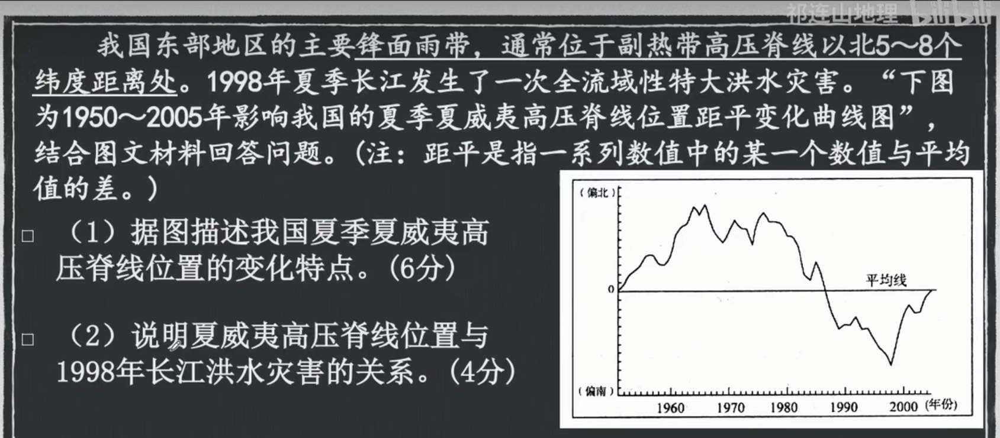

---

<h4>实战2: 2021年10月山西洪水</h4>

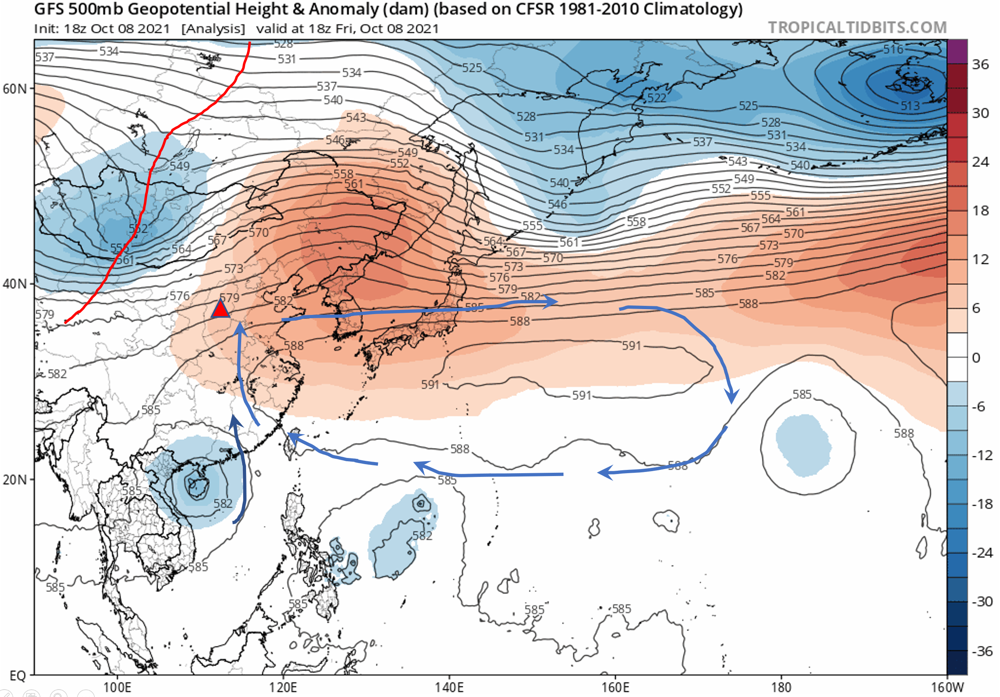  

---

<h4>实战3: 2020年7月31两北强降水</h4>

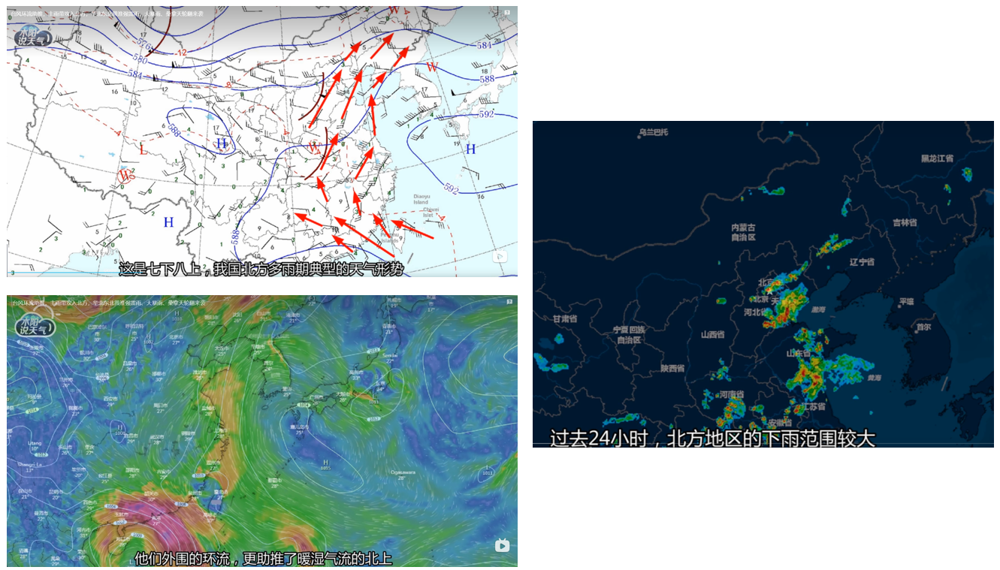

> 木阳说天气，2020-07-31两北强降水，https://www.bilibili.com/video/BV1SC4y1b7h6

<!-- --- -->

<!-- ## 4.2. 赤道辐合带

:::block
定义：赤道辐合带是南北半球信风气流汇合形成的狭窄气流辐合带。
:::

<h4>两种类型：</h4>

(a) 季风辐合带：在北半球夏季，由东北信风与赤道西风相遇形成的气流辐合带，因为这种辐合带活动于季风区，称季风辐合带。

(b) 信风辐合带：南、北半球信风直接交会形成的辐合带。

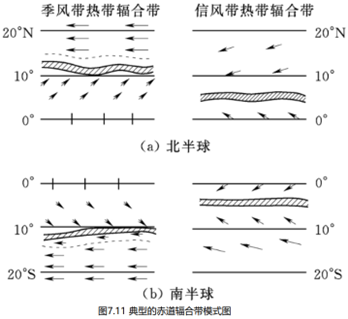   -->

<!-- --- 

## 4.3. 热带气旋

:::block
热带气旋是形成于热带海洋上、具有暖心结构、强烈的气旋性涡旋。<u>强度比较大的热带气旋称为台风。</u>
:::

:::block:命名规则：

- 1989年起，<u>凡出现在东经150°以西，赤道以北的热带风暴和台风</u>，按每年出现顺序进行编号。例如9306热带风暴、9304强热带风暴、9302台风。

- 2000年起，给热带风暴、及台风按特定名字命名，如2000年12号台风名为“派比安”，14号台风名为“桑美” 。
:::

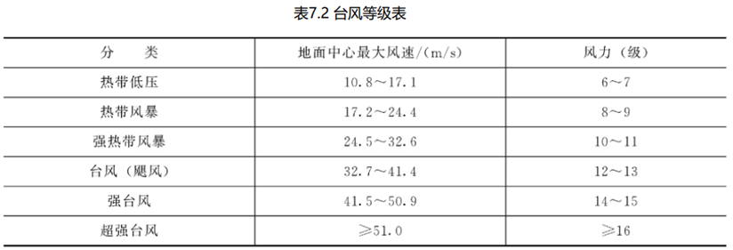  

---

### 4.3.1. 台风形成的条件

1. 较高的温度、充沛的水汽
   > 台风常常产生在洋面**温度超过26~27℃**以上的地区。在温度高的海域内，正好碰上了大气里发生一些扰动，大量空气开始往上升，这时上升海域的外围空气就源源不绝地流入上升区。

2. 风切变
   > 有风切变，才会产生旋转运动，这也是赤道地区没有气旋（也包括台风）的原因。

<http://www.gov.cn/govweb/fwxx/kp/2006-05/17/content_282692.htm>

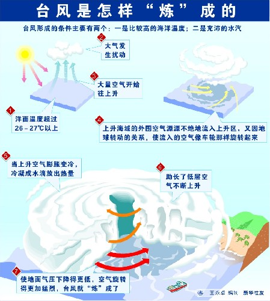  

  

---

<h4>全球台风易发区</h4>

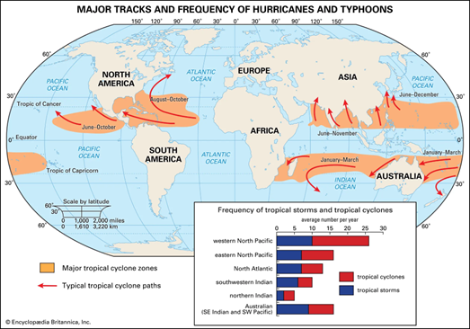   -->
