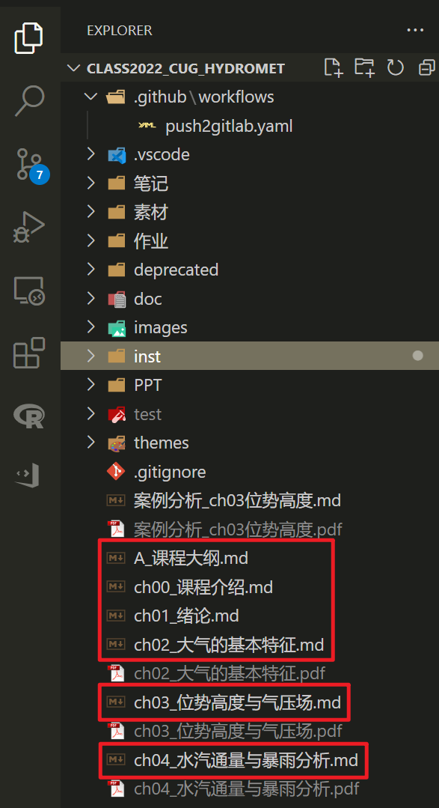
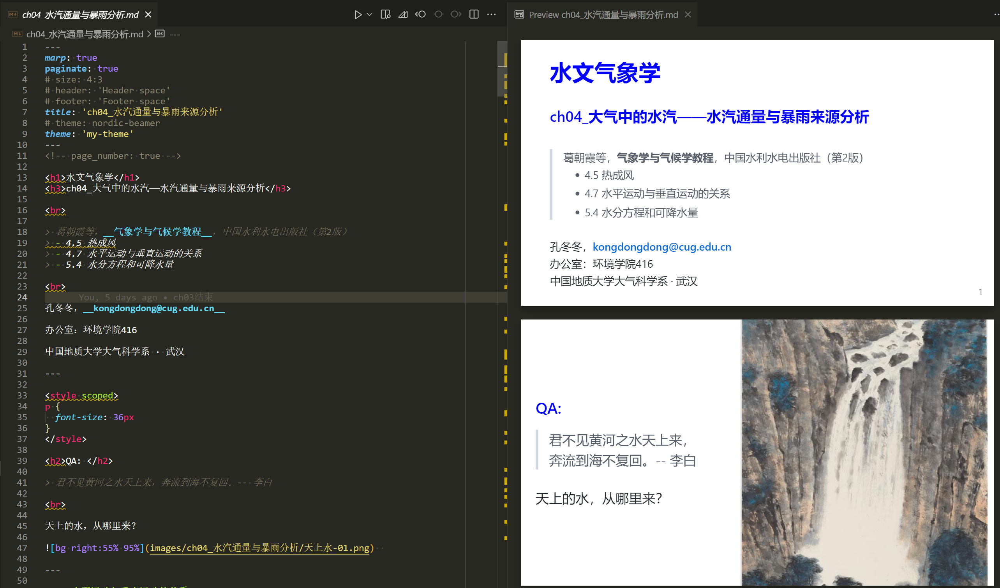
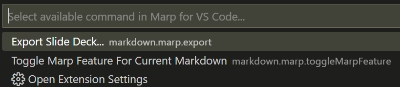
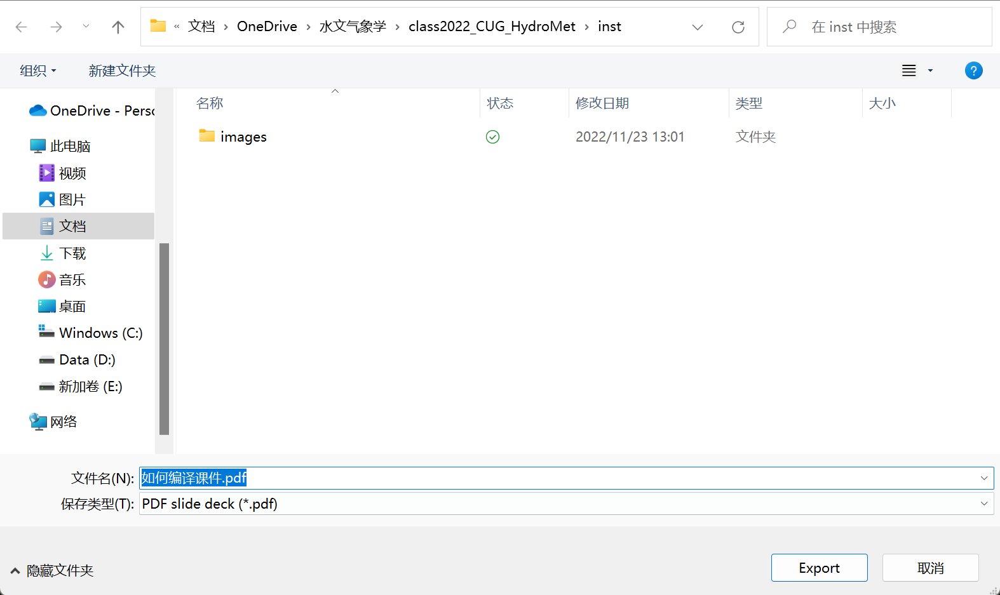

# 1. 如何把课件从md编译成pdf

md文件共分为两种，他们的使用方法分别是：

- `笔记`文件夹：编译成**A4 pdf**格式（复习使用，`Typora`导出pdf）。

- `根目录`：编译成**PPT格式的pdf**（课堂课件，`VSCode`+`Marp`导出pdf）。

## 1.1. PPT格式

1. 安装`VSCode`

   https://code.visualstudio.com/download

2. 安装插件`Marp for VScode`

   https://marketplace.visualstudio.com/items?itemName=marp-team.marp-vscode

3. 下载课件。下面两个链接均可，都是最新的课件：

   - https://gitlab.com/CUG-hydro/class2022_CUG_HydroMet
   - https://github.com/CUG-hydro/class2022_CUG_HydroMet

4. VSCode中打开`md`格式的课件，

   - 打开VSCode

   - File -> Open Folder -> 找到解压缩之后的课件文件夹。打开之后长这个样子：

         

   - 打开某一章节的`md`格式的课件

   - `预览`: 点右上角的`Open preview to slide`

      

   

   - `导出`：则点右上角的`show quick pick of Marp commands`

      

      

      

## 1.2. A4 pdf格式

### 1.2.1. 采用`Typora`打开

### 1.2.2. 命令行编译

```bash
# install nodejs: https://nodejs.org/dist/v16.18.0/node-v16.18.0-x64.msi
npm install -g yarn
npm install -g @marp-team/marp-cli
npx browserslist@latest --update-db
```

```bash
yarn
run.ps1
```

# 2. References

<https://github.com/CUG-hydro/marp-beamer>
